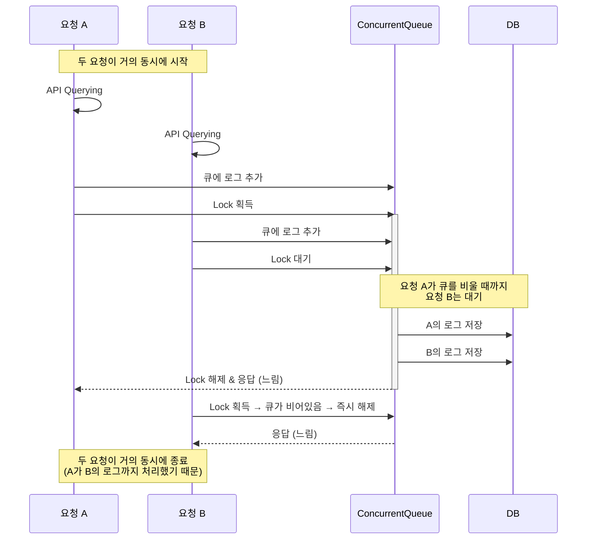

1. [요약](#1-요약)
2. [돌아보기](#2-돌아보기)
3. [왜 응답시간은 극적으로 개선되지 않았나](#3-왜-응답시간은-극적으로-개선되지-않았나)
4. [성과, 그리고 향후 과제](#4-성과-그리고-향후-과제)

---

<script src="https://cdn.jsdelivr.net/npm/chart.js"></script>
<script src="/assets/attachments/2026-04-03/charts.js" type="module"></script>


# 1. 요약

[이전 글]()에서 비동기 로깅을 도입하면 P95에서 94%가 개선될 것이라고 가정했었죠. 배포 전 2일(3/29~3/30)과 배포 후 2일(4/1~4/2) 트랜잭션을 비교해 봤습니다.

**cascade 지연 현상은 사실상 제거된 것으로 보입니다.**

<canvas id="cascadeChart"></canvas>

**응답시간은 전체적으로 개선되었지만, 2,000ms+ 이상 지연은 여전합니다. 이 문제는 페이지네이션 쿼리 문제로 확인됐습니다.**

| 지표 | 배포 전 | 배포 후 | 개선 |
|---|---|---|---|
| cascade(2000ms+) 비율 | 5.59% | 0.35% | ▼94% |
| 최대 응답시간 | 13,369ms | 4,349ms | ▼67% |
| 중앙값 | 82ms | 30ms | ▼63% |
| 평균 | 269ms | 172ms | ▼36% |
| p95 | 2,072ms | 1,753ms | ▼15% |
| p99 | 2,530ms | 1,921ms | ▼24% |

---

# 2. 돌아보기

저는 API에서 잘못된 로그 코드를 발견해 이를 수정하려 했었습니다. 요청이 모두 synchronized로 묶이는 문제였습니다.



만약 4,000ms짜리 요청 세 개가 운 나쁘게 한데 묶인다면, 최대 응답시간이 12,000ms까지 뛰게 되었죠. 요약 표의 최댓값이 13,369ms인 이유입니다.

이 문제를 분석하던 당시, 과거 트랜잭션들을 대량으로 분석할 방법이 없었습니다. 그래서 저는 가설을 세우고 이를 실험했었습니다:

- *모든 API가 3~5% 확률로 묶일 것이다.*

---

# 3. 왜 응답시간은 극적으로 개선되지 않았나

실험의 추정이 잘못되었기 때문이었습니다. 저는

- *(가정) 모든 API가 3~5% 확률로 묶일 것*

라고 가정했고, 실제 추정도 비슷했습니다.

- *(실제) 모든 API가 5% 안팎으로 묶임*

그런데 진짜 핵심은 이랬습니다:

- ***대부분의 묶임 현상은 하나의 API에서만 일어나고 있었음***

## a. 왜 특정 API만 묶이나

이 API는 [**세부사업별 세출현황**](https://www.lofin365.go.kr/portal/LF5120000.do?pdtaId=0GAR4HBB8LWEBSL4NIHZ817053)이라는 API입니다.

- 각 지방자치단체가 어느 사업에 금액을 얼마나 지출했는지

를 매일 업데이트하는, 인기있는 API입니다.

이 API는 전국의 집행 내역을 매일 업데이트하기 때문에, 쿼리의 실행 속도 자체가 느렸습니다.

문제는 느린 요청일수록 묶임 현상이 빈도높게 발생한다는 점입니다. 첫 요청이 오래 걸리면, 다음 요청은 첫 요청을 기다리게 될 가능성이 높습니다.

그래서 상대적으로 헤비한 이 API에 대부분의 묶임 현상이 발생하고 있던 겁니다.

## b. 왜 이 API만 느린가

나머지 API들은 원래부터 응답시간이 짧았습니다. 아무리 길어야 300ms를 넘지 않습니다.

<canvas id="percentileExcludedChart"></canvas>

세부사업별 세출현황 API도 대부분의 요청들은 300ms 안팎을 유지합니다(p1~p65). 그런데 특정 요청인자를 활용하지 않으면 2,000ms 안팎의 응답속도를 가지게 됩니다(p65~p99).

<canvas id="percentileQwgjkChart"></canvas>

이 API의 검색인자 중에는 `wa_laf_cd`가 있습니다. 예컨대 '1100000'을 넣으면, '서울 본청'만 조회할 수 있는 식입니다.


이 검색인자를 넣지 않을 경우 전국구를 조회하는데, 두 검색결과의 행 수가 당연히 크게 차이납니다. 예컨대 2026년 3월 1일 기준으로:

- 전국구는 438,969개
- 서울 본청은 4,346개

100배 정도 차이납니다. *(심지어 전국구 자료 조회는 인덱스까지 활용합니다!)*

문제는 우리 API가 모두 정렬과 페이지네이션을 사용하기 때문에, 서브 쿼리의 크기가 클수록 비효율적인 access-filter 과정을 거친다는 점입니다.

## c. 정리하자면...

다음과 같은 연쇄 문제가 있었고:

```
➊ 정렬, 페이지네이션의 비효율
→ ➋ 인기있는 API의 잦은 지연
→ ➌ 잘못된 로깅 코드로 응답시간이 악화
```

저는 이 중 ➌번만을 고친 셈입니다.


---

# 4. 성과, 그리고 향후 과제

## 성과

낮은 응답시간의 비율이 높아졌습니다.

<canvas id="operationalHistogramChart"></canvas>

인기있는 API ㅡ 세부사업별 세출현황에서도 같은 현상이 보입니다. 그럼에도 2,000ms+ 지연은 여전합니다.

<canvas id="qwgjkHistogramChart"></canvas>

비동기 로깅은 한 건의 실패 없이 아직까지 잘 작동합니다.

## 향후 과제

- 페이지네이션을 keyset으로
- WA_LAF_CD를 filter가 아닌 access로 scan되도록

바꾸는 것입니다. 또, 현재 결과는 배포 전후 2일치에만 국한되므로

- 한 달치 전-후 통계량을 모니터링

하는 것도 포함되겠습니다.