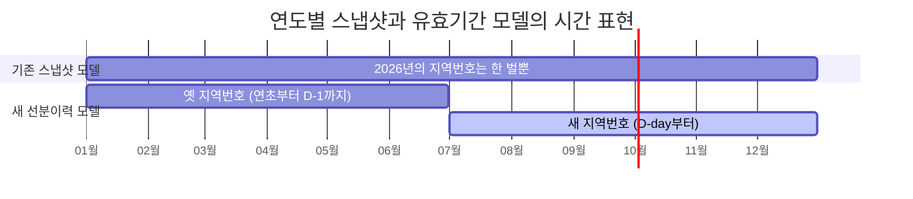
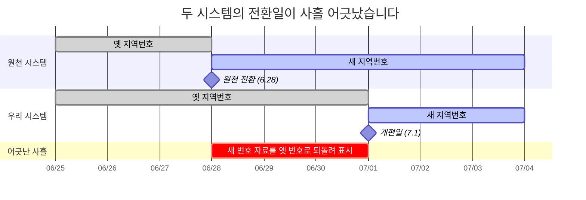
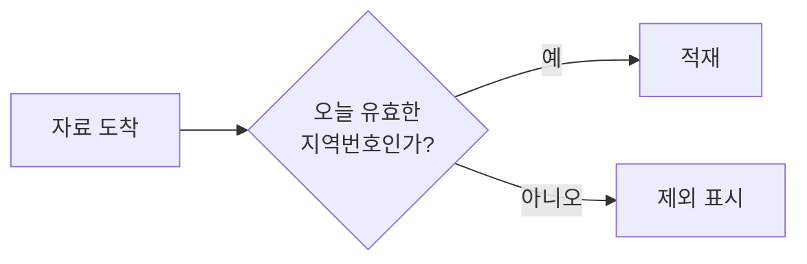
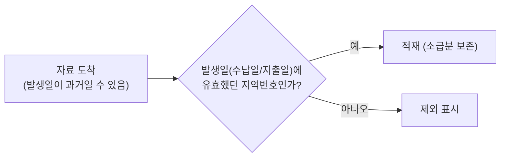
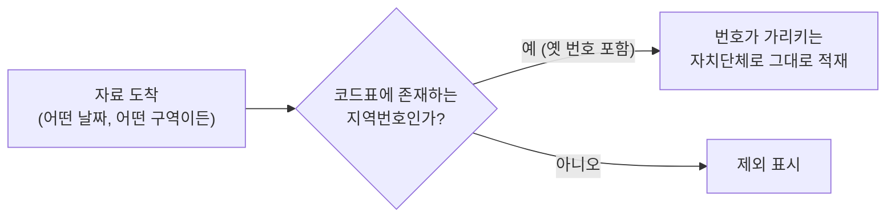
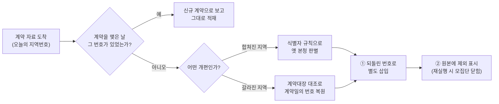

당신은 항공사의 예약 시스템을 담당하고 있습니다. 어느 날 회사가 다른 항공사와 통합된다고 합니다. 예약을 분류하는 식별 체계가, 자정을 기점으로 새 체계로 바뀐다는 공지가 내려옵니다.

그런데 발권을 대행하는 제휴사들은, 사흘 먼저 새 체계로 전환해 버렸습니다. 생전 처음 보는 식별자로 예약 데이터가 쌓이고 있는 상황입니다. 게다가 시스템에는 배치도 있습니다. 어제까지 있던 예약이 오늘 보이지 않으면, No-Show로 간주하고 예약을 닫습니다.

***식별 체계의 교체, 사흘 이른 전환, 부재를 종료로 간주하는 배치. 이 셋이 겹치는 날, 무슨 일이 벌어질까요?***

제가 지난 한 달 반을 붙들고 있던 문제였습니다. 단지 항공사가 아니라 재정정보를 모아 공개하는 시스템이었고, 걸려 있던 것은 예약이 아니라 전국 자치단체의 예산, 계약, 지출 정보였으며, 밤마다 도는 배치는 No-Show가 아닌 자치단체의 사업정보를 선분이력으로 관리하던 배치라는 점만 달랐습니다.

---

# 요약

① (1장) 행정구역을 나타내는 코드성 테이블이 1년 단위로만 변할 수 있어, 연중(7.1) 행정구역을 개편해야 하는 현재의 요구사항에 맞지 않았습니다.<br>
**→ 연도별 코드 테이블을 일별 선분이력 모델로 재설계했습니다.**
<br>

② (3장) 선분이력을 집계하는 배치가 재실행에 멱등하지 않았습니다. 배치를 잘못 재실행하면 자료의 손실(45만건 중 25만~5만)이 일어났습니다.<br>
**→ 선분이력을 관리하는 배치 쿼리를 모방한 SQL문으로 복원했습니다.**
<br>

③ (2, 4장) 원천 자료를 송신하는 시스템들이, 우리보다 앞서 개편된 행정구역의 자료를 보내기로 되어 있었습니다. 과거 행정구역의 자료를 소급해 보내는지도 미리 알 수 없는 상황이었습니다.<br>
**→ 신규 형태의 자료와 소급분을 별도로 판정하고 보정하도록 배치를 재개편했습니다.**

---

1. [시간을 모르는 시스템](#1-시간을-모르는-시스템)
2. [사흘 먼저 도착한 미래](#2-사흘-먼저-도착한-미래)
3. [재실행은 공짜가 아니다](#3-재실행은-공짜가-아니다)
4. [아침 루틴과 자동화](#4-아침-루틴과-자동화)
5. [다시 퀴즈로](#5-다시-퀴즈로)
6. [한계](#6-한계)
7. [회고](#7-회고)

---

# 1. 시간을 모르는 시스템

2026년 7월 1일, 두 광역자치단체가 하나로 합쳐졌습니다. 전라남도와 광주가 합쳐져 전남광주통합특별시가 되었거든요. 그 말은, 오랫동안 전국의 재정 자료를 분류해 온 지역번호가 예고된 자정을 기점으로 바뀐다는 뜻입니다.

저희 시스템은 전국 자치단체의 세입, 세출, 계약, 발주 자료를 매일 받아서 지역번호로 분류해 쌓고 공개합니다. 지역번호는 이 시스템의 우편번호이자 주민등록번호입니다. 시스템 내부에는 해마다의 지역번호를 한 벌씩 보유한 코드 테이블이 있습니다. 2026년 서울 종로구는 1111000, 부산 연제구는 2623000... 이런 식입니다.

문제는 이 코드표는 "2026년의 지역"은 답할 수 있지만, "2026년 6월 30일까지의 지역"은 답할 수 없다는 겁니다. 시간의 해상도가 연도까지만 미치기 때문입니다. 그도 그럴 것이, 행정구역이 연중에 통째로 개편되는 일은 이 시스템이 태어난 뒤로 이번이 처음이었으니까요.[^convention]

이대로 개편일을 맞으면 어떻게 될까요? 7월 1일부터 도착하는 새 행정구역의 자료는 지역번호가 없어 조회할 수가 없게 됩니다. 그럼 새 지역번호로 모두 갈아끼우면 되겠군요? 가령 전남은 빼고, 전남광주특별시의 지역번호를 넣는 것이죠. 당연히 안 됩니다. 작년 6월의 전남 자료를 조회할 수 없게 되거든요. 그럼 옛것과 새것을 모두 유지하면요? 전남도 두고 전남광주특별시도 두면 되지 않을까요? 이것도 안 됩니다. 현재의 코드표는 "6월까지는 전남이고, 7월부터는 전남광주특별시다"를 표현할 수가 없거든요. 자료를 두 쌍으로 관리한다고 해서, 조회도 두 쌍이 되도록 만들 수는 없으니까요. 어느 쪽을 골라도, 하나의 코드표로 두 개의 시대를 표현할 수가 없습니다.

그래서 시간의 해상도를 높이기로 했습니다. 유효한 지역번호의 단위를, 연도가 아닌 일자가 되도록 하는 겁니다. 지역번호마다 시작일과 종료일을 부여하고, 기준일이 주어지면 그 시점의 정답을 받아 가게 하면 됩니다. 이런 모델에는 이미 이름이 붙어 있습니다. **선분이력**입니다.



공짜는 아닙니다. 기준일이 주어지면 하나의 지역번호만 주어지는 것이 이상적이겠지만, 스키마로 강제할 수가 없었습니다. 레거시 호환 때문입니다. 기존 코드표는 하나의 지역이 다수의 지역번호를 갖기도 했거든요. 그 대가로 모든 조회는 "기준일에 유효한 한 행"을 스스로 골라야 하는 비용을 치르게 되었습니다[^overlap]. 결국 겹침을 막는 불변식은 스키마가 아니라, "같은 기간을 겹쳐 넣지 말자"는 약한 구두 약속으로 남게 되었습니다.

그래도 이제 시스템은 연도가 아닌 날짜를 이해할 수 있게 되었습니다. 하지만 그 다음 문제는, 모두가 저희 일정표대로 움직여 주지는 않는다는 데 있었습니다.

---

# 2. 사흘 먼저 도착한 미래

원천 시스템, 그러니까 저희에게 자료를 보내 주는 상류 시스템은 개편일보다 사흘 먼저 새 지역번호로 전환했습니다. 우리는 7월 1일부터 새 행정구역을 보여줘야 하는데, 6월 28일부터 새 행정구역의 자료가 도착하기 시작한 것입니다.

즉 6.28부터 6.30 자정 전까지 3일간 사이트 이용자들을 속여야만 했습니다. 6월에는 새 행정구역의 글자 코빼기도 보이지 않아야 했거든요. 전남광주 목포시 자료는 전남 목포시로, 전남광주 광산구는 광주 광산구로 되돌려야 했습니다.



되돌리기에는 난제가 하나 있습니다. 갈라진 지역은 어느 부모로 돌아가야 하는지 자명합니다. 물론 돌아갈 곳을 안다는 것과 되돌리는 일이 공짜라는 것은 다릅니다만, 적어도 답은 알고 시작합니다. 그런데 합쳐진 지역은 그 답조차 없습니다. 그 자료가 어제까지 어느 지역 소속이었는지 알 수 없다는 뜻입니다. 소속이 왜 중요하냐구요? 전남광주통합특별시 본청에 새로운 세출 자료가 등장했다고 가정합시다. **이 자료는 전남 본청으로 되돌려야 할까요, 광주 본청으로 되돌려야 할까요?**

세출에만 국한되는 문제가 아닙니다. 저희 시스템에서 일 단위 관리되는 도메인은 크게 세입, 세출, 계약, 발주 4가지가 있습니다. 도메인별 원천 시스템은 서로 다르고 담당자도 다릅니다. 즉 외부 기관이 자료를 어떻게 통합해 줄지 모르는 상태에서 3일간 일종의 블랙박스 테스트를 해야만 했던 겁니다. 때문에 저희 팀은 각 도메인별로 담당자를 수소문해 매일 전쟁터 같은 정보전을 벌여야 했습니다. 어떤 식별자는 변하지 않았다더라, 어떤 식별자는 어떻게 변했다더라..

다행히 시스템에는 어제의 자료가 남아있습니다. 예컨대 세출 자료는 같은 사업이 이전에 어느 지역에 속해 있었는지, 직전일의 선례를 찾아 그 지역으로 되돌리면 됩니다[^lineage].

다만 이 방법에도 빈틈이 있습니다. 모든 자료에 어제가 있는 것은 아니거든요. 만약 사흘 사이에 처음 시작된 사업이라면 되돌아갈 선례 자체가 없을 겁니다. 게다가 도메인마다 식별자의 생김새도 다르고, 복합 키를 사용하기도 해서 용례가 다양합니다. 때문에 꼬박 3일간 새로운 자료들의 생김새를 파악하고 보정하는 일에 온 힘을 쏟아야 했습니다.

이렇게 사흘치 미래를 과거로 되돌릴 준비를 도메인별로 하나씩 갖춰 나갔습니다. 얼핏 보기에는, 3일간 알아낸 정보들로 집계 배치를 적절히 수정하면 7.1 자정을 무리없이 보낼 수 있을 것만 같았죠.

---

# 3. 재실행은 공짜가 아니다

이 장의 사건에 앞서, 우리 사이트 이야기를 조금 더 해야겠습니다.

앞서 밝혔듯, 우리 사이트에는 매일 집계되는 4개의 도메인이 있습니다. 이 중 세출 도메인은 지방자치단체가 어떤 사업에 돈을 얼마나 집행했는지를 보여줍니다. 가령 서울 본청의 "[119구급상황관리센터 운영](https://www.lofin365.go.kr/portal/LF3120204.do?dbizCd=61100002016304F6&lafCd=1100000&fyr=2026&inqYmd=20260714)" 사업은 2026년 1월 1일에 시작해 각종 인건비를 며칠 간격으로 지출하고 있습니다. 이렇게 운영되는 전국의 모든 사업 개수는 45만건에 이릅니다.

지방자치단체는 모종의 이유로 사업을 종료시키기도 합니다. 그래서 사업 목록도 1장의 코드표처럼 선분이력으로 관리됩니다. 다른 점은 선분의 주인이 지역번호가 아니라 사업이라는 것뿐입니다.

다만 교과서적인 유효시간(valid time) 상태 테이블[^snodgrass]과는 두 가지가 다릅니다. 하나는 구간의 표기입니다. 교과서는 종료 시점을 열어 두는 반개구간 [시작, 끝)을 권하지만, 이 시스템은 양끝을 모두 포함하는 폐구간 [시작일, 종료일]을 쓰고, 종료일은 "다음 집행일의 전날, 없으면 회계연도 말"로 계산합니다. 여기서 회계연도 말은 실제 종료일이 아니라, "아직 진행 중"을 나타내는 센티넬(sentinel) 값입니다. 다른 하나는 더 치명적입니다. 상식적으로 사업의 시작과 종료를 알리는 이벤트만을 수신하는 것이 맞지만, 그런 방식이 아닙니다. "오늘 기준으로 진행 중인 사업 전량" 45만 건을 매일 통째로 받습니다. 끝났다는 소식은 오지 않고, 끝난 사업이 목록에서 조용히 빠질 뿐입니다. 그래서 부재를 종료로 간주하는 마감 배치가 존재합니다[^antijoin].

바로 이 쿼리가 문제를 일으켰습니다. 새 배치를 돌렸더니 45만건이 아니라 40만여건이 된 겁니다. 5만건이 갑자기 사라진 거죠. 이 문제는 개편 안팎으로 계속 발생해서, 최대 25만여건의 사업이 사라지는 경우도 있었습니다. 안 그래도 데이터를 수동 보정하기 바쁜데, 오염된 데이터까지 신경써야 했던 겁니다. 그렇다면 왜 "오늘 자료"가 간헐적으로 비게 되었을까요?

기술지원팀에 요청해 1.3GB 분량의 배치 로그를 확보하고, 실행 회차의 타임라인을 재구성했습니다[^rerun]. 그리고 알아냈습니다. 이 배치는 멱등하지 않았던 겁니다. 모종의 이유로 배치가 2회차로 재실행되면, 1회차 실행분을 제외한 채 실행되었습니다. 재실행이라는 가장 흔한 운영 행위가 데이터를 지우는 동작이 되어 있었습니다. 결국 원인은 "오늘 입력은 완전하다"를 검증 없이 믿는 구조였습니다.

남은 일은 잘못 닫힌 사업들을 되살리는 것이었습니다. 하필 이 배치만 수정 시각을 남기지 않았고, 로그성 임시 테이블은 매 실행마다 지워지는 구조라 이미 0건이었습니다. 단순히 어제 종료된 사업들을 찾아 되돌리면 될 거라고 생각했습니다. 틀렸습니다. 배치가 잘못 닫은 행과, 오늘 집행된 정상 행은 동일하게 어제 종료된 것으로 간주됩니다. 정상 행까지 함께 열리면 동일 사업이 두 번 집계됩니다.

해답은 잘못 닫힌 행을 골라내지 않는 것이었습니다. 종료일은 애초에 저장하는 값이 아니라, 집행일에서 계산해 내는 파생값입니다. 그러니 오염된 저장값을 의심하며 고를 것이 아니라, 오염되지 않은 재료인 집행일만 가지고 전체를 다시 계산하면 됩니다. 사업 키별로 집행일을 정렬해 그 계산식을 모든 행에 다시 적용토록 했습니다[^history]. 이러면 정상 행은 같은 값이 나올 뿐이고, 잘못 닫힌 행만 센티넬인 회계연도 말로 되돌아가 다시 열립니다.

---

# 4. 아침 루틴과 자동화

7.1 이후 저희 팀에는 새로운 아침 루틴이 생겼습니다. 밤사이 옛 지역번호를 달고 도착한 자료에 시스템이 제외 표시를 달아 두면, 아침에 사람이 출근해서 그 표시가 달린 자료를 하나씩 확인해서 살릴 것은 살리고 버릴 것은 버립니다. 안전을 우선한 보수적 운영이었고, 처음 며칠은 그럴 만했습니다. 문제는 이 루틴이 끝날 기미가 보이지 않았다는 것입니다. 개편은 하루였지만 소급 자료는 매일 왔습니다.

판단 기준은 있었지만 경우의 수가 많아 그때마다 달랐습니다. 그래서 저는 도착하는 자료를 2주간 직접 지켜보며 기준을 처음부터 다시 세웠습니다. 수신 테이블 열두 개가 저마다 어떤 사연으로 과거를 달고 오는지 확인하고 나니, 규칙은 네 가지로 수렴했습니다[^spectrum]. 규칙의 단위는 도메인이 아니라 수신 테이블입니다. 같은 세출이라도, 사업 목록과 집행 상세가 서로 다른 규칙을 따릅니다.

**① 세출 목록과 발주는, 옛 지역번호를 전량 제외합니다.** 이 도메인들에는 소급 송신이 없다는 사실을 알아냈기 때문입니다. 가령 개편 후에 옛 전남 번호를 달고 도착한 사업 목록은, 정당한 과거 자료가 아니라고 보고 제외 표시를 답니다.



**② 세입과 지출은, 발생일로 판정해 소급분을 살립니다.** 지출은 세출 상세 가운데 실제로 돈이 나간 기록을 말합니다. 수납일이나 지출일이 과거인 정당한 자료가 일상적으로 도착하기 때문입니다. 가령 이전 행정구역의 1월 지출을 음수로 반납하고, 같은 금액을 6월에 양수로 다시 기재하는 경우가 있습니다[^refund]. 이 정보를 제외하면 정확한 지출 정보가 어긋나게 됩니다. 그래서 그 자료가 송신된 날짜가 아닌, 그 일이 일어난 날짜를 기준일로 삼아 유효한 지역번호로 적재해야만 했습니다.



**③ 세출 상세는, 개편과 관계 없이 어떠한 지역이든 전부 적재합니다.** 과거의 집행 금액을 고치려는 수요가 실재하기 때문입니다. 가령 인천 중구가 사라진 뒤에도, 중구 시절의 집행 상세를 정정하는 자료는 계속 도착합니다. 그래서 기준을 가장 느슨하게 낮춰, 지역번호가 가리키는 가장 최신의 자치단체에 그대로 적재합니다.



**④ 계약은, 계약을 맺은 날의 자치단체로 되돌려 다시 적재합니다.** 계약은 특정 날짜에 고정된 사실입니다. 2024년에 맺은 계약은 언제 조회하든 그때 그 자치단체의 계약이어야 합니다. 그래서 계약만큼은 개편을 건너뛰더라도 하나의 지역번호를 유지해야 합니다. 그런데 자료는 언제나 오늘의 지역번호를 달고 도착합니다. 개편 전 계약을 고친 자료가 오늘의 번호로 오면, 한 계약의 이력이 두 번호로 갈라지고 목록은 고치기 전의 옛 내용을 보여주게 됩니다.

되돌아갈 곳을 찾는 방법은 개편의 성격에 따라 둘로 갈립니다. 합쳐진 지역은 2장의 본청 문제가 그대로 되풀이됩니다 — 통합된 번호만으로는 원소속을 알 수 없어, 원천 시스템 담당자에게서 받은 식별자 내부 규칙으로 옛 전남과 광주 본청을 가려냅니다. 갈라진 지역은 원소속이 자명하지만 이어받은 지역이 새 번호를 받은 탓에, 이미 쌓여 있는 계약대장에서 같은 계약번호를 찾아 계약일에 유효했던 번호를 그대로 복원합니다. 어느 쪽이든 되돌린 뒤에는 별도 적재를 거치고, 원본에는 제외 표시를 답니다.



이 판정표는 한 번에 나오지 않았습니다. 보정 배치를 두 번 갈아엎었고, 그 과정에서 검증 시나리오까지 완성했던 설계 하나는 영향 범위를 계산해 보고 폐기했습니다. 그렇게 세 번째 판에 이르러서야 아침 루틴은 배치가 되었습니다.

사람은 이제 판단하지 않고, 배치가 남긴 판정 결과를 검토합니다. 돌이켜 보면 코드를 짠 시간보다, 도메인마다 송신되는 자료의 패턴을 보고 없는 규칙을 만들어내는 것이 고됐던 시간이었습니다.

---

# 5. 다시 퀴즈로

서두의 퀴즈로 돌아가겠습니다. 항공사 담당자는 어디부터 손을 대야 할까요.

제 답은 이렇습니다. 그 시스템 안에서 얼마나 많은 시간의 종류가 있는지부터 세어 보는 겁니다. 두 개는 이미 잘 알려져 있습니다. 일이 실제로 벌어진 시간은 **유효시간**(valid time), 시스템이 그것을 알게 된 시간은 **시스템 시간**(system time)입니다[^sql2011]. 이번 개편이 가르쳐 준 것은, 그 둘뿐만 아니라 세 번째 시간이 있다는 사실입니다. 행정구역이 개편되고, 항공사가 합병되고, 식별 체계가 교체되는 시간. 자료를 분류하는 체계 자체가 바뀌는 **체계의 시간**입니다. 세 시계는 평소에는 같은 시각을 가리키고 있어서, 하나처럼 보입니다. 저희 시스템은 오랫동안 그렇게 살았고, 셋을 구분하지 않은 대가를 한 번도 치르지 않았습니다. 개편은 그 셋을 하루아침에 찢어 놓았습니다. 체계의 시간이 분류 키를 바꿨고(1, 2장), 시스템 시간이 불완전한 입력 위에서 태연히 돌았고(3장), 유효시간이 소급분을 쏟아냈습니다(4장).

돌이켜 보면 시스템이 개편 때문에 고장 난 것이 아닙니다. 시간을 구분하지 않는 시스템은 원래부터 고장 나 있었고, 개편은 그 청구서를 하루에 몰아서 내밀었을 뿐입니다.

---

# 6. 한계

**수치는 한정된 표본의 관측입니다.** 3장의 대량 마감은 재실행이 얽혀 여러 차례 일어났고, 회차마다 닫힌 규모가 달랐습니다(5만에서 25만까지).

**마감 로직 자체는 아직 그대로입니다.** 이번 대응은 로직이 아니라 입력을 보정하는 우회였습니다. "오늘 자료는 완전하다"는 전제를 로직 안에서 검증하게 만드는 정공법은 과제로 남아 있습니다.

**임시 봉합이 여전히 돌고 있습니다.** 집행 기간의 연속성이 깨졌을 때의 봉합은 임시 조치가 담당하고 있고, 그 조치가 잡지 못하는 결함 유형이 알려진 채 남아 있습니다.

**불변식은 아직 사람에게 걸려 있습니다.** 1장에서 말씀드린 대로, 코드표의 기간 겹침을 막는 것은 스키마가 아니라 팀의 구두 약속입니다. 약속은 코드와 달리 강제되지 않으므로, 이 위험은 해소된 것이 아니라 유예된 상태입니다.

**문제를 발견해도 배치를 즉시 멈추지 않습니다.** 사전 보정이 이상을 발견했을 때 후속 연계를 중단시키는 대신, 일단 흘려보내고 다음 단계에서 드러나게 두는 쪽을 택했습니다. 가용성과 관측성 사이의 절충이었고, 논쟁의 여지가 있다고 생각합니다.

---

# 7. 회고

돌아보면 모든 사건의 밑바닥에는 시간에 대한 암묵적 가정이 세 개 깔려 있었습니다. 저는 시스템에서 사용하는 세 개의 시계를 고친 셈입니다.

| 암묵적 가정 | 깨진 곳 | 교체된 설계 |
|---|---|---|
| 지역번호는 바뀌지 않는다 | 1, 2장 (개편 공지) | 유효기간 코드표 |
| 재실행은 안전하다 | 3장 (재실행 사건) | 멱등한 실행 순서 |
| 도착한 날이 곧 일어난 날이다 | 4장 (소급분 발견) | 도착일/발생일 분리 |

긴 글 읽어주셔서 감사합니다.

---

# References

[^convention]: 이번이 특이 케이스입니다. 예전엔 이런 문제가 없었습니다. 가령 경북 군위군이 대구 군위군이 되면, 아니면 전라북도가 전북특별자치도가 되면, 새 술을 새 부대에 옮기듯 이전 자치단체의 재정 정보들을 모두 옮겨 담아야 합니다. 수입은 얼마나 걷혔는지, 맺어진 계약은 어떤 것들인지, 어떤 사업을 벌이고 있었는지.. 방대하고 번거로운 작업이기 때문에, 예전에는 늘 "행정구역은 지금 개편하되, 재정 정보는 다음 회계연도부터 반영"하는 식으로 진행해 왔습니다.

[^snodgrass]: Richard T. Snodgrass, *Developing Time-Oriented Database Applications in SQL*, Morgan Kaufmann, 1999. 기간의 표현은 4장(pp. 89~108), 상태 테이블과 시간 키는 5장(pp. 111~139), 시점 조회는 6장(pp. 143~175)을 참고했습니다. 본문의 "교과서는 반개구간을 권한다"는 이 책의 권고입니다. "The preferred representation of a period is a closed-open pair of datetimes."(기간의 권장 표현은 반개구간 시각 쌍이다, p. 91) 이유도 명시되어 있습니다. 폐구간 표기는 술어마다 성가신 +1 보정이 끼어들기 때문입니다(p. 91). 우리 시스템의 종료일 계산식 "다음 집행일의 전날"이 정확히 그 보정입니다. 폐구간을 고른 대가로, 책이 경고한 비용을 계산식마다 지불하고 있는 셈입니다. 이번 코드표 설계는 이 책의 논의와, 사내에서 이미 쓰이던 선분이력 구조를 함께 참고했습니다.

[^sql2011]: ISO/IEC 9075-2:2011 (SQL:2011). 시간 지원이 SQL 표준에 들어간 판입니다. 유효시간은 application-time period table로, 시스템 시간은 system-versioned table(`FOR SYSTEM_TIME` 조회)로 규격화되었고, SQL Server, MariaDB, Db2 등이 이를 구현합니다. 학술 문헌은 시스템 시간을 트랜잭션시간(transaction time)이라고도 부르며, 두 시간을 함께 관리하는 테이블을 바이템포럴(bitemporal)이라고 합니다.

[^overlap]: 기준일 시점의 유효한 한 행을 고르는 방어 패턴 pseudo 쿼리.
    ```sql
    -- 조회마다 반복되는 방어: 기준일에 유효한 행 중 하나만 남긴다
    SELECT ... FROM (
      SELECT ..., ROW_NUMBER() OVER (...) RN
      FROM 코드표 WHERE 기준일 BETWEEN 유효시작일 AND 유효종료일
    ) WHERE RN = 1
    ```
    방어가 누락된 조회가 기간 겹침을 만나면 두 가지 장애가 됩니다. UNIQUE 제약이 있는 테이블에 적재하게 되면 중복 키 오류로 멈추게 됩니다. 이 경우는 명시적으로 실패하니 그나마 낫습니다. 제약이 없는 집계나 조회 경로에서는 조인이 두 행으로 늘어나 금액이 소리 없이 두 배로 잡힙니다. 오류도 알람도 없어서, 참값을 아는 사람이 눈으로 확인하기 전까지는 드러나지 않습니다.

    겹침을 스키마로 막지 못한 것이 이 시스템만의 사정은 아닙니다. 교과서도 못 박아 둡니다. "Adding the timestamp does not serve to convert a nontemporal key to a temporal key."(타임스탬프를 키에 추가한다고 시간 키가 되지는 않는다, Snodgrass 1999, p. 118) "The problem with a current uniqueness constraint is that it can be satisfied today but violated tomorrow, even if there are no changes made to the underlying table."(현재 시점의 유일성 제약은 테이블을 건드리지 않아도 오늘 만족되고 내일 깨질 수 있다, p. 123) 기간 겹침을 막으려면 모든 시점마다 독립적으로 성립하는 시퀀스드(sequenced) 제약이 필요한데, SQL-92의 선언적 키로는 걸 수 없습니다.
    
    이 공백은 그 뒤에 메워졌습니다. SQL:2011이 시간 기본키를 규격화해, PRIMARY KEY (지역번호, 유효기간 WITHOUT OVERLAPS)처럼 선언하면 겹침이 제약으로 막힙니다. 다만 우리 DBMS가 이를 구현하지 않습니다. Oracle은 PERIOD FOR 선언까지만 받아 주고 WITHOUT OVERLAPS 기본키는 거부합니다. 구두 약속이 남은 것은 표준에 답이 없어서가 아니라, 표준의 답이 아직 우리에게 도착하지 않았기 때문입니다.

[^lineage]: 직전일 선례 판별의 pseudo 쿼리.
    ```sql
    -- 의사코드: 통합 번호로 도착한 자료가 어제 어느 지역 소속이었는지 찾는다
    SELECT 지역번호
      FROM 적재 테이블
     WHERE 사업 키 = :수신행.사업 키
       AND :어제 BETWEEN 시작일 AND 종료일
    ```
    직전일에 유효한 행이 있으면 그 지역번호로 되돌립니다. 그런 행이 없다면 전환 기간에 처음 시작된 자료라는 뜻이고, 선례가 없으므로 도메인별로 따로 세운 규칙으로 판별합니다.

[^antijoin]: 마감 안티조인의 pseudo 쿼리.
    ```sql
    -- 의사코드: 전일 활성 사업과 당일 자료의 대조 (실제 키와 컬럼명은 추상화)
    UPDATE 사업목록 SET 종료일 = 어제
    WHERE 어제까지 활성
      AND NOT EXISTS (당일 자료에 같은 업무 키)
    ```
    종료일의 정상 계산식은 "다음 집행일의 전날, 없으면 회계연도 말"입니다. 잘못 닫힌 행과 정상 행이 같은 값이 되는 3장의 복구 난제가 이 계산식에서 나옵니다.

[^history]: 종료일 전면 재계산의 pseudo 쿼리와 전후 절차.
    ```sql
    -- 의사코드: 사업 키별로 집행일을 정렬해 종료일을 다시 계산 (실제 키와 컬럼명은 추상화)
    MERGE INTO 사업목록 T
    USING (
      SELECT ROWID AS rid,
             NVL( LEAD(집행일) OVER (PARTITION BY 사업키 ORDER BY 집행일) - 1,
                  회계연도말 ) AS 새_종료일
        FROM 사업목록
    ) S ON (T.ROWID = S.rid)
    WHEN MATCHED THEN UPDATE SET T.종료일 = S.새_종료일
    ```
    실행 전에 원본을 백업하고, 잘못된 재실행이 삽입한 기준일 이후 행을 먼저 제거했습니다. 재계산 후에는 사업 키마다 집행일이 가장 늦은 행을 뽑아 오염 전 백업본과 양방향 집합 차(MINUS)로 대조하고, 진행 중 사업 수가 같은 값으로 모이는 것을 확인했습니다. 저장된 종료일을 복구의 선택 기준으로 쓰지 않은 이유는, 그 값 자체가 백업본과 운영에서 서로 다르게 오염되어 있었기 때문입니다.

[^rerun]: 재실행 타임라인의 재구성. 중단된 1차 실행과 재실행이 데이터를 지우게 되는 경위는 다음과 같습니다.
    ```mermaid
    sequenceDiagram
        participant R as 수신 테이블
        participant B as 집계 배치
        participant A as 집계 테이블
        participant C as 마감 로직

        Note over B: 1차 실행
        B->>A: 일부 집계 후 커밋
        B->>R: 전송 완료 표시 (모집단에서 제외)
        Note over B: 중단
        Note over B: 2차 실행 (재실행)
        B->>A: 그날치 전량 DELETE
        B->>A: "미전송" 행만 재집계 (부분집합)
        C->>A: 어제 있고 오늘 없는 사업 일괄 종료
    ```

[^refund]: 반납과 재기표 쌍의 구조. 같은 절댓값에 부호만 반대인 두 행이 과거의 발생일을 달고 함께 도착합니다(금액 실값은 밝히지 않습니다). 당초 계획은 옛 지역번호 수신분 전량 제외였고, 검증 시나리오의 기대값도 그렇게 적혀 있었습니다. 그런데 이 쌍은 옛 번호를 달고 있어도 명백히 정당한 소급 정정이라, 버리면 반납만 사라져 회계가 어긋납니다. 실물 한 쌍이 도착하면서 기대값은 "전량 제외"에서 "둘 다 보존"으로 바뀌었고, 규칙 ②(발생일 판정)가 여기서 나왔습니다.

[^spectrum]: 판정 배치의 구현 구조. 구현에는 분기가 없습니다. 테이블마다 적용할 규칙과 뒤따르는 동작을 목록으로 적어 두고, 하나의 루프가 그 목록을 순서대로 읽으며 실행합니다. 규칙이 코드가 아니라 목록에 있어서, 수신 테이블이 늘어나면 목록에 한 줄을 보태는 것으로 끝납니다.
