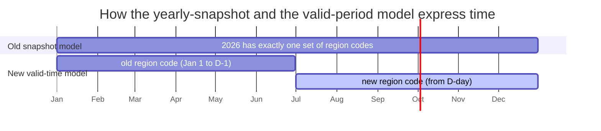
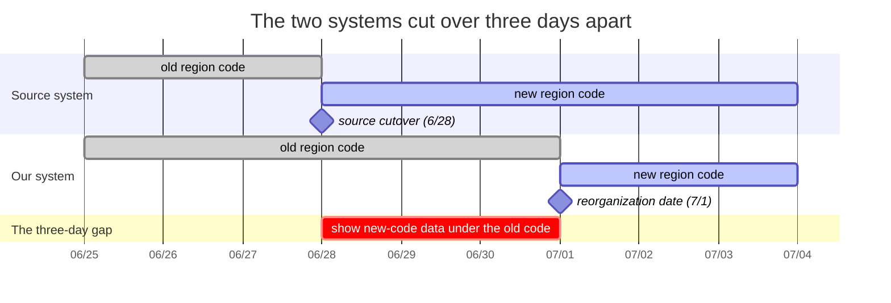
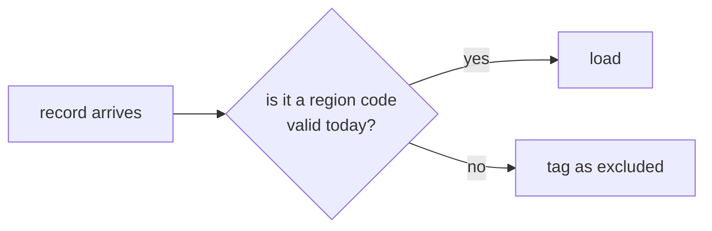
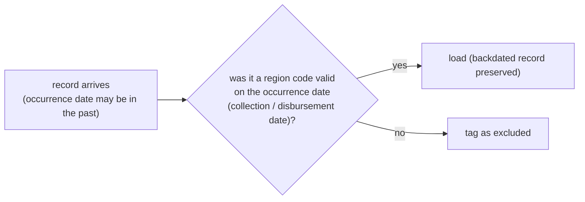
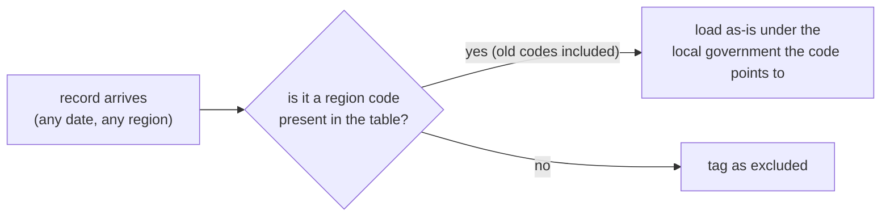
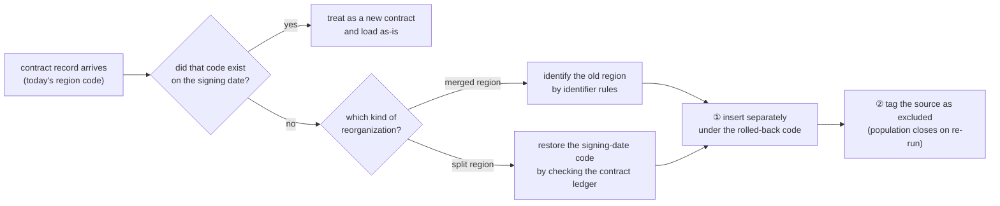

Say you run an airline's reservation system. One day the company announces a merger with another airline, and a notice comes down: at midnight, the identifier scheme that classifies reservations switches to a new one.

Except the partner agencies that handle ticketing switched three days early. For three days now, reservation data has been landing under identifiers nobody has seen before. And there is a batch job in the mix: if a reservation was there yesterday and is gone today, it counts as a no-show, and the batch closes it.

***A scheme change, a cutover three days early, and a batch that reads absence as termination. On the day all three land at once, what happens?***

I spent six weeks on this. It was not an airline but a system that publishes local-government finance data; not flight reservations but administrative region codes; not a no-show batch but a valid-time history batch. Otherwise, the same.

---

# Summary

① (§1) The table that encodes administrative regions could only change once a year, which did not fit a requirement to change mid-year.<br>
**→ Redesigned the yearly code table into a day-grained valid-time history model.**
<br>

② (§2, §3) The upstream systems that send us source data were set to switch to the new regions ahead of us. Whether they would also resend data for the old regions, retroactively, was something we could not know in advance.<br>
**→ Rebuilt the batch so it judges and corrects new-format data and backdated data separately.**
<br>

③ (§4) The batch that aggregates the valid-time history was not idempotent under re-runs. A bad run would corrupt somewhere between 50,000 and 250,000 existing rows.<br>
**→ Recovered with a SQL statement that mimics the aggregation query.**

---

1. [A system that knows the year but not the day](#1-a-system-that-knows-the-year-but-not-the-day)
2. [The future, arriving three days early](#2-the-future-arriving-three-days-early)
3. [The past, arriving late](#3-the-past-arriving-late)
4. [Re-running a batch is not free](#4-re-running-a-batch-is-not-free)
5. [Back to the puzzle](#5-back-to-the-puzzle)
6. [Limitations](#6-limitations)
7. [Looking back](#7-looking-back)

---

# 1. A system that knows the year but not the day

On July 1, 2026, two top-tier local governments merged into one: Jeonnam Province and Gwangju combined into Jeonnam-Gwangju Metropolitan City. Which meant that the region codes that had classified the country's finance data for years would change at a preannounced midnight.

Our system refreshes and displays every local government's finance data on a daily cycle, split into four broad domains: revenue, expenditure, contracts, and procurement. Each record is classified by a region code, which you can think of as a kind of postal code. Because local governments can change, the system keeps a code table with each year's region codes. In 2026, Seoul's Jongno-gu is 1111000, Busan's Yeonje-gu is 2623000, and so on.

The problem is that this table can answer "the region in 2026" but not "the region up to June 30, 2026." Its time resolution only reaches the year. Which is fair enough, because a wholesale mid-year reorganization of administrative regions had never happened in this system's lifetime before now[^convention].

So what happens if we meet the reorganization date as is? Data for the new regions, arriving from July 1, has no region code and cannot be queried. Fine, then swap everything to the new codes? Drop Jeonnam, say, and put in the code for Jeonnam-Gwangju Metropolitan City. No good: now you cannot query last June's Jeonnam data. Then keep both, old and new? Leave Jeonnam in place and add Jeonnam-Gwangju as well? Also no good, because today's table cannot express "it is Jeonnam through June, and Jeonnam-Gwangju from July." Either way, one code table cannot hold two eras.

So we decided to raise the time resolution: manage region codes per day rather than per year. Give each region code a start date and an end date, and when a reference date is supplied, hand back the answer as of that moment. This model already has a name. It is **valid-time history** (in Korean, *seonbun-iryeok*, a "line-segment history").



It is not free. A single query can now return two rows. This is for legacy compatibility: the old table sometimes gave one region several region codes. The price is that every read now has to "pick the one valid row for itself"[^overlap]. And the invariant that prevents overlap lives not in the schema but in a somewhat fragile verbal agreement: don't insert overlapping periods.

Still, the system can now express something finer than the year. The next problem was that not everyone moves on our schedule.

---

# 2. The future, arriving three days early

The source systems, the upstream systems that send us data, switched to the new region codes three days before the reorganization date. We are supposed to show the new regions from July 1, but data for the new regions started arriving on June 28.

So for three days, from June 28 until midnight on June 30, we had to deceive the site's users. Data stamped as Mokpo City in the merged metropolis had to be rolled back to Jeonnam's Mokpo; Gwangsan-gu in the merged metropolis, back to Gwangju's Gwangsan-gu. Through June, the new regions were not supposed to show their face at all.



Rolling back has one hard part. A region that split has an obvious parent. A region that merged does not: we cannot tell which region a given record belonged to yesterday. Why does the parent matter? Suppose on June 28 we receive expenditure data for the head office of Jeonnam-Gwangju Metropolitan City. **Should this roll back to the Jeonnam head office, or the Gwangju head office?**

This is not confined to expenditure. The four domains have different source systems and different people running them. In other words, for three days we were running a kind of black-box test without knowing how the external agencies had changed their data. So our team had to track down a contact for each domain and wage a small intelligence war. This identifier didn't change, apparently; that identifier changed in such-and-such a way.

Fortunately, the system keeps yesterday's data. For expenditure data, for instance, we can look up which region a given program belonged to before, find the precedent from the previous day, and roll it back to that region[^lineage].

This method has a gap too. If a program was created for the first time, there is no precedent to roll back to. And each domain's identifiers look different, some use composite keys, and the usage patterns vary. So for three full days we had to pour everything into understanding the shape of the new data and correcting it.

At a glance, it looked like bolting a rollback feature onto the aggregation batch was all that was left. That was, of course, only the beginning.

---

# 3. The past, arriving late

After July 1, our team acquired a new morning routine. The source systems frequently sent data for the old administrative regions. Keep it, or drop it? A headache. Some domains' historical data looked like it should be kept; other domains' looked like it should be thrown away.

So we started with a crude method. First, exclude all data for the old regions from loading. Overnight, the system tags them as excluded; in the morning, a person comes in, reviews the exclusion list, and keeps what should be kept and drops what should be dropped. It was safety-first, conservative operations, and for the first few days that was reasonable. The problem was that the routine showed no sign of ending.

The reorganization was one day, but the backdated data kept coming, every day. There were many cases, and the basis for judgment shifted from one to the next. So we decided to lay out every case on a sheet of A4 paper. After ten days of daily monitoring, we could set up four broad rules[^spectrum]. Note that the unit of a rule was not the domain but the table: within the same domain, the rule changed depending on how the table behaved.

**① The expenditure list and procurement exclude data for old regions, with no exceptions.** Observation showed that these domains have no retroactive sends. A program list arriving after the reorganization under an old Jeonnam code, say, is treated as not a legitimate historical record and tagged as excluded.



**② Revenue and disbursements keep backdated data on the basis of the date it occurred.** Collected and disbursed amounts often came in retroactively under an old region. For instance, an old region's January disbursement is returned as a negative amount, and the same amount is re-entered as a positive in June[^refund]. So we had to load it under the region code that was valid on the date the event occurred, not the date the data was sent.

This way of managing things already has a name. The time it happened is *valid time*; the time it was recorded is *transaction time*[^sql2011]. This was data whose valid time is in the past but whose transaction time is today.



**③ Expenditure detail loads any region at all, regardless of the reorganization.** There is real demand to amend past disbursement amounts. Even after Incheon's Jung-gu was dissolved[^incheon], data correcting Jung-gu-era disbursement detail keeps arriving. So we load it under the most recent applicable region code. It has the loosest rule of the four.



**④ Contracts roll back to the local government as of the day the contract was signed, and are re-loaded.** A contract is a fixed fact. Contract information signed in 2024 must belong to the original local government. But the data always arrives stamped with today's region code. Load the new code as-is, and a single contract ends up split across two regions.

How do we find the original local government? It splits in two, depending on the nature of the reorganization. For a merged region, solve it the same way as in §2: work the identifier to tell whether it was Jeonnam or Gwangju. For a split region, it is a little different: look up the previous contract number and restore the region that was valid on the contract date.

Then load both separately. Tag the source as excluded too, so a downstream batch does not double-process it.


<br><br>

The batch holding the four rules was implemented in three passes. Only on the third did the morning routine become a batch. People no longer judge; they review the verdicts the batch leaves behind.

Looking back, the hard hours were not the ones spent writing code but the ones spent reading each domain's patterns and setting up the rules.

---

# 4. Re-running a batch is not free

To tell this chapter, I need a bit more setup.

Our site's expenditure domain shows how much money a local government disbursed on which program. Seoul's head office program ["Operation of the 119 Emergency Rescue Situation Center"](https://www.lofin365.go.kr/portal/LF3120204.do?dbizCd=61100002016304F6&lafCd=1100000&fyr=2026&inqYmd=20260714), for instance, started on January 1, 2026 and has been disbursing various personnel costs in a steady stream. The number of such programs running across the country reaches 450,000.

Programs follow a valid-time history (in fact, the new code table was modeled on this). Because programs have a valid period. But our system's valid-time history differs from a textbook valid-time state table in two ways.

- One is the interval notation. The textbook recommends a half-open interval `[start, end)` that leaves the end point open[^snodgrass]; we use a closed interval `[start_date, end_date]` that includes both ends. The end date is written as "the day before the next disbursement date, or the end of the fiscal year if there is none." Here, the end of the fiscal year is a sentinel value meaning "still in progress."

- The other is more fatal. Instead of sending an event for each program's start and end, the source system sends the entire set of "programs valid as of today," all 450,000 of them, every day. News that a program has ended does not arrive; the program simply drops off the list, silently. So there is a closing batch that infers the end of a period from that absence[^antijoin].

That query is exactly what caused the trouble. We ran the new batch, and it produced not 450,000 rows but about 400,000. 50,000 rows had suddenly vanished. This kept happening, before and after the reorganization, and in the worst cases as many as 250,000 programs would disappear. As if manually correcting data were not keeping us busy enough, now we had corrupted data to worry about too. So why was "today's data" going intermittently empty?

We asked the tech support team for 1.3 GB of batch logs and reconstructed the timeline of the run passes[^rerun]. It turned out this batch was not idempotent. When the batch ran a second time, it ran excluding the first pass's work. Re-running, the single most common operational act, amounted to erasing data.

We had to bring the wrongly-closed programs back. Of all batches, this was the one that left no modification timestamp, and its log-style temp table is wiped on every run, so it was already at zero rows. This batch had no transaction time to trace what changed and when. At first I simply looked for programs closed yesterday and tried to reopen them. Wrong. A row corrupted by the non-idempotent batch and a legitimate row disbursed today are both taken as having closed yesterday. Reopen the legitimate rows along with the rest, and some programs can be counted twice.

The answer was to not pick out the wrongly-closed rows. The end date is not a value you store in the first place; it is derived from the disbursement date. So recompute the whole thing from disbursement dates. I had that formula reapplied to every row, sorting disbursement dates per program key[^history]. This way a legitimate row just comes out with the same value, and only a wrongly-closed row goes back to the sentinel, the end of the fiscal year, and reopens.

---

# 5. Back to the puzzle

Back to the puzzle from the opening. Where should the airline's engineer start?

Here is my answer: classify the axes of time hidden in the system. Two of them we have already met: valid time and transaction time. What this reorganization taught me is that our system had not just those two but a third axis.

Unlike the first two, our system's third axis was about the reference date by which a record is classified. The time along which the same code comes to mean a different thing depending on the moment, the way the region code "Jeonnam" points to Jeonnam through June and to the merged metropolis from July. The moment an administrative region is reorganized, an airline merges, an identifier scheme is replaced. I decided to call this **scheme time**.

When the three clocks point to the same instant, they look like one. The reorganization tore the three apart overnight. Scheme time changed the classification (§1); transaction time overtook valid time and carried in, three days early, a future that had not yet arrived (§2); valid time fell behind transaction time and let slip a past that had already gone by (§3).

The administrative reorganization was an expensive invoice, itemizing the fact that the one clock I thought I had was really three.

---

# 6. Limitations

**We did not fix the batch's idempotency problem.** This time we used the workaround of correcting the input and loading manually. It needs to be changed so that a re-run is wholly identical to the first run, even when no one is paying attention.

**The expenditure batch's consistency is still not guaranteed.** When the period continuity of expenditure data breaks, we have to analyze the query and correct it by hand, as we do now. What is needed is a safeguard that prevents the bad load in the first place.

**The new code table depends on a verbal agreement.** What prevents period overlap in the table is the team's verbal agreement, not the schema. Unlike code, an agreement is not enforced, so its force can fade over time.

**The new batch does not induce explicit failure.** The newly built pre-correction batch does not surface its mistakes explicitly. It just raises an "excluded" flag and moves on. A serious problem will surface when a downstream batch fails, but a subtle problem that does not match requirements may go undiscovered.

---

# 7. Looking back

It was a journey of identifying and classifying the three clocks the system uses.

| Implicit assumption | Where it broke | Replacement design |
|---|---|---|
| The classification is independent of time | §1 (the reorganization notice) | valid-period code table |
| Data arrives only after it becomes valid | §2 (the cutover three days early) | roll the arrival time back to the valid time |
| The day it arrived is the day it happened | §3 (discovering the backdated data) | separate arrival date from occurrence date |

It was especially fun and useful to study valid-time history in depth, something I had always found hard to follow. The problem of handling time in a relational database has been studied for a long time and is even codified in a standard, and this work drew on that literature.

Thanks for reading.

---

# References

[^convention]: This was a special case. There used to be no such problem. When North Gyeongsang's Gunwi County becomes Daegu's Gunwi County, say, or North Jeolla becomes Jeonbuk Special Self-Governing Province, then, like pouring new wine into a new wineskin, all of the former local government's finance data has to be moved over: how much revenue was collected, which contracts were signed, which programs were running. Because that is a vast and tedious job, it was always handled by "reorganize the administrative region now, but reflect the finance data from the next fiscal year."

[^snodgrass]:
    > "The preferred representation of a period is a closed-open pair of datetimes." (Richard T. Snodgrass, [Developing Time-Oriented Database Applications in SQL](https://www2.cs.arizona.edu/~rts/tdbbook.pdf), Morgan Kaufmann, 1999, p. 91)

    It states the reason too. A closed-interval notation drags an annoying +1 correction into every query (p. 91). This is exactly why our system corrects the end date to "the day before the next disbursement date." As the price of choosing a closed interval, we pay the cost the book warned about in every formula.

[^sql2011]: These are terms fixed by the SQL:2011 standard.

    > "valid time, the time period during which a row is regarded as correctly reflecting reality by the user of the database. transaction time, the time period during which a row is committed to or recorded in the database." (Kulkarni & Michels, Temporal features in SQL:2011, ACM SIGMOD Record 41(3), 2012, §2.1, p. 35)

    SQL Server, MariaDB, Db2, and others implement this standard. There is a minor difference: SQL:2011 calls transaction time "system time."

    > "The name of the system-time period is specified by the standard as SYSTEM_TIME." (same paper, §2.1, p. 35)

    A table that expresses valid time and transaction time at once is called bitemporal. That is not a standard term. The title of §2.4 of the paper is "Bitemporal tables," but the authors note that the name comes not from the standard but from the literature and some products' conventions.

    > "Though SQL:2011 does not define any specific term for such tables, we use the term 'bitemporal tables' in keeping with its use in the literature as well as in some products." (same paper, p. 41, note 5)

[^overlap]: A defensive-pattern query that picks the one row valid on the reference date.
    ```sql
    SELECT ... FROM (
      SELECT ..., ROW_NUMBER() OVER (...) RN
      FROM code_table WHERE :ref_date BETWEEN valid_start AND valid_end
    ) WHERE RN = 1
    ```
    Omitting the defense causes two problems. On INSERT into a table with a UNIQUE constraint, it can stop with a duplicate-key error. That case is the better one, because it fails explicitly. An aggregation or read with no such constraint can have the join expand to two rows and double-count. It is a serious mistake that stays invisible until a human checks it by eye.

    The best direction is to forbid period overlap from happening in the first place. This has been discussed for a long time and a standard exists. SQL:2011 recommends the form `PRIMARY KEY (id_column, period_column WITHOUT OVERLAPS)`.
    > "it must be possible to forbid overlapping application-time periods, which can be specified with this syntax: ALTER TABLE Emp ADD PRIMARY KEY (ENo, EPeriod WITHOUT OVERLAPS)" (Kulkarni & Michels, [Temporal features in SQL:2011](https://sigmodrecord.org/publications/sigmodRecord/1209/pdfs/07.industry.kulkarni.pdf), SIGMOD Record 41(3), 2012, §2.2.1).

    Not everyone follows this, though.

    | DBMS | WITHOUT OVERLAPS |
    |---|---|
    | PostgreSQL | supported |
    | MariaDB | supported |
    | Oracle | not supported |
    | SQL Server | not supported |
    | MySQL | not supported |

    Source: [the modern-sql compatibility table](https://modern-sql.com/caniuse/without-overlaps-constraints)

[^lineage]: The query that decides whether a precedent exists.
    ```sql
    SELECT region_code
      FROM loaded_table
     WHERE program_key = :incoming_row.program_key
       AND :yesterday BETWEEN start_date AND end_date
    ```
    If a row valid on the previous day exists, roll back to its region code. If no such row exists, the data started for the first time during the transition period; with no precedent, the rollback passes through.

[^antijoin]: An anti-join query that closes out programs by comparing the previous day's active programs against today's data.
    ```sql
    UPDATE program_list SET end_date = yesterday
    WHERE active_through_yesterday
      AND NOT EXISTS (same business key in today's data)
    ```
    The correct formula for the end date is "the day before the next disbursement date, or the end of the fiscal year if there is none." The recovery puzzle in §4, telling wrongly-closed rows from legitimate ones, comes out of this formula.

[^history]: The recovery query that sorts disbursement dates per program key and recomputes the end date.
    ```sql
    MERGE INTO program_list T
    USING (
      SELECT ROWID AS rid,
             NVL( LEAD(disb_date) OVER (PARTITION BY program_key ORDER BY disb_date) - 1,
                  fiscal_year_end ) AS new_end_date
        FROM program_list
    ) S ON (T.ROWID = S.rid)
    WHEN MATCHED THEN UPDATE SET T.end_date = S.new_end_date
    ```
    Before running it, I backed up the original and first removed the rows after the reference date that the bad re-run had inserted.

[^rerun]: Reconstructing the re-run timeline. Here is how an interrupted first run and a re-run come to erase data.
    ```mermaid
    sequenceDiagram
        %% compact
        participant R as receiving table
        participant B as aggregation batch
        participant A as aggregation table
        participant C as closing logic

        Note over B: first run
        B->>A: aggregate some, then commit
        B->>R: mark as sent (removed from population)
        Note over B: interrupted
        Note over B: second run (re-run)
        B->>A: DELETE the whole day
        B->>A: re-aggregate only the "unsent" rows (a subset)
        C->>A: close out programs present yesterday, absent today
    ```

[^refund]: This is an act of a civil servant tidying up spending to match the reorganization. Two amounts differing only in sign arrive under a past occurrence date. This pair must not be excluded from loading even under an old region code. It is an obviously legitimate correction, and leaving it out can throw off the accounts.

[^spectrum]: It happened to come out to four, but that is separate from the number of domains. The tasklet looks like this:

    ```java
    static {
        // define, in order, the behavior for each receiving table
        on(table1).step("keep only codes valid on the collection date");
        on(table2).step("exclude all old codes");
        on(table3).step("exclude old codes")
                  .step("roll back to the old code and re-load")
                  .step("tag the rolled-back source as excluded");
    }

    void execute() {
        for (Table t : tables)
            for (Step s : t.steps)
                s.run();
    }

    // the spec-driven class and its builder methods
    private Meta on(String table)
    private Meta step(String action)
    ...
    ```

[^incheon]: In fact, Incheon's administrative regions changed on July 1 too (a late confession, in case the merged metropolis was already enough of a headache). Incheon's Jung-gu became Yeongjong-gu, Dong-gu became Jemulpo-gu, and Seo-gu was split into Seohae-gu and Geomdan-gu.
