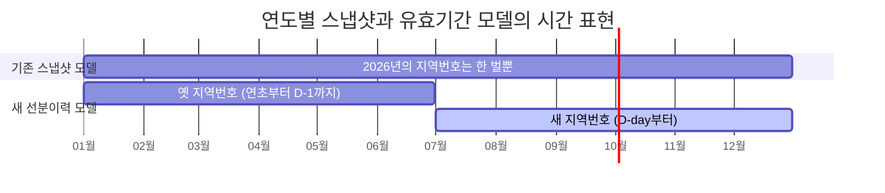
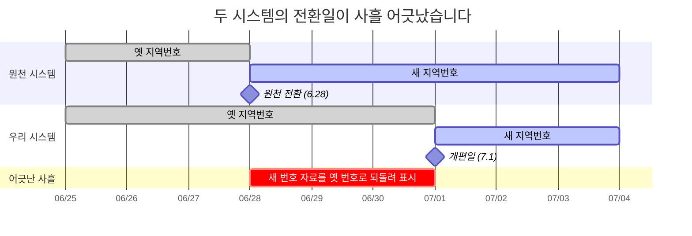
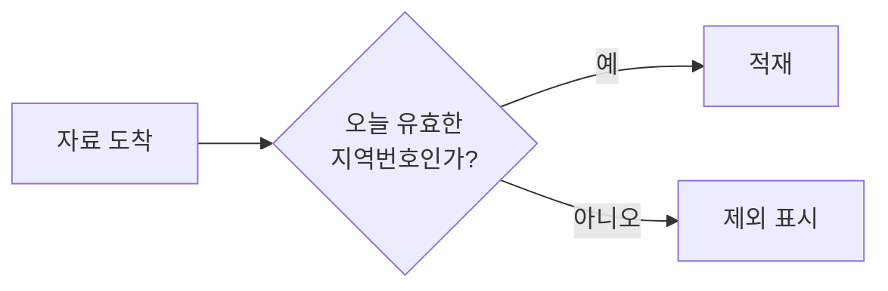
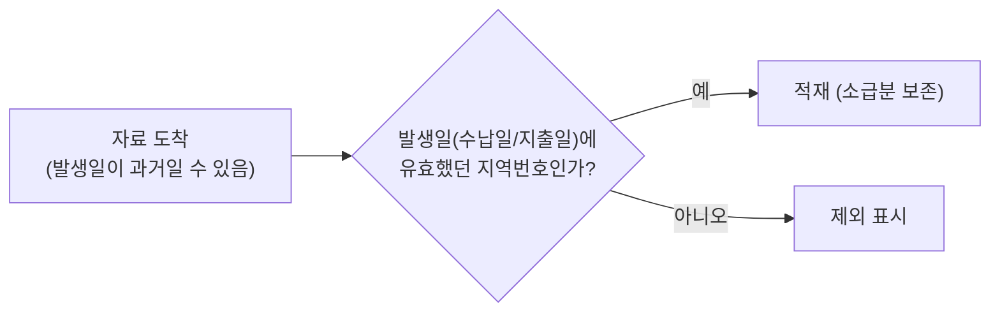
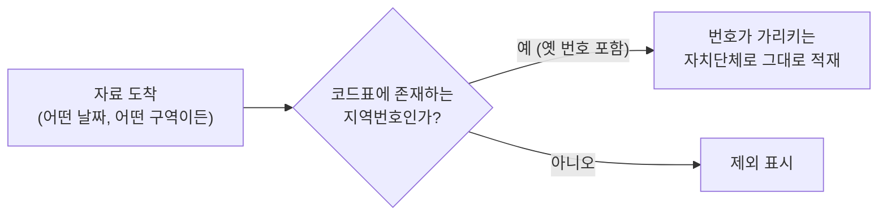
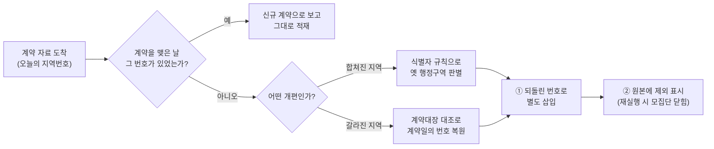

당신은 항공사의 예약 시스템을 담당하고 있습니다. 어느 날 회사가 다른 항공사와 통합된다고 합니다. 예약을 분류하는 식별 체계가, 자정을 기점으로 새 체계로 바뀐다는 공지가 내려옵니다.

그런데 발권을 대행하는 제휴사들은, 사흘 먼저 새 체계로 전환해 버렸습니다. 생전 처음 보는 식별자로 예약 데이터가 쌓이고 있는 상황입니다. 게다가 시스템에는 배치도 있습니다. 어제까지 있던 예약이 오늘 보이지 않으면, No-Show로 간주하고 예약을 닫습니다.

***식별 체계의 개편, 사흘 이른 전환, 부재를 종료로 간주하는 배치. 이 셋이 겹치는 날, 무슨 일이 벌어질까요?***

제가 한 달 반을 씨름한 문제입니다. 단지 항공사가 아니라 재정정보 공개 시스템이었고, 항공권 예약이 아니라 행정구역의 지역번호였으며, No-Show 배치가 아니라 재정정보의 선분이력 배치라는 점만 달랐습니다.

---

# 요약

① (1장) 행정구역을 나타내는 코드성 테이블이 1년 단위로만 변할 수 있어, 연중 변해야 하는 새로운 요구사항에 맞지 않았습니다.<br>
**→ 연도별 코드 테이블을 일별 선분이력 모델로 재설계했습니다.**
<br>

② (2, 3장) 원천 자료를 송신하는 시스템들이, 우리보다 앞서 개편된 행정구역의 자료를 보내기로 되어 있었습니다. 과거 행정구역의 자료를 소급해 보내는지도 미리 알 수 없는 상황이었습니다.<br>
**→ 신규 형태의 자료와 소급분을 별도로 판정하고 보정하도록 배치를 재개편했습니다.**
<br>

③ (4장) 선분이력을 집계하는 배치가 재실행에 멱등하지 않았습니다. 잘못 실행하면 기존 자료를 25만~5만건 씩 오염시켜곤 했습니다.<br>
**→ 집계 쿼리를 모방한 SQL문으로 복원했습니다.**

---

1. [연도만 알고 일자는 모르는 시스템](#1-연도만-알고-일자는-모르는-시스템)
2. [사흘 먼저 도착한 미래](#2-사흘-먼저-도착한-미래)
3. [뒤늦게 도착한 과거](#3-뒤늦게-도착한-과거)
4. [재실행은 공짜가 아니다](#4-재실행은-공짜가-아니다)
5. [다시 퀴즈로](#5-다시-퀴즈로)
6. [한계](#6-한계)
7. [회고](#7-회고)

---

# 1. 연도만 알고 일자는 모르는 시스템

2026년 7월 1일, 두 광역자치단체가 하나로 합쳐졌습니다. 전라남도와 광주가 합쳐져 전남광주통합특별시가 되었거든요. 그 말은, 오랫동안 전국의 재정 자료를 분류해 온 지역번호가 예고된 자정을 기점으로 바뀐다는 뜻입니다.

저희 시스템은 전국 자치단체의 재정 자료들을 매일 단위로 갱신해 보여주는데, 크게 네 가지 도메인으로 나뉩니다. 세입, 세출, 계약, 발주입니다. 각 자료는 지역번호로 분류돼 있는데, 일종의 우편번호라고 생각하시면 됩니다. 자치단체가 바뀔 수도 있기 때문에, 시스템에는 해마다의 지역번호를 보유한 코드표가 있습니다. 2026년 서울 종로구는 1111000, 부산 연제구는 2623000... 이런 식입니다.

문제는 이 코드표는 "2026년의 지역"은 답할 수 있지만, "2026년 6월 30일까지의 지역"은 답할 수 없다는 겁니다. 시간의 해상도가 연도까지만 미치기 때문입니다. 그도 그럴 것이, 행정구역이 연중에 통째로 개편되는 일은 이 시스템이 태어난 뒤로 이번이 처음이었으니까요.[^convention]

이대로 개편일을 맞으면 어떻게 될까요? 7월 1일부터 도착하는 새 행정구역의 자료는 지역번호가 없어 조회할 수가 없게 됩니다. 그럼 새 지역번호로 모두 갈아끼우면 되겠군요? 가령 전남은 빼고, 전남광주특별시의 지역번호를 넣는 것이죠. 안 됩니다. 작년 6월의 전남 자료를 조회할 수 없게 되거든요. 그럼 옛것과 새것을 모두 유지하면요? 전남도 두고 전남광주특별시도 두면 되지 않을까요? 이것도 안 됩니다. 현재의 코드표는 "6월까지는 전남이고, 7월부터는 전남광주특별시다"를 표현할 수가 없어서요. 어느 쪽이든 현재의 코드표로 두 개의 시대를 표현할 수가 없습니다.

그래서 시간의 해상도를 높이기로 했습니다. 지역번호를 연도가 아닌 일자마다 관리하는 겁니다. 지역번호에 시작일과 종료일을 부여하고, 기준일이 주어지면 그 시점의 정답을 받아 가게 하면 됩니다. 이런 모델에는 이미 이름이 붙어 있습니다. **선분이력**입니다.



공짜는 아닙니다. 한 번의 쿼리에 두 행이 반환될 수도 있습니다. 레거시 호환 때문입니다. 기존 코드표는 하나의 지역이 다수의 지역번호를 갖기도 했거든요. 그 대가로 모든 조회는 "유효한 한 행을 스스로 골라야" 하는 비용을 치르게 되었습니다[^overlap]. 겹침을 막는 불변식은 스키마가 아니라, "같은 기간을 겹쳐 넣지 말자"는 다소 연약한 구두 약속으로 남게 되었습니다.

그래도 이제 시스템은 연도보다는 깊은 시간을 표현할 수 있게 되었습니다. 하지만 그 다음 문제는, 모두가 저희 일정표대로 움직여 주지는 않는다는 데 있었습니다.

---

# 2. 사흘 먼저 도착한 미래

원천 시스템, 그러니까 저희에게 자료를 보내 주는 상류 시스템은 개편일보다 사흘 먼저 새 지역번호로 전환했습니다. 우리는 7월 1일부터 새 행정구역을 보여줘야 하는데, 6월 28일부터 새 행정구역의 자료가 도착하기 시작한 것입니다.

그래서 6.28부터 6.30 자정 전까지 3일간 사이트 이용자들을 속여야 했습니다. 예컨대 통합특별시 목포시 자료는 전남 목포시로, 통합특별시 광산구는 광주 광산구로 되돌리는 식으로 말이죠. 6월에는 새 행정구역이 코빼기도 보이지 않아야 했거든요.



되돌리기에는 난제가 하나 있습니다. 갈라진 지역은 부모가 자명합니다. 하지만 합쳐진 지역은 부모를 알 수 없습니다. 그 자료가 어제까지 어느 지역 소속이었는지 알 수 없다는 뜻입니다. 부모가 왜 중요하냐구요? 6.28 전남광주통합특별시 본청의 세출 자료를 받았다고 가정합시다. **이 자료는 전남 본청으로 되돌려야 할까요, 광주 본청으로 되돌려야 할까요?**

세출에만 국한되는 문제가 아닙니다. 4개 도메인은 원천 시스템이 서로 다르고 담당자도 다릅니다. 즉 외부 기관이 자료를 어떻게 바꿨는지 모르는 상태에서, 3일간 일종의 블랙박스 테스트를 했던 겁니다. 때문에 저희 팀은 각 도메인별로 담당자를 수소문해 정보전을 벌여야 했습니다. 어떤 식별자는 변하지 않았다더라, 어떤 식별자는 어떻게 변했다더라..

다행히 시스템에는 어제의 자료가 남아있습니다. 예컨대 세출 자료는 같은 사업이 이전에 어느 지역에 속해 있었는지, 직전일의 선례를 찾아 그 지역으로 되돌리면 됩니다[^lineage].

다만 이 방법에도 빈틈은 있습니다. 만약 처음 생성된 사업이라면 되돌아갈 선례 자체가 없을 겁니다. 게다가 도메인마다 식별자의 생김새도 다르고, 복합 키를 사용하기도 해서 용례가 다양합니다. 때문에 꼬박 3일간 새로운 자료들의 생김새를 파악하고 보정하는 일에 온 힘을 쏟아야 했습니다.

얼핏 보기에는, 집계 배치에 되돌리기 기능만 덧대면 더 할 일은 없어 보였죠. 물론 이제 시작이었지만요.

---

# 3. 뒤늦게 도착한 과거

7.1 이후 저희 팀에는 새로운 아침 루틴이 생겼습니다. 원천 시스템들은 빈번히 옛 행정구역의 자료를 보내곤 했습니다. 이걸 살려야 하나 버려야 하나.. 골치 덩어리었죠. 어떤 도메인의 과거 자료는 살려야 할 것처럼 보였고, 어떤 도메인은 버려야 할 것처럼 보였거든요.

그래서 원시적인 방법을 먼저 사용했습니다. 일단 옛 행정구역의 자료는 모두 적재 대상에서 제외시킵니다. 밤사이 시스템이 제외 표시를 달아 두면, 아침에 사람이 출근해서 제외 명단을 확인해 살릴 것은 살리고 버릴 것은 버리는 겁니다. 안전을 우선한 보수적 운영이었고, 처음 며칠은 그럴 만했습니다. 문제는 이 루틴이 끝날 기미가 보이지 않았다는 것입니다.

개편은 하루였지만 소급 자료는 매일 왔습니다. 경우의 수가 많아 판단 기준도 그때마다 달랐습니다. 그래서 A4용지에 경우의 수를 총망라해 보기로 했습니다. 10일간 매일 모니터링한 결과, 규칙을 크게 네 가지로 세울 수 있었습니다[^spectrum]. 참고로 규칙의 단위는 도메인이 아니라 테이블이었습니다. 같은 도메인이라도 테이블의 양태에 따라 규칙이 달라졌기 때문입니다.

**① 세출 목록과 발주는, 옛 지역의 자료를 예외없이 제외합니다.** 관찰 결과 이 도메인들은 소급 송신이 없기 때문입니다. 가령 개편 후에 옛 전남 번호를 달고 도착한 사업 목록은, 정당한 과거 자료가 아니라고 보고 제외 표시를 답니다.



**② 세입과 지출은, 발생일 기준으로 소급분을 살립니다.** 수납이나 지출 금액은 옛 지역으로 소급해 들어오는 경우가 많았습니다. 예컨대 이전 행정구역의 1월 지출을 음수로 반납하고, 같은 금액을 6월에 양수로 다시 기재하는 식입니다[^refund]. 그래서 그 자료가 송신된 날짜가 아닌, 그 일이 일어난 날짜를 기준일로 삼아 유효했던 지역번호로 적재해야 했습니다.



**③ 세출 상세는, 개편과 관계 없이 어떠한 지역이든 전부 적재합니다.** 과거의 집행 금액을 고치려는 수요가 실재하기 때문입니다. 가령 인천 중구가 사라진 뒤에도[^incheon], 중구 시절의 집행 상세를 정정하는 자료는 계속 도착합니다. 그래서 해당하는 가장 최신의 지역번호로 적재합니다. 제일 느슨한 기준을 가진 셈이죠.



**④ 계약은, 계약을 맺은 날의 자치단체로 되돌려 다시 적재합니다.** 계약은 고정된 사실입니다. 2024년에 맺은 계약 정보는 반드시 최초 자치단체에 귀속되어야 합니다. 그런데 자료는 언제나 오늘의 지역번호를 달고 도착합니다. 새 지역번호를 그대로 적재하면, 하나의 계약에 두 지역이 공존하게 돼 버립니다.

최초 자치단체를 어떻게 찾아내야 할까요? 개편의 성격에 따라 둘로 갈립니다. 합쳐진 지역은 2장과 동일하게 해결하면 됩니다. 식별자를 잘 요리해 전남인지 광주인지 가려냅니다. 갈라진 지역은 조금 다릅니다. 이전 계약번호를 찾아 계약일에 유효했던 지역으로 복원합니다.

둘 다 별도로 적재합니다. 후속하는 배치가 중복 처리하지 않도록 제외 대상으로 표기도 달아 두고요.


<br><br>

4개의 규칙을 담은 배치는 세 번에 걸쳐 구현했습니다. 세 번째에 이르러서야 아침 루틴은 배치가 되었습니다. 사람은 이제 판단하지 않고, 배치가 남긴 판정 결과를 검토합니다.

돌이켜 보면 코드를 짠 시간보다, 도메인마다 패턴을 보고 규칙을 세우는 것이 고됐던 시간이었습니다.

---

# 4. 재실행은 공짜가 아니다

이번 장을 이야기하려면, 부연이 조금 더 필요합니다.

우리 사이트의 세출 도메인은 지방자치단체가 어떤 사업에 돈을 얼마나 집행했는지를 보여줍니다. 가령 서울 본청의 "[119구급상황관리센터 운영](https://www.lofin365.go.kr/portal/LF3120204.do?dbizCd=61100002016304F6&lafCd=1100000&fyr=2026&inqYmd=20260714)" 사업은 2026년 1월 1일에 시작해 각종 인건비를 촘촘히 지출하고 있습니다. 이렇게 운영되는 전국의 모든 사업 개수는 45만건에 이릅니다.

사업은 선분이력을 따릅니다(사실 새로운 코드표도 이걸 보고 따라 만들었습니다). 사업은 유효기간이 있기 때문입니다. 다만 저희 시스템의 선분이력은, 교과서적인 유효시간(valid time) 상태 테이블과는 두 가지가 다릅니다.

- 하나는 구간의 표기입니다. 교과서는 종료 시점을 열어 두는 반개구간 `[시작, 끝)`을 권하지만[^snodgrass], 우리는 양끝을 모두 포함하는 폐구간 `[시작일, 종료일]`을 씁니다. 종료일은 "다음 집행일의 전날, 없으면 회계연도 말"로 표기합니다. 여기서 회계연도 말은 "아직 진행 중"을 나타내는 센티넬 값입니다.

- 다른 하나는 더 치명적입니다. 원천 시스템은 사업마다 시작과 종료를 알리는 이벤트를 보내는 대신, "오늘 기준으로 유효한 사업 전량" 45만건을 매일 통째로 보냅니다. 어떤 사업이 끝났다는 소식이 오는 게 아니라, 그냥 말없이 목록에서 빠질 뿐입니다. 그래서 부재로부터 기간의 종료를 추정하는 마감 배치가 존재합니다[^antijoin].

바로 이 쿼리가 문제를 일으켰습니다. 새 배치를 돌렸더니 45만건이 아니라 40만여건이 된 겁니다. 5만건이 갑자기 사라진 거죠. 이 문제는 개편 안팎으로 계속 발생해서, 최대 25만여건의 사업이 사라지는 경우도 있었습니다. 안 그래도 데이터를 수동 보정하기 바쁜데, 오염된 데이터까지 신경써야 했던 겁니다. 그렇다면 왜 "오늘 자료"가 간헐적으로 비게 되었을까요?

기술지원팀에 요청해 1.3GB 분량의 배치 로그를 확보하고, 실행 회차의 타임라인을 재구성했습니다[^rerun]. 알고 보니 이 배치는 멱등하지 않았습니다. 배치가 2회차로 재실행되면, 1회차 실행분을 제외하고 실행되었던 겁니다. 재실행이라는 가장 흔한 운영 행위가 데이터를 지우는 꼴이 된 셈입니다.

잘못 닫힌 사업들을 되살려야 했습니다. 하필 이 배치만 수정 시각을 남기지 않았고, 로그성 임시 테이블은 매 실행마다 지워지는 구조라 이미 0건이었습니다. 처음에는 단순히 어제 종료된 사업들을 찾아 되돌려 봤습니다. 틀렸습니다. 멱등하지 않은 배치가 오염시킨 행과, 오늘 집행된 정상 행은 동일하게 어제 종료된 것으로 간주되기 때문입니다. 정상 행까지 함께 열리면 어떤 사업은 두 번 집계될 수 있습니다.

해답은 잘못 닫힌 행을 골라내지 않는 것이었습니다. 종료일은 애초에 저장하는 값이 아니라, 집행일에서 파생되는 값입니다. 그러니 집행일로 전체를 다시 계산하면 됩니다. 사업 키별로 집행일을 정렬해 그 계산식을 모든 행에 다시 적용토록 했습니다[^history]. 이러면 정상 행은 같은 값이 나올 뿐이고, 잘못 닫힌 행만 센티넬인 회계연도 말로 되돌아가 다시 열립니다.

---

# 5. 다시 퀴즈로

서두의 퀴즈로 돌아가겠습니다. 항공사 담당자는 어디부터 손을 대야 할까요.

제 답은 이렇습니다. 시스템에 숨겨진 시간의 축을 분류해 보는 겁니다. 두 개는 이미 잘 알려져 있습니다. 사건이 발생한 시간인 **유효시간**(valid time)과, 사건을 알게 된 시간인 **트랜잭션 시간**(transaction time)입니다[^sql2011]. 이번 개편이 가르쳐 준 것은, 우리 시스템에 그 둘뿐만 아니라 세 번째 축이 있었다는 겁니다.

앞의 두 축과는 다르게, 우리 시스템의 세 번째 축은 그 자료를 분류하는 기준일에 관한 것이었습니다. 전남이라는 지역번호가 6월까지는 전남을, 7월부터는 통합특별시를 가리키듯, 같은 코드가 시점에 따라 다른 대상을 뜻하게 되는 시간. 행정구역이 개편되고, 항공사가 합병되고, 식별 체계가 교체되는 순간입니다. 저는 이것을 **체계의 시간**이라 부르기로 했습니다.

세 시계가 같은 시각을 가리킬 때에는 하나처럼 보입니다. 개편은 그 셋을 하루아침에 찢어 놓았습니다. 체계의 시간이 분류 기준을 바꿨고(1장), 트랜잭션 시간이 아직 유효하지 않은 미래를 사흘 빠르게 실어 왔고(2장), 유효시간이 이미 지나간 과거를 소급해 흘려보냈습니다(3장).

행정구역 개편은 하나인 줄 알았던 시계가 사실 셋이었음을 알려주는 비싼 청구서였던 셈입니다.

---

# 6. 한계

**배치의 멱등성 문제를 고치지 못했습니다.** 이번에는 입력을 보정해 수동으로 적재하는 우회책을 썼습니다. 사람이 신경쓰지 않더라도 재실행이 온전히 처음 실행과 같도록 바꿔야 합니다.

**세출 배치의 정합성은 여전히 보장받지 못합니다.** 세출 자료의 기간 연속성이 깨지면, 지금과 같이 쿼리를 분석해 수동 보정해야 합니다. 애초에 잘못된 적재를 막을 수 있는 안전장치가 필요합니다.

**새 코드표는 구두 약속에 의존합니다.** 코드표의 기간 겹침을 막는 것은 스키마가 아니라 팀의 구두 약속입니다. 약속은 코드와 달리 강제되지 않으므로 시간이 지나 강제성이 옅어질 수 있습니다.

**새 배치는 명시적 실패를 유도하지 않습니다.** 새로 만들어진 사전 보정 배치는 잘못을 명시적으로 드러내지 않습니다. 오로지 "제외 대상" 플래그만을 세운 채 넘어갑니다. 중대한 문제는 후속하는 배치가 실패하며 떠오르겠지만, 요구사항과 맞지 않는 미묘한 문제는 발견하지 못할 수 있습니다.

---

# 7. 회고

시스템에서 사용하는 세 개의 시계를 식별하고 분류해 내는 여정이었습니다.

| 암묵적 가정 | 깨진 곳 | 교체된 설계 |
|---|---|---|
| 분류 기준은 시점과 무관하다 | 1장 (개편 공지) | 유효기간 코드표 |
| 자료는 유효해진 뒤에야 도착한다 | 2장 (사흘 이른 전환) | 도착 시점을 유효 시점으로 되돌림 |
| 도착한 날이 곧 일어난 날이다 | 3장 (소급분 발견) | 도착일/발생일 분리 |

특히 평소에 이해가 어렵던 선분이력을 깊게 공부하게 돼 재밌고 유익한 시간이었습니다. 관계형 데이터베이스에 시간을 다루는 문제는 이미 오래전부터 연구되어 표준으로도 정리되어 있었고, 이번 작업도 그 논의를 참고해 진행했습니다.

긴 글 읽어주셔서 감사합니다.

---

# References

[^convention]: 이번이 특이 케이스입니다. 예전엔 이런 문제가 없었습니다. 가령 경북 군위군이 대구 군위군이 되면, 또는 전라북도가 전북특별자치도가 되면, 새 술을 새 부대에 옮기듯 이전 자치단체의 재정 정보들을 모두 옮겨 담아야 합니다. 수입은 얼마나 걷혔는지, 맺어진 계약은 어떤 것들인지, 어떤 사업을 벌이고 있었는지.. 방대하고 번거로운 작업이기 때문에, 예전에는 늘 "행정구역은 지금 개편하되, 재정 정보는 다음 회계연도부터 반영"하는 식으로 진행해 왔습니다.

[^snodgrass]:
    > "The preferred representation of a period is a closed-open pair of datetimes."(반개구간 기간을 쌍으로 표현하는 것을 권장한다, Richard T. Snodgrass, [Developing Time-Oriented Database Applications in SQL](https://www2.cs.arizona.edu/~rts/tdbbook.pdf), Morgan Kaufmann, 1999, p. 91)

    이유도 명시합니다. 폐구간 표기는 쿼리마다 성가신 +1 보정이 끼어들기 때문입니다(p. 91). 우리 시스템에서 "다음 집행일의 전날"로 종료일을 보정하는 것이 바로 이 때문입니다. 폐구간을 고른 대가로 책이 경고한 비용을 계산식마다 지불하고 있는 셈입니다.

[^sql2011]: > "valid time, the time period during which a row is regarded as correctly reflecting reality by the user of the database. transaction time, the time period during which a row is committed to or recorded in the database."(유효시간은 한 행이 현실을 올바르게 반영한다고 여겨지는 기간이고, 트랜잭션 시간은 한 행이 DB에 기록되어 있는 기간이다, Kulkarni & Michels, Temporal features in SQL:2011, ACM SIGMOD Record 41(3), 2012, §2.1, p. 35)

    SQL Server, MariaDB, Db2 등이 이 표준을 구현합니다. 다만 SQL:2011은 트랜잭션 시간을 시스템 시간이라고 부르는, 사소한 차이는 있습니다.

    > "The name of the system-time period is specified by the standard as SYSTEM_TIME."(시스템시간 기간의 이름은 표준에서 SYSTEM_TIME으로 정해져 있다, 위 논문 §2.1, p. 35)

    유효시간과 트랜잭션 시간을 동시에 나타내는 테이블은 바이템포럴(bitemporal)이라 부릅니다. 표준 용어는 아닙니다. 논문 §2.4의 제목은 "Bitemporal tables"이지만, 저자들은 각주로 그 이름이 표준이 아니라 문헌과 일부 제품의 관행에서 비롯됐다고 밝힙니다.

    > "Though SQL:2011 does not define any specific term for such tables, we use the term 'bitemporal tables' in keeping with its use in the literature as well as in some products."(SQL:2011은 그런 테이블을 가리키는 특정 용어를 정의하지 않지만, 문헌과 일부 제품의 관행에 따라 '바이템포럴 테이블'이라 부른다, 위 논문 p. 41, 각주 5)

[^overlap]: 기준일에 유효한 한 행을 선택하는 방어 패턴 쿼리.
    ```sql
    SELECT ... FROM (
      SELECT ..., ROW_NUMBER() OVER (...) RN
      FROM 코드표 WHERE 기준일 BETWEEN 유효시작일 AND 유효종료일
    ) WHERE RN = 1
    ```
    방어가 누락되면 두 가지 문제가 생깁니다. UNIQUE 제약이 있는 테이블에 INSERT 시 중복 키 오류로 멈출 수 있습니다. 이 경우는 명시적으로 실패하니 그나마 낫습니다. 제약이 없는 집계나 조회는 조인이 두 행으로 늘어나 중복 집계될 수도 있습니다. 사람이 눈으로 확인하기 전까지는 모르게 될 중대한 실수입니다.

    가장 좋은 방향은 기간 겹침이 애초에 발생하지 않도록 강제하는 겁니다. 이 문제는 꽤 오래 논의되었고 표준도 존재합니다. SQL:2011에서는 `PRIMARY KEY (식별컬럼, 기간컬럼 WITHOUT OVERLAPS)` 형태로 사용하라고 권고합니다.
    > "it must be possible to forbid overlapping application-time periods, which can be specified with this syntax: ALTER TABLE Emp ADD PRIMARY KEY (ENo, EPeriod WITHOUT OVERLAPS)"(겹치는 유효기간을 금지할 수 있어야 하며, 이는 다음 구문으로 지정한다, Kulkarni & Michels, [Temporal features in SQL:2011](https://sigmodrecord.org/publications/sigmodRecord/1209/pdfs/07.industry.kulkarni.pdf), SIGMOD Record 41(3), 2012, §2.2.1).

    다만 모두가 이 표준안을 따르는 것은 아닙니다.

    | DBMS | WITHOUT OVERLAPS |
    |---|---|
    | PostgreSQL | 지원 |
    | MariaDB | 지원 |
    | Oracle | 미지원 |
    | SQL Server | 미지원 |
    | MySQL | 미지원 |

    출처: [modern-sql 호환성 표](https://modern-sql.com/caniuse/without-overlaps-constraints)

[^lineage]: 이전 선례가 있는지 판별하는 쿼리.
    ```sql
    SELECT 지역번호
      FROM 적재 테이블
     WHERE 사업 키 = :수신행.사업 키
       AND :어제 BETWEEN 시작일 AND 종료일
    ```
    직전일에 유효한 행이 있으면 그 지역번호로 되돌립니다. 그런 행이 없다면 전환 기간에 처음 시작된 자료라는 뜻이고, 선례가 없으므로 되돌리기는 통과합니다.

[^antijoin]: 전일 활성 사업과 당일 자료를 대조해 종료시키는 안티조인 쿼리.
    ```sql
    UPDATE 사업목록 SET 종료일 = 어제
    WHERE 어제까지 활성
      AND NOT EXISTS (당일 자료에 같은 업무 키)
    ```
    종료일의 정상 계산식은 "다음 집행일의 전날, 없으면 회계연도 말"입니다. 잘못 닫힌 행과 정상 행을 골라내는 4장의 복구 난제가 이 계산식에서 나옵니다.

[^history]: 사업 키별로 집행일을 정렬해 종료일을 다시 계산하는 복구 쿼리.
    ```sql
    MERGE INTO 사업목록 T
    USING (
      SELECT ROWID AS rid,
             NVL( LEAD(집행일) OVER (PARTITION BY 사업키 ORDER BY 집행일) - 1,
                  회계연도말 ) AS 새_종료일
        FROM 사업목록
    ) S ON (T.ROWID = S.rid)
    WHEN MATCHED THEN UPDATE SET T.종료일 = S.새_종료일
    ```
    실행 전에 원본을 백업하고, 잘못된 재실행이 삽입한 기준일 이후 행을 먼저 제거했습니다.

[^rerun]: 재실행 타임라인의 재구성. 중단된 1차 실행과 재실행이 데이터를 지우게 되는 경위는 다음과 같습니다.
    ```mermaid
    sequenceDiagram
        participant R as 수신 테이블
        participant B as 집계 배치
        participant A as 집계 테이블
        participant C as 마감 로직

        Note over B: 1차 실행
        B->>A: 일부 집계 후 커밋
        B->>R: 전송 완료 표시 (모집단에서 제외)
        Note over B: 중단
        Note over B: 2차 실행 (재실행)
        B->>A: 그날치 전량 DELETE
        B->>A: "미전송" 행만 재집계 (부분집합)
        C->>A: 어제 있고 오늘 없는 사업 일괄 종료
    ```

[^refund]: 공무원이 행정구역 개편에 맞게 지출을 정리하는 행위입니다. 부호만 반대인 두 금액이 과거의 발생일로 도착합니다. 이 쌍은 옛 지역번호라도 적재를 제외시켜서는 안 됩니다. 명백히 정당한 정정이니 회계가 어긋날 수 있습니다.

[^spectrum]: 어쩌다 보니 4개가 되었습니다만, 도메인 수와는 별개입니다. Tasklet은 이렇게 생겼습니다:

    ```java
    static {
        // 수신 테이블마다 행동을 순서대로 정의
        on(테이블1).step("수납일에 유효했던 코드만 남긴다");
        on(테이블2).step("옛 코드를 전량 제외한다");
        on(테이블3).step("옛 코드를 제외한다")
                  .step("옛 번호로 되돌려 다시 적재한다")
                  .step("되돌린 원본에 제외 표시를 단다");
    }

    void execute() {
        for (Table t : tables)
            for (Step s : t.steps)
                s.run();
    }

    // 명세로 동작하는 클래스와 빌더 메소드
    private Meta on(String table)
    private Meta step(String action)
    ...
    ```

[^incheon]: 사실 7.1에는 인천의 행정구역도 바뀌었습니다(통합특별시로도 머리가 충분히 아프실까봐 뒤늦게 고백합니다). 인천 중구는 영종구로, 인천 동구는 제물포구로, 인천 서구는 쪼개져 서해구와 검단구로 바뀌었습니다.