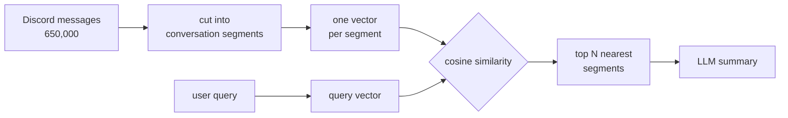
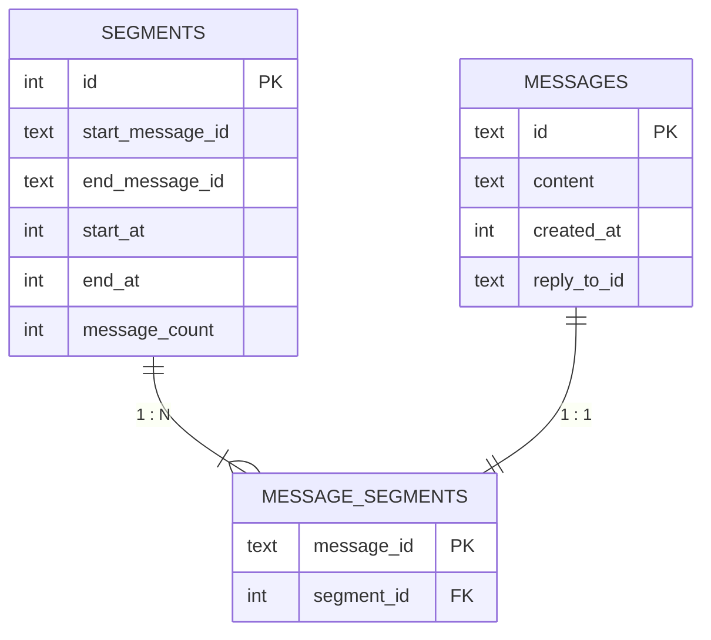
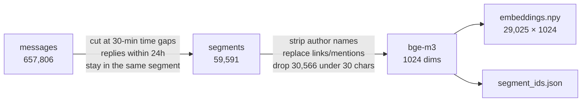
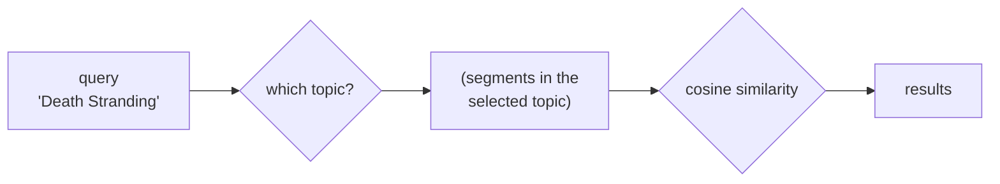
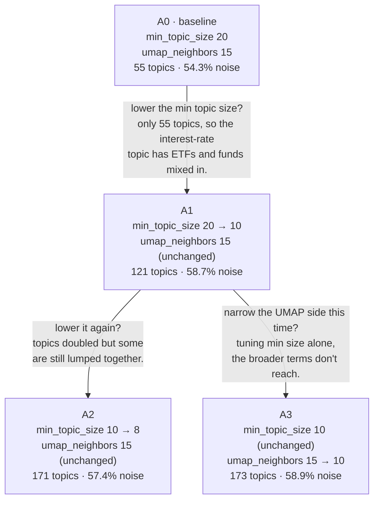

My high-school friends and I trade small talk on Discord instead of KakaoTalk. Six years of it adds up to a lot of messages — about 650,000. Which makes digging up something we talked about ages ago genuinely hard.

So I built one: a privacy-preserving Discord search bot running on a local EXAONE model.

<style>
.discord-search-bot-figure1,
.discord-search-bot-figure2 {
  width: 100%;
  height: auto;
}
@media (min-width: 769px) {
  .discord-search-bot-figure1,
  .discord-search-bot-figure2 {
    width: 70%;
  }
}
</style>


---

1. [Do We Just Throw an LLM at It?](#1-do-we-just-throw-an-llm-at-it)
2. [Embedding Search and the Search Pipeline](#2-embedding-search-and-the-search-pipeline)
3. [A Conversation Search Engine Is a Privacy Search Engine](#3-a-conversation-search-engine-is-a-privacy-search-engine)
4. [First Attempt: reply-link](#4-first-attempt-reply-link)
5. [Second Attempt: an Embedding Search Engine](#5-second-attempt-an-embedding-search-engine)
6. [Third Attempt: BERTopic](#6-third-attempt-bertopic)

---

# 1. Do We Just Throw an LLM at It?

At first I thought about it like this.

> What if I pour all the messages into Elasticsearch and build an inverted index?

But an inverted index needs me to know the exact words that were in the conversation I'm looking for.

> Then what if I use something like Word2Vec to find similar words?

But Word2Vec gives one vector per word, so it doesn't capture context.

So I asked Claude.

> 👤 Me
>
> : I'm a junior backend developer with no ML experience. My friends and I have been talking on Discord for years, and I want to build something that takes a range of messages and shows me the topics in it.
>
> 🤖 Claude
>
> : Since you said you have no ML experience, let me build up from the concepts. The short version: a four-stage pipeline — **group messages into conversations → embed → clustering-based topic modeling → LLM summary** — is the modern standard approach to this problem.

Here is the core idea. Split the conversation into chunks. Embed the chunks. When the user throws a query at it, turn the query into a vector too. Use cosine similarity to find the chunks most like the query.

Go a step further and hand those similar chunks to an LLM, and you get a more coherent answer.



The literature calls this semantic retrieval — literally, methodology for retrieving meaning.

---

# 2. Embedding Search and the Search Pipeline

The gif at the top follows this process[^seqdiag].
```
query "who said they were moving last year?"
   |
   v
subquery A "moving"       subquery B "finding a place"   -- (1) LLM splits the query
   |                          |
   v                          v
[API] embedding + keyword  [API] embedding + keyword      -- (2) hybrid search
   |  top 40                  |  top 40
   v                          v
[API] rescore -> sort      [API] rescore -> sort          -- (3) rescoring
   |  ranked list A           |  ranked list B
   +------------+-------------+
                v
          [bot] fuse with RRF                             -- (4) RRF
                v
          [bot] LLM summary
```

Step by step.

(1) **Query decomposition** — why is it needed? Because some sentences blur time, people, and events together. Embed "who said they were moving last year?" whole and you get a smeared vector. I solved it by splitting the query into short search terms and searching each one[^querydecomp].

(2) **Hybrid search** — why is it needed? Because embeddings are weak on proper nouns. Ask "find the stuff about Death Stranding" and it would surface conversations that had nothing to do with the game. I solved it by mixing in keyword-search results[^hybrid].

(3) **Rescoring** — why is it needed? Because finding a chunk similar to the query doesn't mean that chunk fully represents the relevance. Ask "find the conversation about the thesis" and a real conversation about a thesis and one that merely contains the word "thesis" once would both land in the top results. I solved it by rescoring the segment message by message[^rerank].

(4) **RRF** — why is it needed? Because you have to normalize across the related chunks. Say "moving" is a common word and tends to score around 0.6, while "finding a place" is rare and tends to score around 0.4. Line the segments up as-is and everything about "moving" sits at the front while everything about "finding a place" sits at the back. This problem has a classic solution, and I just followed it[^rrf].

### What I didn't hand to the LLM

At first I had the LLM pull out people's names during query decomposition too. But the 7.8B model kept missing names — especially when we called someone by a nickname or a shortened form. So I split name detection out into an alias dictionary, and told the prompt outright: "leave out names and forms of address; just write what is being searched for." The LLM handles natural language; rules handle the parts that need an exact match.

I also changed what an alias keys off. The previous version identified people by display name, but Discord display names change. Over six years it was common for one person to show up under three names. So I made the unchanging user ID the anchor of identity, and grouped the display names underneath it as aliases.

---

From here on, I'll tell the story of what I designed and tried.

---

# 3. A Conversation Search Engine Is a Privacy Search Engine

*This is the story of how I designed the agent's security.*

I did not want the Discord messages leaving egress without my say-so. The agent had, once, called `chmod u+w` on its own.

### Caging the agent

So the first thing I locked up was the agent that would help me code.

- I locked sensitive files like the original DB and .env to chmod 600, and the directories where embedding outputs and experiment logs pile up to 700.
- I also made a separate local account for the coding agent. I took the agent account out of the default user group so it couldn't get into my home directory at all.
- I moved the project outside my home directory and made it owned by a shared group that both my account and the agent account belong to. `chmod g+s` makes newly created files inherit that group too.
- I added a bash command called `cs` (claude safe) so Claude Code only ever runs as that account. Under the hood it's a short function that switches accounts with `sudo -u`.

Now when the agent tries to touch a sensitive directory:

> 🤖 Claude
>
> : find: ..project/data: Permission denied
>
> 👤 Me
>
> : That's because you don't have permission on the data directory. I moved a txt file up into the current directory, its parent. Try again.

### When conversations must be shown, be selective

I tried training a model (scrapped, though). I make an answer key, hand the model a question sheet, and grade what it answers. If you want good data, you can just shovel conversation context at the agent and have it review. But then conversation content leaks indiscriminately.

So I built a labeling program that shows the conversation context[^labeler]. Once I had the labeler, judging how sensitive a conversation was got much easier. Non-sensitive conversations I can review with an LLM; the rest I judge alone. When a conversation is sensitive and I don't know the answer, I just move to the next one.

Sadly the final version fell back to a plain RAG structure, so this stopped being useful.

### Making it un-peekable

The Discord bot doesn't connect to the DB directly; it goes through an API. But putting that endpoint on 127.0.0.1:8000 creates a problem: bot, human, or agent, any other account on the same machine can pull conversation content out with one line of curl. Any exposure of the messages at all bothered me.

Claude suggested a Unix domain socket — a BSD socket that takes a file path instead of an address. It's not for outside communication anyway. And that means you can restrict access with filesystem permissions.

```python
socket_path = Path(os.getenv("TOPIC_API_SOCKET", ...))
os.umask(0o077)                             # from now on, strip these bits from files this process creates
uvicorn.run(... uds=str(socket_path), ...)  # 700
```

Something else I learned here. Some operating systems check the permissions on the socket file and some don't. On one that doesn't, a connection succeeds even at `000`. My MacBook, fortunately, was the checking kind — but Claude dug up the Linux man page and said not to lean on this for security[^unixsocket]. So as a practical compromise, I put `socket_path` under a 700 sensitive directory.

---

# 4. First Attempt: reply-link

*The story of trying to train a model to represent the edges between messages.*

At first I wanted to build an API like this:
```
/catchup -> SELECT * FROM conversation_unit WHERE start_time > last_seen
         -> "2 conversations yesterday: the on-sale one / the should-I-buy-it one"
```

But how do you find the needle of a topic in a desert of natural language?

### The answer is in the replies

This area is called conversation disentanglement. When several conversations run through one channel at once, it's the problem of recovering "which message belongs to which conversation," and apparently it's been studied since the early 2000s. Claude introduced me to one technique from it, called reply-link.

> 🤖 Claude
>
> : You don't need to train a production-scale model. What you have is a personal project plus years of Discord logs, so here's the path: ... LLM `reply-link prediction`. For the remaining messages (the ones posted without a reply or mention), feed the LLM each message together with the N most recent active messages and ask: "is this a response to one of those earlier messages, or the start of a new conversation?"

It also mentioned a paper[^kummerfeld]. It's known for 77,563 labels applied by hand to conversations in an Ubuntu tech-support IRC channel, where dozens of people talk over each other at once.

It seemed close to my use case, so I decided to follow it.

### Messages into a tree

The idea amounts to connecting messages with edges. Give each message a single answer to "who is my parent?" and the whole thing becomes a forest of parent-child relationships.

Take the case of two people talking about different things.
```
[2001] 15:02 A: this really should go on sale
[2002] 15:02 B: oh btw there's a new edition out
[2003] 15:02 B: maybe i'll buy it used
[2004] 15:02 B: wait no, i was given one
[2005] 15:03 A: ended up paying full price
```

Each message pairs off like so.
```
2002 -> null  (starts a new branch)
2003 -> 2002
2004 -> 2003
2005 -> 2001  <- skips three back
```

Connect those up and you get two segments.
```
{ 2001, 2005 }       <- A's on-sale thread
{ 2002, 2003, 2004 } <- B's should-I-buy-it thread
```

But how do you extract a tree from 650,000 messages? Claude offered this blueprint.

> (1) Build 200 labeled samples.
>
> (2) Have a heavy model learn from them (the teacher).
>
> (3) Have a light model learn from the heavy one (the student).

Training a student on the teacher's answers as ground truth is called distillation. Step (3) is a very light model that only guesses and returns "what is this message's parent." It's essentially a search-engine indexer.

Sadly I never got as far as distillation. Why, later.

### Building the golden set

The 200 samples from step (1) get a special name: the golden set. It's the human-labeled answer key the model has to match.

> 🤖 Claude
>
> : The golden set is never used for training, not once. It's for evaluation only. The 50 dev samples you look at while tuning the prompt; the 150 test samples you must never open during development. Look even once and it's contaminated from that moment, and you can't trust the measurements.

The idea is to let the big model (teacher) learn from humans and the small model (student) learn from the big one. The samples used for the former are trustworthy, so they're called gold labels; those for the latter are less accurate and called silver labels. The golden set is the bundle of gold labels.

Done properly, like in the paper, several people label the same items and you also measure how much they agree. That's actually why I built the labeler[^labeler]. I *was* going to hand it to my friends gamified, so they would take part in the panel review (= forced labor).

But it was a PoC, and you can't go around asking people to help label an idea that isn't even validated yet. So for now I built the 200-item golden set myself, with the labeler's help.

### Evaluating against the golden set

With the 200 filled in, I ran the first measurement over 50 of them using a local Qwen 32B model[^evalcode]. Scoring was by F1[^f1].

| Round | Condition | TP | FP | FN | TN | F1 |
|:---:|:---|:---:|:---:|:---:|:---:|:---:|
| 1 | baseline (20 preceding messages) | 28 | 20 | 17 | 1 | **0.602** |

Looking at the misses, in a few the right answer was off-screen entirely. So I widened the window from 20 to 30. I figured more visible candidates would help.

| Round | Condition | TP | FP | FN | TN | F1 |
|:---:|:---|:---:|:---:|:---:|:---:|:---:|
| 2 | widened to 30 preceding messages | 27 | 22 | 18 | 0 | **0.574** |

It got worse instead. Misses went up, and the count of correctly identified new-conversation starts (TN) went from 1 to 0. Widening the candidates didn't enrich its judgment; it just confused it more.

So this time I put three examples in the prompt[^fewshot]. I thought showing samples of how to answer in which situation might help it understand the task.

| Round | Condition | TP | FP | FN | TN | F1 |
|:---:|:---|:---:|:---:|:---:|:---:|:---:|
| 3 | added 3 examples | 17 | 21 | 28 | 5 | **0.410** |

Much worse.

Digging in, example 2 in that footnote was the culprit. In example 2 the answer is three back. The model saw that and learned "be suspicious of the immediately preceding message and skip it." Concretely:
- picking the immediately preceding message wrongly dropped from 13 to 5,
- but missing it when it *was* the answer rose from 0 to 13.

Fixed in one direction, broken in the other by the same amount.

### Giving up on reply-link

By now I was starting to doubt this was the right path. A conversation with Claude settled it.

> 👤 Me
>
> : I was starting to doubt whether the reply-link structure is the best fit for my requirements. ... Suppose it's not a daily summary but that I can specify topics. That is, suppose topics are already learned somehow and given as a timeline. You pick a start topic and an end topic, and it summarizes that stretch.
>
> 🤖 Claude
>
> : reply-link predicts "which earlier message is this one replying to." The output is a parent-child forest of messages. That's a tree, not a timeline. But ... what you're asking for is "a linear timeline of topics" — an order [topic 1, topic 2, topic 3, ...] where you can slice a range like "topic 7 through topic 12." ... So reply-link learns a finer structure than you need, while the "topic boundary" information you actually want comes through only indirectly.

All I wanted was a set of related conversations. But reply-link was building something far more precise. You only get the conversation set after connecting who replied to whom, all of it.

The cost was also out of reach. Auto-labeling for training took 60 hours per 10,000 messages. For all 650,000, that's 164 days.


<p align="center"><span style="color:gray"><i>(hang in there, MacBook...)</i></span></p>

So I set off on the next journey.

---

# 5. Second Attempt: an Embedding Search Engine

*The story of building a rudimentary embedding search engine.*

Back to the start. Cut the conversation by time into segments, embed the segments, find the segments near the query. The very method Claude gave me in section 1.

This time there's no training. No labels, no 164 days. Instead there's one thing to decide: **where to cut.**

### Let's cut at 30 minutes

I was told to split segments on a fixed time interval. But how do you measure "fixed time"? Picking it by heuristic felt uneasy.

So I pulled the quantiles of the gaps between messages.

| Quantile | Gap |
|:---:|:---:|
| 50% | 10s |
| 75% | 94s |
| 90% | 25m 33s |
| 95% | 1h 45m |
| 99% | 17h 31m |

The 90th percentile is around 25 minutes, so I set it at roughly 30.

But what does "split at 30 minutes" actually mean? There are several ways; I chose to group messages and build a list of segments. It amounts to tagging each of the 650,000 messages with a note: "you belong to segment number N."



`segments` holds each segment's start and end message ID — it specifies a range. And `message_segments` holds one row per message for its membership. 650,000 messages, 650,000 rows[^msgseg].

But there's an exception: replies.

### Replies are a free answer key

A friend replies this morning to last night's conversation. That message is **plainly part of last night's conversation**. But a mechanical 30-minute split treats the reply as a different segment.

A Discord reply carries a `reply_to_id` field — the parent message's ID. No reason to turn down a free answer. So I built it like this.

```
for message in messages:
    segment = None

    # Rule 1. if it's a reply within 24h, follow the parent
    if message.reply_to_id and parent is not None:
        if message.time - parent.time <= 24h:
            segment = parent.segment

    # Rule 2. otherwise, look at the gap to the previous segment
    if segment is None:
        if message.time - last_segment.end_time <= 30min:
            segment = last_segment

    # Rule 3. if neither, start a new one
    if segment is None:
        segment = new_segment()

    # INSERT INTO message_segments (message.id, segment.id)
```

The 24-hour threshold is a heuristic. Reply to a conversation from days ago, or even years ago, and everything in between would fuse into one. It caps how far a merge can reach at a day.

### One segment, one vector

Next, embedding. First, concatenate the messages per segment.

```python
text = " / ".join(preprocess(m) for m in segment_messages)
```

It doesn't go in as raw text; it passes through some preprocessing.

- **Drop author names.** At first I thought "who said it" was information too, so I prefixed each message with the name. Then it clustered by speaker rather than subject. The speaker had become a stronger signal than the topic.

- **Replace links, mentions, and custom emoji with placeholders.** `https://...` became `[link]`, `<@123456789>` became `[mention]`. Left in, a long meaningless string jostles the vector. I also filtered: any segment whose concatenated text is under 30 characters is dropped entirely. A segment made of two or three "yep"s and "lol"s is never going to match a search, embed it or not.

Beyond that, for segments over 200 messages I used only the first 200. The result:

| Item | Count |
|:---|---:|
| Segments cut | 59,591 |
| Dropped (too short) | 30,566 |
| **Remaining** | **29,025** |

Then I fed the surviving 29,025 into the BAAI/bge-m3[^bge] model, turning each into a 1024-dimensional vector. Korean and English are mixed, so a multilingual model was needed.

The output is two files:
- embeddings.npy: a 29,025 × 1024 matrix.
- segment_ids.json: an array of segment IDs in row order.



### First success!

When a query comes in, compute the dot product and find the high-scoring row numbers. Map the numbers back to IDs, then look up the text in the DB.

```python
emb     = np.load("embeddings/embeddings.npy")   # 29,025 × 1024
seg_ids = json.load(open("embeddings/segment_ids.json"))
model   = SentenceTransformer("BAAI/bge-m3", device="mps")

def search(query, k=8):
    q_vec = model.encode([query], normalize_embeddings=True)[0]

    sims = emb @ q_vec              # dot product against every segment at once
    top  = np.argsort(-sims)[:k]    # k nearest

    for idx in top:
        seg_id = seg_ids[idx]
        yield seg_id, sims[idx]
```

Run `python myscript.py "game talk"` and it comes out great!

I should have stopped here...

---

# 6. Third Attempt: BERTopic

*The story of failing to bolt topics onto the embedding search engine I'd just built.*

I got greedy. Gather the similar vectors among the 30,000 and don't you get a topic? If I want "game talk," can't I just gather the vectors near "game" and serve those?

Not my idea. It's a technique called BERTopic.


### Topic clustering

I decided to give it a go.

First, reduce the 1024-dimensional vectors to 5 with UMAP. In high dimensions the distances between all points become much of a muchness, which makes "it's dense here" hard to judge.

Then find the clumps with HDBSCAN (clustering). The clumps are topics. Points too far out to join a clump become noise.

From each cluster, a morphological analyzer keeps the nouns and verb stems to assign representative keywords.

```
Topic 1  ->  [game, pokemon, switch, story, ...]
Topic 2  ->  [interest rate, stocks, etf, exchange rate, ...]
Topic 3  ->  [professor, thesis, phd, research, ...]
```

Out came 55 topics, 54.3% noise.

Next, an endpoint — running a python script every time is a pain. I made a `/topic-search` endpoint to query against.



Now I threw queries at it to check quality. I picked three queries of different character.

| Query | Character | Result |
|:---|:---|:---|
| boiler | concrete object | works well |
| job hunting | abstract concept | empty |
| Death Stranding | proper noun | **returns unrelated conversations** |

- boiler: it returned the conversation from the day the boiler burst last winter. I thought, this works.
- job hunting: no conversations. Not that surprising — it's an abstract term. Spell it out concretely, like "changing jobs" or "interview," and it comes out fine.
- Death Stranding (it's a game): this was the problem. Even though several conversations plainly exist, it kept returning ones with nothing to do with the game.

Why the three different results?

### Is the clustering the culprit?

The first thing I suspected was cluster quality. With only 55 topics, each one is so big that maybe the game talk was lumped in with another topic.

So I tried splitting topics finer. There are two variables:
- min_topic_size: the minimum condition for a cluster. At 20, any clump of fewer than 20 becomes noise. Tied to HDBSCAN.
- umap_neighbors: how many neighbors get pulled together during dimensionality reduction. Like the headcount in a matchmaking game. Tied to UMAP.

I re-ran the clustering three more times, changing each parameter.



A3, the final result, looked better. More topics, and "game," "interest rates," "thesis," and "MacBook" each separated into a clean topic. In A0 they had been lumped together.

**But A3, too, failed to understand "Death Stranding."** A clean "game" topic was right there, and the query still could not reach it.

### The culprit is the API's scorer

I had built the `/topic-search` endpoint like this.
```
query "Death Stranding"
   |
   v
(1) call score_topic_match() to score each topic
   |  drop zeros, sort by score, keep the top 3
   v
(2) gather only the segments in those topics, cosine similarity on embeddings
   |  top 5
   v
(3) return results
```

A double filter: a scoring pass, then cosine similarity. score_topic_match() looked roughly like this.
```python
for topic in topics:
    score = 0
    for keyword in topic.keywords:  # ['interest rate', 'stocks', 'etf', ...]
        if matches_query:      score += high
        elif keyword_in_query: score += medium
    for token in query_tokens:      # ['death', 'stranding', 'find' ...]
        if token_in_a_keyword: score += low
        ...
```

This was the problem. When the query "Death Stranding" comes in, the code checks which topics' keywords appear inside the string. But **the token "death" overlaps with a topic that has nothing to do with the game.** That topic scored high and passed the first filter. The wrong group was chosen from the start, so nothing downstream mattered.

Still, the scoring pass earned its keep in one way: it can **decide "nothing."** Leave only embedding search and you hit a problem. Vector math returns a value for whatever you put in, so something a human sees as completely unrelated still comes back as a "result."

(I learned later there's also a technique of putting a threshold on the similarity.)

### Browsing is not querying

By this point, the table from "Topic clustering" was fully explained.

- boiler: a concrete object, so the word survives verbatim in the keyword list. An exact match scores highest, and the right topic is picked.
- job hunting: an abstract term, so it isn't chosen as any topic's representative keyword. It matches nowhere, so the result is empty.
- Death Stranding: not present as a keyword, but a substring happened to overlap an unrelated keyword. Worse than nothing — it picks a wrong answer with confidence.

Claude drove the point home.

> 🤖 Claude
>
> : Topic modeling solves a **browse** problem: "what subjects came up?" Semantic search solves a **query** problem: "what specifically was said about this subject?" Your second API is actually much closer to query than to browse.

Oops. I had used the wrong tool. BERTopic suits "round up what conversations happened last night." "Find me conversations like this one" is a problem plain embedding search solves.

The four experiments A0–A3 had been digging in the wrong place from the outset. It took me a month to learn the lesson that **browsing is not querying**. After that I realized the second attempt had been right, and fell back to the final version: the embedding search engine with the search pipeline on top.

---

Thanks for reading this long one.

Note: the Claude conversations and query strings in this post are real. The Discord messages are lightly dramatized.

---

# References

[^seqdiag]:
    A more detailed sequence diagram. The LLM is called at the very front and the very back; in between, a deterministic pipeline enforces quality.
    ```mermaid
    %% compact
    sequenceDiagram
        box transparent Discord · Node.js
            actor U as User
            participant B as index.js
            participant L as llm.js
        end
        box transparent EXAONE · Ollama
            participant O as exaone3.5:7.8b
        end
        box transparent Python
            participant A as search_api.py
            participant S as sqlite + embeddings.npy
        end

        U->>B: /query "..."
        B->>L: planQuery()
        L->>O: temperature 0.0<br>force JSON
        O-->>L: {author, subqueries, keywords[]}
        L-->>B: plan
        Note over B: strip IDs, resolve aliases, etc.

        loop per subquery · up to 4×
            B->>A: GET /search (q, keywords, author)
            Note over A: embed the query (bge-m3)
            A->>S: filter by user id → set A
            A->>S: filter by content → set B
            S-->>A: return candidates (A ∩ B)
            A->>S: filter to the candidates
            S-->>A: return top 40
            A->>S: load messages for the 40
            Note over A: message-level rescoring<br/>final = 0.5·segment + 0.5·best message<br/>preview = messages containing the query term ±1
            A-->>B: results[]
        end

        Note over B: RRF fusion
        B->>L: summarizeResults()
        L->>O: temperature 0.3<br/>"don't invent facts not in the results"
        O-->>L: natural-language answer
        L-->>B: answer
        B-->>U: embed + links to the original messages
    ```

[^querydecomp]: This pattern is called multi-query retrieval. Instead of one search from one query, you split it into branches, search each, and merge the results.

    I used a local LLM (exaone3.5:7.8b) to split the query. I had heard its Korean is excellent, and the size fits my local MacBook M1 (32GB).

    Here is the prompt I actually used (originally in Korean):
    ```
    You turn a Korean question into a "search plan" for semantic search. Output exactly one JSON object and nothing else.

    Rules:
    - "subqueries": an array splitting the question's core meaning into 1-4 short search terms. Leave out names and forms of address; write only *what* is being searched for. If several concepts are mixed, split by concept.
    - "keywords": an array of only the distinctive words that must appear verbatim (product names, tool names, service names, proper nouns). Never include general concept words ("report", "edit", "trip", etc.). Empty array [] if none.

    Example 1
    Question: audit every edit Cheolsu made to the economics report he built with claude
    Output: {"subqueries":["economics report edits","report content changes","report feedback applied"],"keywords":["claude"]}

    Example 2
    Question: find the talk about how hard job hunting was
    Output: {"subqueries":["job hunt struggles","job search stress","job-hunting worries"],"keywords":[]}

    Example 3
    Question: the story about the boiler breaking
    Output: {"subqueries":["boiler broke","boiler repair"],"keywords":[]}
    ```

    So the LLM's query decomposition consists of two parts:
    - **subqueries**: 1-4 short search terms the query is split into.
    - **keywords**: distinctive words that must appear verbatim.

    There was trial and error. The model often missed names — especially nicknames and shortened forms. So I split name detection out into an alias dictionary.

    temperature, the parameter for tuning LLM output, had to be pinned at 0, because the decomposition needs to come out similar every time. With the caveat that it still isn't deterministic.

[^hybrid]: A typical hybrid search, I gather, builds separate ranked lists from keyword search (BM25 and the like) and vector search, then combines them.

    But since this was my first time with ML, I didn't want to add complexity. So instead I used a filter that narrows candidates by keyword first: a LIKE query picks only the segments containing the keyword, and cosine similarity is computed within that set.

    Since only an exact keyword match passes the first filter, proper-noun accuracy goes up. But it has a fatal limitation: if not a single keyword matches, the result is zero.

    So I put in a rudimentary safety net that expands synonyms, on the theory that I could keep finding counterexamples and adding them:
    ```javascript
    const KEYWORD_SYNONYMS = {
        claude: ['claude', '클로드', '클코', '클로드코드', 'claude code'],
        ...
    }

    function expandKeywords(keywords) {
        ...
        const syns = KEYWORD_SYNONYMS[k.toLowerCase()];
        if (syns) syns.forEach((s) => out.add(s));
        ...
    }
    ```

    If it still returns zero, it falls back to pure embedding search.

[^rerank]: This step of re-sorting the search results is usually called *rerank*, and it usually uses a separate model (a cross-encoder) that scores the query and document together.

    As I said, I didn't want to add complexity to the finer pipeline — I was sure I wouldn't be able to understand my own code later. So instead of standing up a separate model, I recomputed similarity at the message level with the embedding model I was already using. It's less a rerank than a **finer-grained re-search**.

    I took the top 40 segments (conversation chunks), then pulled 80 messages per conversation and re-encoded them:
    ```python
    def search() -> list[dict[str, Any]]:
        ...
        similarities = self.embeddings[indices] @ query_vector
        pool = np.argsort(-similarities)[:RERANK_POOL]          # 40
        ...
        segment_map = self._fetch_segments_by_ids(top_ids)      # fetch segments
        results = []
        for sid in top_ids:
            seg = segment_map.get(sid)
            results.append(
                {
                    "segment_id": sid,
                    "score": seg_score.get(sid, 0.0),
                    "channel_id": seg.channel_id,
                    "start_at": seg.start_at,
                    "message_count": seg.message_count,
                    "preview_messages": previews.get(sid, []),
                    "start_message_url": build_message_url(
                        seg.channel_id, seg.start_message_id
                    ),
                }
            )
        return results
    ```

    The **_rerank_by_message()** function re-evaluates the messages. It pulls up to 80 messages per segment, encodes them in one batch, and computes how close each is to the query. It takes the highest score as that segment's representative value and re-ranks by `final = 0.5 × segment score + 0.5 × best message score`.

    There was trial and error. Searching for conversations about a thesis, a message that was just the single word "thesis" scored high. A word with no context should not rank first. So I added a length weight, `weight = min(1, char_count / 12)`.
    ```python
    RERANK_FULL_CHARS = 12                                  # full weight at 12 chars
    sims = mat @ query_vector
    # the shorter the message, the more its similarity is docked.
    lens = np.array([len(t) for t in flat_texts])           # length per message. [2, 47, 8, 130...]
    weights = np.minimum(1.0, lens / RERANK_FULL_CHARS)     # weight per length. [0.167, 1.0, 0.667, 1.0 ...]
    weighted = sims * weights
    ```

    Disclaimer: I didn't really agonize over thresholds like 40, 80, or 0.5. Claude put them in arbitrarily, and since query quality wasn't bad, I kept them.

[^rrf]: Reciprocal Rank Fusion. G. V. Cormack, C. L. A. Clarke, and S. Buettcher, "[Reciprocal Rank Fusion Outperforms Condorcet and Individual Rank Learning Methods](https://dl.acm.org/doi/10.1145/1571941.1572114)," *Proc. 32nd ACM SIGIR*, Jul. 2009, pp. 758–759.

    A 2009 paper introducing one *rank aggregation* technique. Earlier I said *rerank* is a technique that produces different rankings. Rank aggregation is a technique that *fuses* different rankings into one.

    Techniques for ***fusing*** rankings like this are really, really varied depending on the shape of the data. Of them, the authors' RRF is widely used because it's simple — it just takes the reciprocal of the rank.

    [This blog](https://gaejabong.com/wiki/rrf) lays out the calculation very well.
    ```
    Two search systems (keyword search, vector search), with k=60:

    keyword search results:
    doc A (rank 1)
    doc B (rank 2)
    doc C (rank 3)

    vector search results:
    doc C (rank 1)
    doc A (rank 2)
    doc D (rank 3)

    RRF score:
    doc A: 1 / (60 + 1) + 1 / (60 + 2) = 0.0325
    doc B: 1 / (60 + 2) + 0 = 0.0161
    doc C: 1 / (60 + 3) + 1 / (60 + 1) = 0.0323
    doc D: 0 + 1 / (60 + 3) = 0.0159

    final ranking: A -> C -> B -> D
    ```

    The authors say the calculation follows this intuition:

    > "Our intuition in choosing this formula derived from fact that while highly-ranked documents are more important, the importance of lower-ranked documents does not vanish as it would were, say, an exponential function used. The constant k mitigates the impact of high rankings by outlier systems."

    For what it's worth, changing the constant k doesn't have much effect, so 60 is used empirically.

[^bge]: `BAAI/bge-m3` is a multilingual embedding model that turns a sentence into a single 1024-dimensional vector. My friends' conversations mix Korean and English, so I needed one with multilingual support.

    I stored the vectors L2-normalized, because setting every vector's length to 1 makes cosine similarity and the dot product coincide.

    I thought the dot product was something you only learn in math class; I did not expect it back here. The dot product is needed to measure the vectors' direction. Similar sentences have similar directions. For example:
    - Sentence A: "the weather is nice today" → [0.2, 0.5, 0.7, ...]
    - Sentence B: "the weather is really nice today" → [0.21, 0.48, 0.69, ...]

    But the dot product, unfortunately, reflects length as well as direction. So *L2 normalization* is what came out of the wish to "see only direction." Force every vector to length 1 and length's influence disappears, leaving only direction. That's why the search is one line, `embeddings @ query_vector`.

    I truncated the input length to 1024 tokens. At first I ran without setting it and hit `RuntimeError: Invalid buffer size: 128.00 GiB`. If an unusually long segment is in the mix, the model tries to allocate a buffer to fit that length.

[^labeler]: The labeler serves up random conversations endlessly, like this:

    ```
    [42] 03:11 A: that's the thing we talked about yesterday right?
    [43] 03:12 B: yep
    ...
    --- TARGET ---
    [57] 07:40 A: so how'd it actually turn out?

    enter a number / n=new thread / b=expand context / u=undo / q=quit >
    ```

    You type the number of the line that message 57 ("so how'd it actually turn out?") is a reply to. In the example above, 43 is the right answer.

[^unixsocket]: Linux, in the [unix(7) man page](https://man7.org/linux/man-pages/man7/unix.7.html), explicitly says not to rely on the permissions of that path.

    > "Connecting to the socket object requires read/write permission on that socket. This behavior differs from many BSD-derived systems which ignore permissions for UNIX domain sockets. **Portable programs should not rely on this feature for security.**"

    Current BSD systems, in fact, are the checking kind. The unix(4) pages for [FreeBSD](https://man.freebsd.org/cgi/man.cgi?query=unix&sektion=4), [OpenBSD](https://man.openbsd.org/unix.4), [NetBSD](https://man.netbsd.org/unix.4), and [macOS](https://keith.github.io/xcode-man-pages/unix.4.html) all say the same thing. (BSD's unix(4) covers exactly the same Unix-domain-socket material as Linux's unix(7).)

    > "Normal filesystem access-control mechanisms are also applied when referencing pathnames; e.g., the destination of a connect(2) or sendto(2) must be writable."

    I checked on my MacBook (Darwin 25.5.0) too, changing only the socket mode. **000** is refused with EACCES; **600** connects. The Linux page's "many BSD-derived systems" looks like an old description pointing at 4.4BSD-era behavior.

    The warning still holds, though, because operating systems that ignore it do exist. The practical compromise I used isn't my idea either — it's in PostgreSQL's server configuration docs.

    > "This parameter is irrelevant on systems, notably Solaris as of Solaris 10, that ignore socket permissions entirely. There, one can achieve a similar effect by pointing `unix_socket_directories` to a directory having search permission limited to the desired audience."
    >
    > — [PostgreSQL connection and authentication docs](https://www.postgresql.org/docs/current/runtime-config-connection.html)

    Why gating with a directory is the practical compromise is simple: to reach `.run/topic_api.sock` you first have to pass through `.run`, and passing through a directory needs execute (search) permission. Another account is blocked before it can even confirm the socket exists.

[^kummerfeld]: J. K. Kummerfeld, S. R. Gouravajhala, J. J. Peper, V. Athreya, C. Gunasekara, J. Ganhotra, S. S. Patel, L. C. Polymenakos, and W. Lasecki, "[A Large-Scale Corpus for Conversation Disentanglement](https://aclanthology.org/P19-1374/)," *Proc. 57th Annual Meeting of the Association for Computational Linguistics*, Jul. 2019, pp. 3846–3856.

[^evalcode]: Since the conversations are sensitive, I ran the teacher locally too. Because it had to run on a MacBook, I needed an inference framework with Apple Silicon acceleration, so I ran a 4-bit-quantized Qwen 32B with MLX-LM.

    The setup feeds in 50 of the 200 golden-set items one at a time and gets back one line of JSON:
    ```python
    for row in golden_rows:
        response = generate(model, tokenizer, prompt...)
        save_checkpoint(...)
    ```

    The prompt looked like this (originally in Korean):
    ```
    In a Korean Discord group chat, find the parent that the TARGET message is directly replying to.

    Criteria for the parent (content connection, not time order):
    1. Pick the earlier message that TARGET directly picks up on in content.
    2. If the immediately preceding message is a different topic, skip it and find the real target of the reply.
    3. parent_msg_id must be an exact id present in the context (no guessing or altering).

    Cases where you must pick null:
    - an utterance that starts a new topic
    - a lone link or image drop (not aimed at a specific message)
    - a new utterance after a gap of 8+ hours
    - a one-off interjection with no preceding message (a bare "lol", "whoa")
    → if there is no clearly connected parent, always null.

    confidence: how sure you are of that parent (0.0-1.0).
    Sure: 0.9+; plausible but uncertain: 0.6-0.8; a guess: below 0.5.

    Output one line of JSON only, no other text:
    {"parent_msg_id": "<exact id or null>", "confidence": 0.85}

    === (examples follow) ===
    ```

    Each item took about 10-15 seconds, so 50 is a dozen-odd minutes. I stopped and restarted often, so I saved each prediction to a file and skipped the ones already done.

[^f1]: I asked Claude, and it says there are three yardsticks for model evaluation: precision, recall, and F1, which combines the two.

    Say your inbox has 100 spam messages in it, and models A and B classify them:
    - A predicted 50 as spam, and 48 of those were really spam
    - B predicted 120 as spam, and 90 of those were really spam

    Here, A got almost everything it pointed at right (precision 48/50 = 96%), but caught only 48 of the 100 total spam (recall 48%). B caught most of the spam (recall 90%), but misclassified 30 good messages as spam (precision 90/120 = 75%).

    **F1** is the harmonic mean of the two. Unlike the arithmetic mean, it drops sharply if either value is low, so it screens out lopsided models.

    So why does the table in the body have alien-looking terms like TP and FP? Because computing precision and recall needs four counts. In the terms of the body's example:
    - **TP**: got the parent exactly right
    - **FP**: called something the parent when it wasn't
    - **FN**: missed the real parent
    - **TN**: correctly said there was no parent

    Precision is TP/(TP+FP); recall is TP/(TP+FN).

    Point at a parent but pick the wrong one and it counts as both FP and FN: the error of claiming something that isn't there, plus the error of missing the real one. That's why the four values sum (66 / 67 / 71) to more than the sample size of 50. The excess is exactly the number of times a parent was found but the wrong one was named (16 / 17 / 21).

    As noted repeatedly, though, reply-link was scrapped at the PoC stage, so the three F1 values have the limitation of not being precise — I did the labeling alone. The reason I still ran it "as if for real" is that I meant to ask my friends to label later. Labeling my friends took part in would be precious data, and you can't evaluate that haphazardly.

[^msgseg]: Instead of piling up another 650,000 rows, couldn't you decide membership from the start/end range in `segments`?

    No. Because of the reply rule from the next section. When a reply pulls a message into a past segment, that segment's **end time slides forward.** But the other conversations that flowed in the meantime stay in their own segments. The result is overlapping segments.

    Measured after including replies, **1,728** of the 59,591 segments overlapped. Between the start and end of those segments, 29,231 messages that didn't belong to them were wedged in, and the worst single segment had **864**.

    That's why a separate mapping table beats a range.

[^fewshot]: Adding the following prompt for the LLM made it worse.
    ```
    === Example 1: parent is the immediately preceding message ===
    [1001] 00:27 A: are you making fun of me right now?
    [1002] 01:25 B: nah
    --- TARGET ---
    [1003] 01:25 B: didn't mean it like that
    Output: {"parent_msg_id": "1002", "confidence": 0.9}


    === Example 2: parent is not the immediately preceding message ===
    [2001] 15:02 A: this really should go on sale
    [2002] 15:02 B: oh btw there's a new edition out
    [2003] 15:02 B: maybe i'll buy it used
    [2004] 15:02 B: wait no, i was given one
    --- TARGET ---
    [2005] 15:03 A: ended up paying full price
    Output: {"parent_msg_id": "2001", "confidence": 0.9}


    === Example 3: no parent ===
    ...
    Output: {"parent_msg_id": null, "confidence": 0.93}
    ```
