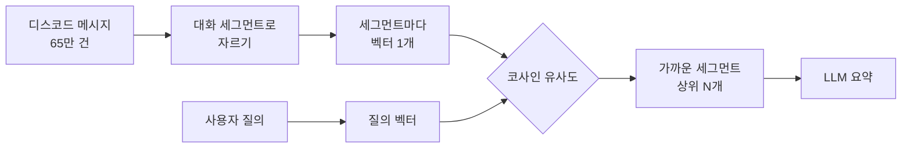
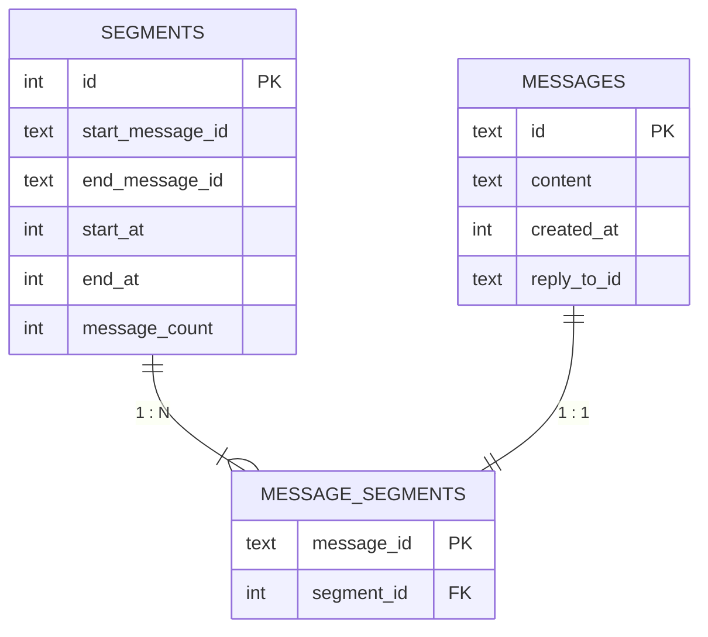
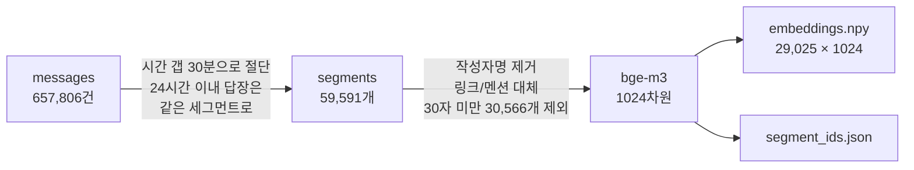
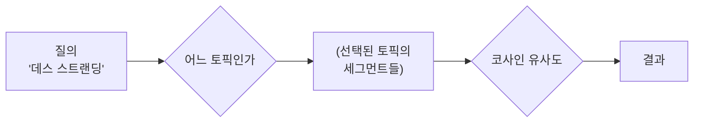
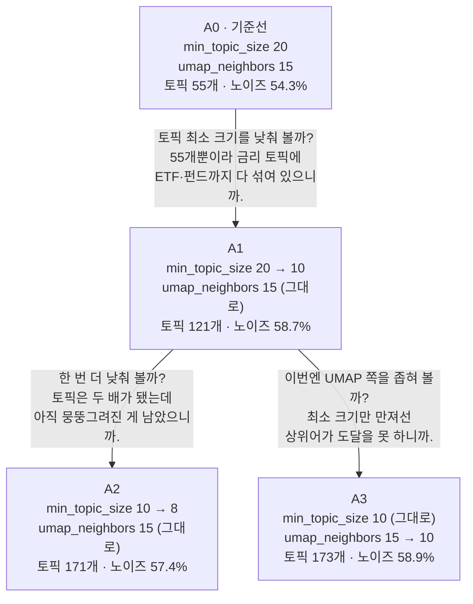

저는 고등학교 친구들과 카카오톡 대신 디스코드로 시시콜콜한 잡담을 주고받고 있습니다. 6년이나 떠들었으니 메시지 양이 상당합니다(65만 건). 때문에 예전에 무슨 대화를 했는지 찾아보는 것이 여간 힘든 일이 아닙니다.

그래서 만들어 봤습니다. 로컬 엑사원 모델을 사용해, 사생활이 보호되는 디스코드 검색 봇.

<style>
.discord-search-bot-figure1,
.discord-search-bot-figure2 {
  width: 100%;
  height: auto;
}
@media (min-width: 769px) {
  .discord-search-bot-figure1,
  .discord-search-bot-figure2 {
    width: 70%;
  }
}
</style>


---

1. [LLM 같은 걸 끼얹나?](#1-llm-같은-걸-끼얹나)
2. [임베딩 검색과 검색 파이프라인](#2-임베딩-검색과-검색-파이프라인)
3. [대화 검색기 = 사생활 검색기](#3-대화-검색기--사생활-검색기)
4. [첫 번째 도전: reply-link](#4-첫-번째-도전-reply-link)
5. [두 번째 도전: 임베딩 검색기](#5-두-번째-도전-임베딩-검색기)
6. [세 번째 도전: BERTopic](#6-세-번째-도전-bertopic)


---

# 1. LLM 같은 걸 끼얹나?

처음에는 이렇게 생각해 봤습니다.

> 대화를 모두 Elasticsearch에 부어버리고 역색인을 하면 되지 않을까?

하지만 역색인은 찾으려는 대화에 있던 단어를 제가 정확히 알고 있어야 합니다.

> 그럼 Word2Vec 같은 걸 이용해서 유사한 단어를 찾도록 만들면 되지 않을까?

하지만 Word2Vec은 단어 하나에 벡터를 주는 방식이라 문맥은 반영하지 못합니다.

그래서 클로드에게 물어봤습니다.

> 👤 나
>
> : 나는 ML 경험이 없는 주니어 백엔드 개발자야. 친구들과 디스코드에서 대화를 나눠 왔는데, 메시지 범위를 지정하면 토픽을 모아 보여주는 기능을 만들어 보려고 해.
>
> 🤖 클로드
>
> : ML 경험이 없다고 하셨으니 개념부터 차근차근 정리해 드리겠습니다. 결론부터 말씀드리면, **"대화 단위로 묶기 → 임베딩 → 클러스터링 기반 토픽 모델링 → LLM 요약"** 이라는 4단계 파이프라인이 이 문제의 현대적인 표준 접근입니다.

핵심은 이겁니다. 대화를 여러 뭉치로 쪼갭니다. 뭉치들을 임베딩합니다. 사용자가 질의를 던지면 그 질의도 벡터로 바꿉니다. 코사인 유사도를 이용해 질의에 가장 비슷한 대화 뭉치들을 찾아냅니다.

나아가 비슷한 대화 뭉치들을 LLM에게 제공하면 더 그럴듯한 답변을 얻을 수 있습니다.



학계에서는 이걸 semantic retrieval이라고 부른다고 합니다. 말 그대로 의미를 찾아내는 방법론입니다.

---

# 2. 임베딩 검색과 검색 파이프라인

맨 위에서 본 gif는 다음과 같은 과정을 따릅니다[^seqdiag].
```
질의 "작년에 누가 이사 간다고 했었지?"
   ↓
서브질의 A "이사"        서브질의 B "집 구하기"   -- ① LLM이 질의 분해
   ↓                        ↓
[API] 임베딩∩키워드      [API] 임베딩∩키워드     -- ② 하이브리드 검색
   ↓  상위 40개               ↓  상위 40개
[API] 재채점 → 정렬      [API] 재채점 → 정렬    -- ③ 재채점
   ↓  순위 목록 A             ↓  순위 목록 B
   └────────┬───────────────┘
            ↓
        [봇] RRF로 융합                      -- ④ RRF
            ↓
        [봇] LLM 요약
```

단계별로 보겠습니다.

① **질의 분해**는 왜 필요할까요? 어떤 문장들은 시점, 인물, 사건이 한데 섞여 있기 때문입니다. "작년에 누가 이사 간다고 했었지?"를 통째로 임베딩하면 선명하지 않은 벡터가 나옵니다. 질의를 짧은 검색어들로 쪼개 각각 검색하도록 해결했습니다[^querydecomp].

② **하이브리드 검색**은 왜 필요할까요? 임베딩은 고유명사에 약하기 때문입니다. "데스 스트랜딩에 관한 내용 찾아줘"라고 물으면 게임과 관련 없는 엉뚱한 얘기가 검색되곤 했습니다. 키워드 검색 결과를 적절히 버무려 해결했습니다[^hybrid].

③ **재채점**은 왜 필요할까요? 질의와 비슷한 대화 뭉치를 찾았다고 해서, 그 대화 뭉치가 연관도를 온전히 대표하지는 않기 때문입니다. 가령 "논문 얘기한 대화 찾아줘"라고 물으면, 진짜 논문에 관한 대화와 "논문"이라는 단어 하나만 포함된 대화가 동시에 상위결과에 뜨곤 했습니다. 세그먼트를 메시지 단위로 다시 채점해 점수를 내는 것으로 해결했습니다[^rerank].

④ **RRF**는 왜 필요할까요? 연관 있는 대화 뭉치들을 정규화해야 하기 때문입니다. 예컨대 "이사"는 흔한 단어라서 0.6점대가 자주 나오고, "집 구하기"는 드물어서 0.4점대가 자주 나온다고 하겠습니다. 만약 세그먼트들을 이대로 줄지어 버리면, "이사"에 관한 것들은 앞에 위치하고 "집 구하기"에 관한 것들은 모두 뒤에 위치해 버리게 됩니다. 이 문제는 전통적인 해결책이 있어서 그대로 따랐습니다[^rrf].

### LLM에게 맡기지 않은 것

처음에는 질의 분해 단계에서 LLM이 인물명도 같이 뽑게 했습니다. 그런데 7.8B 모델이 사람 이름을 자주 놓쳤습니다. 별명이나 줄임말로 부르면 특히 그랬고요. 그래서 인물 탐지만 떼어내 별칭 사전으로 처리하고, 프롬프트에는 아예 "사람 이름/호칭은 빼고 무엇을 찾는지만 적어라"라고 적었습니다. LLM은 자연어를 다루고, 정확한 매칭이 필요한 곳은 규칙이 맡는 구조입니다.

별칭의 기준도 바꿨습니다. 그 전 버전에서는 사람을 표시명으로 찾았는데, 디스코드 표시명은 바뀝니다. 6년치에서 같은 사람이 세 개의 이름으로 등장하는 일이 흔했습니다. 그래서 바뀌지 않는 사용자 ID를 정체성의 기준으로 삼고, 표시명들은 그 아래 별칭으로 묶었습니다.

---

이제부터는 설계하고 시도한 것들에 대해 썰을 풀겠습니다.

---

# 3. 대화 검색기 = 사생활 검색기

*제가 어떻게 에이전트 보안을 설계했는지에 대한 이야기입니다.*

디스코드 대화가 제 허락 없이 절대 egress로 나가게 하고 싶지 않았습니다. 에이전트가 제멋대로 `chmod u+w`를 호출한 적도 있었거든요.

### 에이전트 격리

그래서 먼저 코딩을 도와줄 에이전트부터 감금했습니다.

- 원본 DB와 .env 같은 민감 파일은 chmod 600으로, 임베딩 산출물과 실험 로그가 쌓이는 디렉토리는 700으로 잠갔습니다.
- 코딩 에이전트용 로컬 계정도 따로 만들었습니다. 에이전트 계정은 기본 사용자 그룹에서 빼서 제 홈에 아예 못 들어오게 했습니다.
- 프로젝트를 홈 디렉토리 밖으로 위치시키고, 제 계정과 에이전트 계정을 같은 공유 그룹 소유로 뒀습니다. `chmod g+s` 명령어로 새로 생기는 파일도 같은 그룹 소유가 되게 했습니다.
- bash에 `cs`(claude safe)라는 명령어를 만들어 해당 계정으로만 claude code가 실행되게 했습니다. 내부적으로는 sudo -u로 계정을 바꿔 실행하는 짧은 함수입니다.

이제 에이전트가 민감한 디렉토리에 접근하려 하면:

> 🤖 클로드
>
> : find: ..project/data: Permission denied
>
> 👤 나
>
> : data 디렉토리에 권한이 없어서 그래. 상위 폴더인 현재 디렉토리에 txt파일을 옮겼어. 다시 시도해 줘.

### 대화를 보여줘야 할 때는 선별적으로

모델 학습을 시도했었습니다(폐기되었지만요). 제가 답안지를 만들고, 모델에게 문제지를 제공해서 모델이 푼 문제를 채점하는 겁니다. 좋은 품질의 데이터를 원한다면, 대화 맥락을 에이전트에게 마구 넘겨주고 리뷰를 시키면 됩니다. 하지만 이 경우 무분별하게 대화 내용이 유출됩니다.

그래서 대화의 맥락이 보이는 라벨링 프로그램을 만들었습니다[^labeler]. 라벨러를 만들고 나니, 대화의 민감도를 확인하기가 훨씬 쉬웠습니다. 민감하지 않은 대화는 LLM과 같이 리뷰하면 되고, 아닌 대화는 혼자 평가하면 됩니다. 민감한 대화인데 정답을 모를 때에는 다음 대화로 넘어가기만 하면 되죠.

안타깝게도 최종 버전이 단순 RAG 구조로 회귀하게 돼 쓸모는 없어졌습니다.

### 엿볼 수도 없게 하기

디스코드 봇은 DB에 직접 연결하지 않고 API로 간접 호출합니다. 그런데 이 엔드포인트를 127.0.0.1:8000에 띄워두면 문제가 생깁니다. 봇이든 사람이든 에이전트든, 같은 컴퓨터를 쓰는 다른 계정이라면 누구든 curl 한 줄로 대화 내용을 꺼내갈 수 있기 때문입니다. 대화내용이 조금이라도 노출될 수 있다는 점이 영 찜찜했습니다.

클로드는 유닉스 도메인 소켓을 추천해 줬습니다. BSD 소켓에 주소 대신 파일 경로를 넣어 사용하는 겁니다. 어차피 외부 통신용이 아니니까요. 그리고 그 말은, 파일 시스템 권한으로 통신을 제한할 수 있다는 뜻이 됩니다.

```python
socket_path = Path(os.getenv("TOPIC_API_SOCKET", ...))
os.umask(0o077)                             # 이제부터 프로세스가 만드는 파일은 이 비트를 빼라
uvicorn.run(... uds=str(socket_path), ...)  # 700
```

여기서 더 알게 된 사실. 소켓 파일의 퍼미션을 검사하는 OS와 그렇지 않은 OS가 따로 있다고 합니다. 검사하지 않는 OS라면 퍼미션이 `000`이더라도 연결이 성립한다는 뜻입니다. 제 맥북은 다행히 검사하는 쪽이었지만, 클로드는 리눅스 man page를 찾아와서 이 기능에 보안을 의존하면 안 된다고 했습니다[^unixsocket]. 그래서 실용적 절충안으로 `socket_path`는 700 권한의 민감 디렉토리 하위에 두도록 했습니다.

---

# 4. 첫 번째 도전: reply-link

*메시지의 간선 관계를 나타내기 위해 모델 학습을 시도한 이야기입니다.*

처음에는 이런 API를 만들려고 했었습니다:
```
/캐치업 → SELECT * FROM conversation_unit WHERE start_time > 마지막_접속
      → "어제 대화 두 건 있었어요: 할인 얘기 / 구매 고민"
```

그런데 자연어의 사막 속에서 토픽이라는 바늘을 어떻게 찾아낼까요?

### 답장 속에 답이 있다

이 분야를 대화 분리(conversation disentanglement)라고 합니다. 한 채널에 여러 대화가 동시에 흐를 때 "어느 메시지가 어느 대화에 속하는가"를 복원하는 문제로, 2000년대 초부터 연구되어 왔다고 하네요. 클로드는 그중 reply-link라는 기법을 소개해 주었습니다.

> 🤖 클로드
>
> : 프로덕션 규모 모델을 훈련시킬 필요 없어요. 당신이 가진 건 개인 프로젝트 + 수년치 Discord 로그니까, 이렇게 가면 됩니다: ... LLM `reply-link 예측`. 남은 메시지들(reply/멘션 없이 올라온 것들)에 대해, 각 메시지와 최근 활성 메시지들 N개를 LLM에 같이 주고 "이게 어떤 이전 메시지의 응답인지, 아니면 새 대화 시작인지" 질문.

그리고 논문 하나를 언급했습니다[^kummerfeld]. Ubuntu 기술 지원 IRC 채널에서, 수십 명이 동시다발적으로 떠드는 대화에 사람이 직접 라벨을 77,563개나 단 것으로 유명하다고 합니다.

제 유즈케이스와 비슷한 것 같아 이걸 따라 해 보기로 마음먹었습니다.

### 메시지를 트리로

이 아이디어는 결국 메시지를 간선으로 잇는 것과 같습니다. 메시지마다 "내 부모는 누구인가"를 하나씩 정해 주면, 전체가 부모-자식 관계의 숲(포레스트)이 됩니다.

가령 두 사람이 각자 다른 얘기를 하는 경우를 보겠습니다.
```
[2001] 15:02 A: 이거 할인 좀 하지
[2002] 15:02 B: 아 근데 새 패키지 나왔더라
[2003] 15:02 B: 중고로 살까
[2004] 15:02 B: 아니다 선물받은 거 있었지
[2005] 15:03 A: 결국 정가 주고 샀음
```

메시지마다 하나씩 이렇게 짝지을 수 있습니다.
```
2002 → null  (새 갈래 시작)
2003 → 2002
2004 → 2003
2005 → 2001  ← 세 칸 건너뜀
```

이들을 연결하면 세그먼트 두 개가 나옵니다.
```
{ 2001, 2005 }       ← A의 할인 얘기
{ 2002, 2003, 2004 } ← B의 구매 고민
```

그런데 65만 건 메시지에서 트리를 어떻게 뽑아낼까요? 클로드는 다음과 같은 청사진을 제공했습니다.

> ① 200개 라벨링 표본을 만드세요.
>
> ② 무거운 모델에게 학습시키세요(teacher).
>
> ③ 가벼운 모델이 무거운 모델로부터 배우게 하세요(student).

teacher가 매긴 답을 정답 삼아 student를 학습시키는 것을 증류라고 합니다. ③은 매우 가벼운 모델로, "이 메시지의 부모는 무엇인가"만을 추측해 반환합니다. 일종의 검색엔진 인덱서인 셈입니다.

다만 안타깝게도 증류까지는 시도하지 못했습니다. 이유는 후술합니다.

### 골든셋 만들기

①에서 언급한 200개의 표본을 특별히 "골든셋"이라고 부릅니다. 사람이 손으로 매긴, 모델이 맞혀야 할 정답지를 가리킵니다.

> 🤖 클로드
>
> : 골든셋은 훈련에는 단 한 번도 쓰이지 않아요. 오직 평가용이에요. dev 50개는 프롬프트를 고칠 때 보면서 쓰고, test 150개는 개발 중에 절대 열어보면 안 돼요. 한 번이라도 보면 그 순간부터 오염되고, 측정 결과를 신뢰할 수 없어요.

큰 모델(teacher)은 사람의 지도를 받게 하고, 작은 모델(student)은 큰 모델의 지도를 받게 하자는 아이디어입니다. 전자에 쓰이는 표본은 신뢰도가 높아 골드 라벨, 후자에 쓰이는 것은 덜 정확해 실버 라벨이라고 합니다. 골든셋은 골드 라벨의 묶음을 뜻합니다.

원래 제대로 하려면 논문처럼 여러 사람이 같은 문항을 매겨 서로 얼마나 일치하는지를 함께 재야 합니다. 사실 라벨러[^labeler]를 만든 이유가 이것입니다. 친구들에게 게이미피케이션처럼 제공해 친구들이 패널 리뷰(=강제 노역)에 참여하게 하려고 했***었***거든요.

하지만 PoC 단계였고, 검증되지도 않은 아이디어의 라벨링을 먼저 도와달라고 뿌릴 수는 없는 노릇입니다. 그래서 일단 저 혼자 라벨러의 힘을 빌려 골든셋 200건을 만들었습니다.

### 골든셋 평가하기

그렇게 200개를 채우고, 50개 대상으로 로컬 Qwen 32B 모델을 이용해 첫 측정을 돌렸습니다[^evalcode]. 채점은 F1 값으로 했습니다[^f1].

| 회차 | 조건 | TP | FP | FN | TN | F1 |
|:---:|:---|:---:|:---:|:---:|:---:|:---:|
| 1 | 기준선 (앞 메시지 20개) | 28 | 20 | 17 | 1 | **0.602** |

틀린 것들을 들여다보니, 정답이 아예 화면 밖에 있는 사례가 몇 개 보였습니다. 그래서 범위를 20개에서 30개로 늘려봤습니다. 볼 수 있는 후보를 넓히면 나아지겠거니 했습니다.

| 회차 | 조건 | TP | FP | FN | TN | F1 |
|:---:|:---|:---:|:---:|:---:|:---:|:---:|
| 2 | 앞 메시지 30개로 확대 | 27 | 22 | 18 | 0 | **0.574** |

오히려 나빠졌습니다. 틀린 개수가 늘고, 새 대화의 시작이라고 제대로 판단한 건수(TN)가 1에서 0이 됐습니다. 후보를 넓히니 풍부한 판단을 한 게 아니라 오히려 더 헷갈려한 셈입니다.

그래서 이번엔 프롬프트에 예시 세 개[^fewshot]를 넣어봤습니다. 어떤 상황에서 어떻게 답해야 하는지 견본을 보여주면 태스크를 더 잘 이해하지 않을까 싶었습니다.

| 회차 | 조건 | TP | FP | FN | TN | F1 |
|:---:|:---|:---:|:---:|:---:|:---:|:---:|
| 3 | 예시 3개 추가 | 17 | 21 | 28 | 5 | **0.410** |

훨씬 나빠졌습니다.

원인을 찾아보니 위 각주의 예시 2가 범인이었습니다. 예시 2에서 정답은 세 칸 떨어져 있습니다. 모델은 이걸 보고 "직전 메시지는 일단 의심하고 건너뛰어라"를 배웠습니다. 실제로
- 직전 메시지를 잘못 고르던 경우는 13건 → 5건으로 줄었고,
- 반대로 정답이 직전 메시지인데 놓친 경우는 0건 → 13건으로 늘었습니다.

고친 만큼 반대 방향으로 망가진 셈입니다.

### reply-link를 포기하다

이제 슬슬 이 길이 맞는지 의심이 듭니다. 클로드와의 대화가 결정적이었습니다.

> 👤 나
>
> : reply-link 구조가 내 요구사항에 최선인지를 의심중이었던 거야. ... 일일 요약이 아니라, 토픽을 지정할 수 있다고 가정하자. 즉 어떤 식으로든 이미 토픽이 학습되어 있어서, 시계열로 주어진다고 가정하자. 시작 토픽과 끝 토픽을 선택하면 그 부분을 요약해 주는 거야.
>
> 🤖 클로드
>
> : reply-link는 "이 메시지는 어느 이전 메시지에 응답한 것인가"를 예측합니다. 출력물은 메시지들의 부모-자식 포레스트(숲)예요. 트리 구조지 시계열이 아닙니다. 그런데 ... 요구하는 것은 "토픽의 선형 시계열"입니다 — [토픽1, 토픽2, 토픽3, ...] 이라는 순서가 있고, "토픽7부터 토픽12까지"처럼 범위를 잘라낼 수 있어야 합니다. ... 즉 reply-link는 필요 이상으로 미세한 구조를 학습하면서, 정작 필요한 "토픽 경계" 정보는 간접적으로밖에 주지 못합니다.

저는 단순히 연관된 대화들의 집합만 원했습니다. 그러나 reply-link는 그보다 훨씬 정밀한 것을 만들고 있었습니다. 누가 누구에게 답했는지를 전부 연결한 뒤에야 대화 집합이 나옵니다.

비용도 감당이 안 됐습니다. 학습용 라벨을 자동으로 붙이는 데 1만 건에 60시간이 걸렸습니다. 65만 건 전체라면 164일입니다.


<p align="center"><span style="color:gray"><i>(힘내라 맥북...)</i></span></p>

그래서 다음 여정을 떠나게 됩니다.

---

# 5. 두 번째 도전: 임베딩 검색기

*초보적인 임베딩 검색기를 만든 이야기입니다.*

다시 처음으로 왔습니다. 대화를 시간으로 잘라 세그먼트를 만들고, 세그먼트를 임베딩하고, 질의와 가까운 세그먼트를 찾는 것. 1장에서 클로드가 맨 처음 알려준 그 방법입니다.

이번엔 학습이 없습니다. 라벨도 필요 없고 164일도 필요 없습니다. 대신 정해야 할 게 하나 생깁니다. **어디서 자를 것인가.**

### 30분으로 잘라 보자

일정한 시간 간격을 기준으로 세그먼트를 나누라고 들었습니다. 그런데 "일정한 시간"을 어떻게 측정할까요? 휴리스틱으로 정하자니 영 마음이 찝찝합니다.

그래서 메시지 간격의 분위수를 뽑아 봤습니다.

| 분위수 | 간격 |
|:---:|:---:|
| 50% | 10초 |
| 75% | 94초 |
| 90% | 25분 33초 |
| 95% | 1시간 45분 |
| 99% | 17시간 31분 |

90% 지점이 25분쯤이니, 대충 30분으로 정했습니다.

그런데 "30분으로 나눈다"는 게 정확히 무슨 뜻일까요? 여러 방법이 있겠지만, 저는 메시지들을 묶어 세그먼트의 목록을 만드는 방식을 택했습니다. 65만 건의 메시지마다 "너는 몇 번 세그먼트(segment) 소속이야"라고 메모를 다는 셈입니다.



`segments`에는 세그먼트의 시작과 끝 메시지 ID가 들어갑니다. 범위를 지정하는 겁니다. 그리고 `message_segments`에는 메시지 한 건마다 소속이 한 줄씩 들어갑니다. 65만 건이면 65만 줄입니다[^msgseg].

그런데 예외가 있습니다. 바로 답장입니다.

### 답장은 공짜 정답지

친구가 어젯밤 대화에 오늘 아침 답장을 답니다. 그 메시지는 **명백히 어젯밤 대화의 일부**입니다. 하지만 기계적인 30분 분할은, 답장 메시지를 다른 세그먼트로 취급합니다.

디스코드의 답장 메시지는 `reply_to_id` 필드를 가지고 있습니다. 부모 메시지의 ID가 달립니다. 공짜 정답을 마다할 이유가 없습니다. 그래서 다음과 같이 만들었습니다.

```
for message in messages:
    segment = None

    # 규칙 1. 24시간 이내 답장이면 부모를 따라간다
    if message.reply_to_id and parent is not None:
        if message.time - parent.time <= 24시간:
            segment = parent.segment

    # 규칙 2. 아니면 직전 세그먼트와의 간격을 본다
    if segment is None:
        if message.time - last_segment.end_time <= 30분:
            segment = last_segment

    # 규칙 3. 둘 다 아니면 새로 판다
    if segment is None:
        segment = new_segment()

    # INSERT INTO message_segments (message.id, segment.id)
```

24시간의 임계치는 휴리스틱입니다. 며칠 전 대화, 심지어 몇 년 전 대화에 답장을 달면 그 사이가 통째로 하나가 되어 버리니까요. 합쳐질 수 있는 범위를 하루로 한정한 것입니다.

### 세그먼트 하나를 벡터 하나로

다음은 임베딩입니다. 일단 segment별로 메시지를 이어 붙입니다.

```python
text = " / ".join(전처리(m) for m in segment_messages)
```

그냥 텍스트째 넣진 않고, 몇 가지 전처리를 거칩니다.

- **작성자 이름은 뺍니다:** 처음에는 "누가 말했는지"도 정보라고 생각해서 메시지마다 이름을 앞에 붙였습니다. 그랬더니 화제가 아니라 화자를 기준으로 뭉쳤습니다. 화자가 화제보다 강한 신호가 되어 버린 겁니다.

- **링크·멘션·커스텀 이모지는 자리표시자로 바꿉니다.** `https://...`는 `[링크]`로, `<@123456789>`은 `[멘션]`으로 바꿨습니다. 그대로 두면 의미 없는 긴 문자열이 벡터를 흔듭니다. 필터도 걸었습니다. 이어 붙인 본문이 30자도 안 되는 세그먼트는 아예 제외했습니다. "ㅇㅇ", "ㅋㅋㅋ" 두어 개로만 이뤄진 세그먼트는 임베딩해 봐야 검색에 걸릴 일이 없으니까요.

그 외에 메시지가 200개를 넘는 세그먼트는 앞에서부터 200개까지만 썼습니다. 그 결과가 이렇습니다.

| 항목 | 수 |
|:---|---:|
| 잘라낸 세그먼트 | 59,591개 |
| 너무 짧아 제외 | 30,566개 |
| **나머지 세그먼트** | **29,025개** |

그리고 살아남은 29,025개를 BAAI/bge-m3[^bge] 모델에 넣어 각각 1024차원 벡터로 만들었습니다. 한국어와 영어가 섞여 있어 다국어 모델이 필요했습니다.

결과물은 파일 두 개입니다:
- embeddings.npy: 29,025 × 1024 크기의 행렬.
- segment_ids.json: 행 번호 순서대로 나열한 세그먼트 ID 배열.



### 첫 성공!

질의가 들어오면 내적을 계산해 점수가 높은 행 번호를 찾습니다. 그 번호를 ID로 되돌린 뒤 DB에서 본문을 조회합니다.

```python
emb     = np.load("embeddings/embeddings.npy")   # 29,025 × 1024
seg_ids = json.load(open("embeddings/segment_ids.json"))
model   = SentenceTransformer("BAAI/bge-m3", device="mps")

def search(query, k=8):
    q_vec = model.encode([query], normalize_embeddings=True)[0]

    sims = emb @ q_vec              # 전체 세그먼트와 한 번에 내적
    top  = np.argsort(-sims)[:k]    # 가까운 순 k개

    for idx in top:
        seg_id = seg_ids[idx]
        yield seg_id, sims[idx]
```

`python myscript.py "게임 얘기"`를 실행하니 잘 나옵니다!

여기서 멈췄어야 했습니다...

---

# 6. 세 번째 도전: BERTopic

*앞서 만든 임베딩 검색기에 토픽을 덧대려다 실패한 이야기입니다.*

욕심이 났습니다. 3만 개 중 비슷한 벡터를 모으면 토픽이 되지 않을까요? "게임 얘기"를 찾고 싶다면, 게임과 비슷한 벡터들을 모아 제공하면 되는 게 아니냐는 거죠.

제가 떠올린 아이디어는 아닙니다. BERTopic이라는 기법입니다.


### 토픽 클러스터링

한 번 따라 해 보기로 했습니다.

먼저 1024차원 벡터를 UMAP으로 5차원까지 줄입니다. 차원이 높으면 모든 점 사이의 거리가 고만고만해져서, "여기가 빽빽하다"는 판단이 어려워지기 때문입니다.

그다음 HDBSCAN으로 모인 덩어리를 찾습니다(클러스터링). 이 덩어리들이 토픽입니다. 덩어리에 소속되지 못한, 멀리 떨어진 점들은 노이즈가 됩니다.

그렇게 묶인 각 군집에서 형태소 분석기로 명사와 용언 어간을 남겨 대표 키워드들을 매깁니다.

```
Topic 1  →  [게임, 포켓몬, 스위치, 스토리, ...]
Topic 2  →  [금리, 주식, etf, 환율, ...]
Topic 3  →  [교수, 논문, 박사, 연구, ...]
```

토픽 55개, 노이즈 54.3%가 나왔습니다.

다음으로는 엔드포인트를 만듭니다. 매번 python 스크립트를 실행하기는 불편하니까요. `/topic-search`라는 엔드포인트를 만들어 질의할 수 있게 했습니다.



이제 질의를 던져 품질을 확인해 보기로 했습니다. 성격이 다른 질의 세 개를 골라 봤습니다.

| 질의 | 성격 | 결과 |
|:---|:---|:---|
| 보일러 | 단순 사물 | 잘 나옴 |
| 취업 | 추상적 개념 | 빈 결과 |
| 데스 스트랜딩 | 고유명사 | **무관한 대화가 나옴** |

- 보일러: 작년 겨울 보일러가 터졌던 날의 대화가 나왔습니다. 잘 되는구나 싶었습니다.
- 취업: 대화가 안 나옵니다. 그렇게 놀랍지는 않습니다, 추상어니까요. 대신 "이직"이나 "면접"처럼 구체적으로 풀어서 넣으면 잘 나옵니다.
- 데스 스트랜딩(게임입니다): 이게 문제였습니다. 분명히 대화가 여럿 존재하는데도, 게임과 아무 상관 없는 대화만 자꾸 나왔습니다.

왜 각기 다른 결과가 나올까요?

### 클러스터링이 범인인가?

가장 먼저 의심한 건 클러스터 품질이었습니다. 토픽이 55개밖에 안 되니, 하나하나가 너무 커서 게임 얘기가 다른 토픽과 뭉쳐 있는 게 아닐까 싶었습니다.

그래서 토픽을 더 잘게 쪼개 보기로 했습니다. 변인이 두 개 있습니다:
- min_topic_size: 군집의 최소 조건입니다. 20이라면 20개 미만으로 모여있는 덩어리는 모두 노이즈가 됩니다. HDBSCAN과 관련이 있습니다.
- umap_neighbors: 차원을 줄일 때 몇 명까지 모이게 할지입니다. 짝짓기 게임에서의 인원수 같은 겁니다. UMAP과 관련이 있습니다.

각 파라미터를 바꿔 세 번 더 클러스터링 해 봤습니다.



최종 결과물인 A3는 더 나아 보였습니다. 토픽 수도 늘고, "게임", "금리", "논문", "맥북"이 각각 깨끗한 토픽으로 분리됐거든요. A0에서는 이것들이 뭉뚱그려져 있었습니다.

**하지만 A3 역시 "데스 스트랜딩"을 이해하지 못했습니다.** 게임이라는 깨끗한 토픽이 눈앞에 생겼는데도, 질의가 그 토픽에 도달하지 못한 겁니다.

### 범인은 API의 점수 계산기

저는 `/topic-search`라는 엔드포인트를 이렇게 만들어 뒀었습니다.
```
질의 "데스 스트랜딩"
   ↓
① score_topic_match()를 호출해 토픽별로 점수 계산
   ↓  0점은 탈락, 점수순 정렬, 상위 3개만 통과
② 그 토픽들에 속한 세그먼트만 모아 임베딩 코사인 유사도
   ↓  상위 5개
③ 결과 반환
```

점수제, 코사인 유사도로 2중 필터를 건 셈입니다. score_topic_match()는 대충 이렇게 생겼습니다.
```python
for topic in topics:
    score = 0
    for keyword in topic.keywords:  # ['금리', '주식', 'etf', ...]
        if 질의와_일치하면: score += 높은점수
        elif 질의에_키워드가_포함되면: score += 중간점수
    for token in query_tokens:      # ['데스', '스트랜딩', '찾아' ...]
        if 키워드_토큰에_포함되면: score += 낮은점수
        ...
```

이게 문제였습니다. 예컨대 "데스 스트랜딩"이라는 질의가 들어오면, 이 코드는 문자열 안에 어떤 토픽의 키워드가 들어 있는지를 봅니다. 그런데 **"데스"라는 두 글자가 게임과 무관한 토픽과 겹칩니다.** 그 토픽이 높은 점수를 얻어 1차 필터링된 것입니다. 애초에 잘못된 집단을 선택했으니, 뒤는 더 볼 것도 없었습니다.

그래도 이 점수제의 존재 의의는 있었습니다. 바로 **없음을 판정**한다는 겁니다. 임베딩 검색만 남기면 문제가 생깁니다. 벡터 계산은 무엇을 넣든 값이 나오니, 사람이 보기에 전혀 무관한 것도 결과랍시고 나옵니다.

(나중에 알게 된 사실인데, 유사도에 임계값을 두는 기법도 있다고 합니다.)

### 탐색과 질의는 다르다

여기까지 오니 「토픽 클러스터링」에서 본 표가 전부 설명됐습니다.

- 보일러: 구체적인 사물이라 키워드 목록에 그 단어 그대로 살아남아 있습니다. 완전 일치라 가장 높은 점수를 받고, 맞는 토픽이 선택됩니다.
- 취업: 추상어라 어느 토픽의 대표 키워드에도 뽑히지 않습니다. 아무 데도 안 걸리니 빈 결과가 나옵니다.
- 데스 스트랜딩: 키워드로는 없는데, 부분 문자열이 무관한 키워드와 우연히 겹쳤습니다. 없느니만 못합니다. 확신을 갖고 틀린 답을 고르니까요.

클로드가 쐐기를 박았습니다.

> 🤖 클로드
>
> : 토픽 모델링은 "어떤 주제들이 오갔나"라는 **탐색** 문제를 풉니다. 의미 검색은 "이 주제에 대해 구체적으로 뭐라 했나"라는 **질의** 문제를 풉니다. 두 번째 API는 사실 탐색보다 질의에 훨씬 가깝습니다.

아뿔싸! 제가 도구를 잘못 쓴 겁니다. BERTopic은 "어제 밤에 무슨 대화 있었는지 추려 줘"에 어울리는 도구입니다. "이것과 비슷한 대화 찾아 줘"는 단순 임베딩 검색으로 해결되는 문제입니다.

A0~A3 네 번의 실험이 애초에 잘못된 곳을 파고 있었던 겁니다. **탐색과 질의는 다르다**는 교훈을 1달에 걸쳐 얻은 셈입니다. 이후 두 번째 시도가 옳았음을 깨닫고, 임베딩 검색기에 검색 파이프라인을 얹은 최종본으로 회귀하게 됩니다.

---

긴 글 읽어주셔서 감사합니다.

※ 이 글에 나오는 클로드 대화 내역이나 질의어는 실제와 같습니다. 디스코드 대화 내용은 다소 각색하였습니다.

---

# References

[^f1]: 클로드에게 물어보니 모델 평가의 기준이 세 가지 있다고 합니다. 정밀도, 재현율, 그리고 둘을 합친 F1입니다.

    예를 들어 메일함에 스팸이 100개 섞여 있고, 이를 분류하는 모델 A와 B가 있다고 하겠습니다:
    - A는 50개를 스팸이라 예측했고 그중 48개가 실제 스팸이었음
    - B는 120개를 스팸이라 예측했고 그중 90개가 실제 스팸이었음

    이 경우, A는 지목한 것 중에서는 거의 다 맞혔지만(정밀도 48/50 = 96%), 전체 스팸 100개 중 48개밖에 못 잡았습니다(재현율 48%). B는 스팸을 대부분 잡아냈지만(재현율 90%), 정상 메일 30개를 스팸으로 잘못 분류했습니다(정밀도 90/120 = 75%).

    **F1**은 두 값의 조화평균입니다. 산술평균과 달리 둘 중 하나라도 낮으면 크게 떨어지기 때문에, 한쪽으로 치우친 모델을 걸러냅니다.

    그런데 본문의 표에 TP, FP 같은 외계어가 왜 나오냐고요? 정밀도와 재현율을 계산할 때 4개의 지표가 필요하기 때문입니다. 본문의 예로 들면:
    - **TP**: 부모를 정확히 맞힌 것
    - **FP**: 사실은 부모가 아닌데 부모라고 한 것
    - **FN**: 진짜 부모인데 놓친 것
    - **TN**: 부모가 없음을 정확히 맞힌 것

    정밀도는 TP/(TP+FP), 재현율은 TP/(TP+FN)로 계산한다고 합니다.

    부모를 지목했는데 엉뚱한 걸 골랐으면 FP와 FN이 둘 다 집계됩니다. 없는 걸 있다고 한 잘못 + 진짜를 놓친 잘못. 그래서 네 값의 합(66 / 67 / 71)이 표본 수 50을 넘는 겁니다. 초과분은 곧 부모를 찾긴 했는데 엉뚱한 걸 짚은 횟수(16 / 17 / 21)가 됩니다.

    다만 누차 밝히듯, reply-link는 PoC 단계에서 엎어졌기 때문에, 3차례에 걸친 F1값은 정밀하지 못하다는 한계가 있습니다. 저 혼자 라벨링을 진행했기 때문입니다. 그럼에도 "그럴듯하게" 진행한 이유는, 추후 친구들에게 라벨링을 부탁하려고 했었기 때문입니다. 친구들이 참여한 라벨링은 귀한 자료인데, 중구난방으로 평가할 수는 없으니까요.


[^unixsocket]: 리눅스는 [unix(7) man page](https://man7.org/linux/man-pages/man7/unix.7.html)에서 해당 경로의 퍼미션에 의존하지 말라고 명시합니다.

    > "Connecting to the socket object requires read/write permission on that socket. This behavior differs from many BSD-derived systems which ignore permissions for UNIX domain sockets. **Portable programs should not rely on this feature for security.**"

    정작 현행 BSD 계열은 검사하는 쪽입니다. [FreeBSD](https://man.freebsd.org/cgi/man.cgi?query=unix&sektion=4)·[OpenBSD](https://man.openbsd.org/unix.4)·[NetBSD](https://man.netbsd.org/unix.4)·[macOS](https://keith.github.io/xcode-man-pages/unix.4.html)의 unix(4)가 모두 똑같습니다. (BSD의 unix(4)는 리눅스의 unix(7)과 완전히 동일한, 유닉스 도메인 소켓에 관한 내용을 담고 있습니다.)

    > "Normal filesystem access-control mechanisms are also applied when referencing pathnames; e.g., the destination of a connect(2) or sendto(2) must be writable."

    제 맥북(Darwin 25.5.0)에서도 소켓 모드만 바꿔 확인했습니다. **000**은 EACCES로 거부되고 **600**은 연결됩니다. 위 리눅스 문서의 "many BSD-derived systems"는 4.4BSD 시절 동작을 가리키는 오래된 서술로 보입니다.

    그럼에도 경고가 유효한 이유는 무시하는 OS가 실재하기 때문입니다. 제가 사용한 실용적 절충안도 제 아이디어가 아닙니다. PostgreSQL의 서버 설정 문서에도 있습니다.

    > "This parameter is irrelevant on systems, notably Solaris as of Solaris 10, that ignore socket permissions entirely. There, one can achieve a similar effect by pointing `unix_socket_directories` to a directory having search permission limited to the desired audience."
    >
    > — [PostgreSQL 연결 및 인증 문서](https://www.postgresql.org/docs/current/runtime-config-connection.html)

    디렉토리로 막는 편이 실용적 절충안인 이유는 단순합니다. `.run/topic_api.sock`에 닿으려면 먼저 `.run`을 통과해야 하고, 디렉토리를 통과하는 데는 실행(검색) 권한이 필요합니다. 다른 계정은 소켓의 존재조차 확인하지 못하고 막히는 셈입니다.

[^kummerfeld]: J. K. Kummerfeld, S. R. Gouravajhala, J. J. Peper, V. Athreya, C. Gunasekara, J. Ganhotra, S. S. Patel, L. C. Polymenakos, and W. Lasecki, "[A Large-Scale Corpus for Conversation Disentanglement](https://aclanthology.org/P19-1374/)," *Proc. 57th Annual Meeting of the Association for Computational Linguistics*, Jul. 2019, pp. 3846–3856.

[^msgseg]: 65만 줄이나 더 쌓을 것 없이, `segments`의 시작·끝 범위로 소속을 판정하면 되지 않을까요?

    안 됩니다. 바로 다음 절에서 다룰 답장 규칙 때문입니다. 답장으로 메시지 하나가 과거 세그먼트에 합류하면, 그 세그먼트의 **끝 시각이 뒤로 밀립니다.** 그런데 그사이에 흐른 다른 대화들은 각자 다른 세그먼트에 그대로 남아 있습니다. 결과적으로 세그먼트들이 서로 겹치게 됩니다.

    실제로 답장을 포함시킨 뒤 실측해 보니, 전체 59,591개 세그먼트 중 **1,728개**에서 겹침이 발생했습니다. 이 세그먼트들의 시작과 끝 사이에는 자기 소속이 아닌 메시지가 모두 29,231건 끼어 있었고, 가장 심한 세그먼트 하나에는 **864건**이 들어와 있었습니다.

    범위보다는 매핑 테이블을 따로 두는 것이 유리한 이유입니다.

[^fewshot]: LLM에게 다음 프롬프트를 추가해 줬더니 더 악화됐습니다.
    ```
    === 예시 1: 직전 메시지가 parent ===
    [1001] 00:27 A: 지금 나 놀리는 거야?
    [1002] 01:25 B: ㄴㄴ
    --- TARGET ---
    [1003] 01:25 B: 그런 의도는 아님
    Output: {"parent_msg_id": "1002", "confidence": 0.9}


    === 예시 2: 직전이 아닌 메시지가 parent ===
    [2001] 15:02 A: 이거 할인 좀 하지
    [2002] 15:02 B: 아 근데 새 패키지 나왔더라
    [2003] 15:02 B: 중고로 살까
    [2004] 15:02 B: 아니다 선물받은 거 있었지
    --- TARGET ---
    [2005] 15:03 A: 결국 정가 주고 샀음
    Output: {"parent_msg_id": "2001", "confidence": 0.9}


    === 예시 3: parent 없음 ===
    ...
    Output: {"parent_msg_id": null, "confidence": 0.93}
    ```

[^querydecomp]: 이 패턴을 multi-query retrieval이라고 부릅니다. 질의 하나로 한 번 검색하는 대신, 여러 갈래로 쪼개 각각 검색한 뒤 결과를 합치는 방식입니다.

    저는 로컬 LLM(exaone3.5:7.8b)을 사용해 질의를 쪼갰습니다. 한국어 실력이 출중하다고 들었고, 제 로컬 맥북 M1(32GB)에 알맞은 크기여서입니다.

    다음은 제가 실제로 사용한 프롬프트입니다:
    ```
    너는 한국어 질문을 의미 검색용 "검색 계획"으로 바꾼다. 반드시 JSON 객체 하나만 출력하고 다른 말은 절대 하지 마라.

    규칙:
    - "subqueries": 질문의 핵심 의미를 1~4개의 짧은 검색어로 나눈 배열. 사람 이름/호칭은 빼고 "무엇을" 찾는지만 적어라. 여러 개념이 섞였으면 개념별로 나눠라.
    - "keywords": 반드시 글자 그대로 등장해야 하는 고유한 단어(제품명·도구명·서비스명·고유명사)만 배열로. 일반 개념어("보고서","수정","여행" 등)는 절대 넣지 마라. 없으면 빈 배열 [].

    예시1
    질문: 철수가 claude로 만든 경제 보고서를 고친 내역을 전수조사해줘
    출력: {"subqueries":["경제 보고서 수정","보고서 내용 변경","보고서 피드백 반영"],"keywords":["claude"]}

    예시2
    질문: 취업 힘들던 시절 얘기 찾아줘
    출력: {"subqueries":["취업 준비 힘듦","취업 스트레스","구직 고민"],"keywords":[]}

    예시3
    질문: 보일러 고장났던 얘기
    출력: {"subqueries":["보일러 고장","보일러 수리"],"keywords":[]}
    ```

    즉, LLM의 질의 분해는:
    - **서브질의**: 질의를 쪼갠, 짧은 검색어 1~4개.
    - **키워드**: 반드시 글자 그대로 등장해야 하는 고유한 단어.

    두 개로 이루어진 셈입니다.

    시행착오도 있었습니다. 모델이 인물명을 자주 놓쳤습니다. 별명이나 줄임말로 부르면 특히 그랬습니다. 그래서 인물 탐지만 떼어내 별칭 사전으로 처리했습니다.

    LLM의 아웃풋을 조정하기 위한 매개변수인 temperature는 0으로 고정해야 했습니다. 매번 분해 결과가 비슷해야 하기 때문입니다. 다만 결정론적이지는 않다는 한계가 있습니다.

[^hybrid]: 일반적인 하이브리드 검색은 키워드 검색(BM25 등)과 벡터 검색을 각각 순위표로 만든 뒤 합친다고 합니다.

    하지만 저는 ML 경험이 처음이다 보니, 복잡성을 더하고 싶지 않았습니다. 그래서 대신 키워드로 후보를 미리 좁히는 필터를 사용했습니다. LIKE 쿼리로 키워드가 포함되는 세그먼트만 골라내고, 코사인 유사도는 그 안에서만 계산합니다.

    키워드가 정확히 일치해야만 1차 필터링되니, 고유명사 정확도는 올라갑니다. 하지만 키워드가 하나도 안 맞으면 결과가 0건이라는 치명적 한계가 있습니다.

    그래서 다음과 같이 유사어들을 확장할 수 있는 초보적인 안전장치를 뒀습니다. 반례를 계속 찾아 추가하면 되지 않겠느냐는 심산이었습니다:
    ```javascript
    const KEYWORD_SYNONYMS = {
        claude: ['claude', '클로드', '클코', '클로드코드', 'claude code'],
        ...
    }

    function expandKeywords(keywords) {
        ...
        const syns = KEYWORD_SYNONYMS[k.toLowerCase()];
        if (syns) syns.forEach((s) => out.add(s));
        ...
    }
    ```

    그래도 0건이 나오면 순수 임베딩 검색으로 폴백하도록 했습니다.

[^rerank]: 검색 결과를 다시 정렬하는 이 단계를 보통 재정렬*rerank*이라고 하고, 대개는 질의와 문서를 함께 넣어 점수를 내는 별도 모델(cross-encoder)을 쓴다고 합니다.

    앞서 밝혔듯, 저는 세부 파이프라인에 복잡성을 더하고 싶지 않았습니다. 제가 나중에 코드를 이해할 수 없을 것만 같았거든요. 그래서 별도 모델을 띄우지 않고, 이미 쓰고 있던 임베딩 모델로 메시지 단위 유사도를 다시 계산하는 방식을 썼습니다. 재정렬이라기보다는 **세분화된 재검색**에 가까운 셈입니다.

    저는 상위 세그먼트(대화 뭉치)들을 40개 추린 뒤, 대화별로 메시지를 80개 꺼내 재인코딩하는 방식을 썼습니다:
    ```python
    def search() -> list[dict[str, Any]]:
        ...
        similarities = self.embeddings[indices] @ query_vector
        pool = np.argsort(-similarities)[:RERANK_POOL]          # 40
        ...
        segment_map = self._fetch_segments_by_ids(top_ids)      # 세그먼트 추출
        results = []
        for sid in top_ids:
            seg = segment_map.get(sid)
            results.append(
                {
                    "segment_id": sid,
                    "score": seg_score.get(sid, 0.0),
                    "channel_id": seg.channel_id,
                    "start_at": seg.start_at,
                    "message_count": seg.message_count,
                    "preview_messages": previews.get(sid, []),
                    "start_message_url": build_message_url(
                        seg.channel_id, seg.start_message_id
                    ),
                }
            )
        return results
    ```

    **_rerank_by_message()** 함수가 메시지들을 다시 평가합니다. 세그먼트마다 메시지를 최대 80개까지 꺼내 한 배치로 인코딩하고, 각 메시지가 질의와 얼마나 가까운지 계산합니다. 그중 가장 높은 점수를 그 세그먼트의 대표값으로 삼아 `최종점수 = 0.5 × 세그먼트점수 + 0.5 × 최고메시지점수`로 순위를 다시 냅니다.

    시행착오도 있었습니다. 논문에 관한 대화를 찾았는데, "논문" 두 글자만 던진 메시지가 높은 점수를 얻었습니다. 맥락도 없는 단어가 1위면 안 되죠. 그래서 길이 가중치 `weight = min(1, 글자수 / 12)` 를 넣었습니다.
    ```python
    RERANK_FULL_CHARS = 12                                  # 최소길이 12자
    sims = mat @ query_vector
    # 짧은 메시지일수록 유사도를 깎는다.
    lens = np.array([len(t) for t in flat_texts])           # 메시지별 길이. [2, 47, 8, 130...]
    weights = np.minimum(1.0, lens / RERANK_FULL_CHARS)     # 길이별 가중치. [0.167, 1.0, 0.667, 1.0 ...]
    weighted = sims * weights
    ```

    disclaimer: 40개, 80개, 0.5점 등의 threshold는 딱히 고민하지 않았습니다. 클로드가 임의로 넣었는데, 질의 품질이 나쁘지 않길래 그대로 쓰게 되었습니다.

[^rrf]: Reciprocal Rank Fusion. G. V. Cormack, C. L. A. Clarke, and S. Buettcher, "[Reciprocal Rank Fusion Outperforms Condorcet and Individual Rank Learning Methods](https://dl.acm.org/doi/10.1145/1571941.1572114)," *Proc. 32nd ACM SIGIR*, Jul. 2009, pp. 758–759.

    2009년 글로, 순위 집계*rank aggregation* 기법 중 하나를 소개하는 내용입니다. 앞서 재정렬*rerank*는 서로 다른 순위를 내는 기법이라고 했습니다. 순위 집계는, 서로 다른 순위를 한데 합치는*fusion* 기법입니다.

    이렇게 순위를 ***융합하는*** 기법은 데이터의 양상에 따라 정말정말 다양하다고 합니다. 그중 저자들이 소개한 RRF는, 단순히 순위의 역수만을 취하기 때문에 간단해서 많이 쓰인다는군요.

    [이 블로그](https://gaejabong.com/wiki/rrf)에 계산 방식이 아주 잘 적혀 있습니다.
    ```
    두 개의 검색 시스템(키워드 검색, 벡터 검색)이 있고, k=60일 때:

    키워드 검색 결과:
    문서 A (순위 1)
    문서 B (순위 2)
    문서 C (순위 3)

    벡터 검색 결과:
    문서 C (순위 1)
    문서 A (순위 2)
    문서 D (순위 3)

    RRF 점수 계산:
    문서 A: 1 / (60 + 1) + 1 / (60 + 2) = 0.0325
    문서 B: 1 / (60 + 2) + 0 = 0.0161
    문서 C: 1 / (60 + 3) + 1 / (60 + 1) = 0.0323
    문서 D: 0 + 1 / (60 + 3) = 0.0159

    최종 순위: A → C → B → D
    ```

    저자들은 이 계산방식이 다음과 같은 직관을 따른다고 말합니다:

    > "Our intuition in choosing this formula derived from fact that while highly-ranked documents are more important, the importance of lower-ranked documents does not vanish as it would were, say, an exponential function used. The constant k mitigates the impact of high rankings by outlier systems."
    >
    > 이 공식을 선택한 직관은, 상위에 랭크된 문서가 더 중요하지만, 하위에 랭크된 문서의 중요성이 (예를 들어) 지수 함수를 사용할 때처럼 완전히 사라져서는 안 된다는 점에서 비롯되었다. 또한 상수 k는 일부 이상치(outlier) 시스템이 매우 높은 순위를 부여했을 때 그 영향력을 완화한다.

    참고로 상수 k는 바꿔도 큰 영향력을 미치지 않아, 경험적으로 60을 사용한다고 합니다.

[^bge]: `BAAI/bge-m3`는 문장을 1024차원 벡터 하나로 바꿔 주는 다국어 임베딩 모델입니다. 친구들 대화가 한국어와 영어가 섞여 있어 다국어를 지원하는 쪽이 필요했습니다.

    벡터는 L2 정규화해서 저장했습니다. 모든 벡터의 길이를 1로 맞춰 두면 코사인 유사도와 내적이 일치하기 때문입니다.

    내적은 수학 시간에나 배우는 건 줄 알았는데, 여기서 또 나올 줄 몰랐습니다. 내적이 필요한 이유는 벡터의 방향을 재기 위해서입니다. 비슷한 문장은 비슷한 방향을 가집니다. 예를 들어:
    - 문장 A: "오늘 날씨가 좋다" → [0.2, 0.5, 0.7, ...]
    - 문장 B: "오늘 날씨가 정말 좋네" → [0.21, 0.48, 0.69, ...]

    그런데 내적은 안타깝게도 방향뿐만 아니라 길이도 반영됩니다. 그래서 "방향만 보고 싶다"는 욕구로 나온 것이 L2 정규화*Normalization*라고 합니다. 모든 벡터를 길이 1로 맞춰 버리면 길이의 영향이 사라지고, 방향만 남기 때문입니다. 검색이 `embeddings @ query_vector` 한 줄로 끝나는 것이 이 덕분입니다.

    입력 길이는 1024 토큰으로 잘랐습니다. 처음에는 이 값을 지정하지 않고 돌렸다가 `RuntimeError: Invalid buffer size: 128.00 GiB`를 만났습니다. 세그먼트 중에 유난히 긴 것이 섞여 있으면 모델이 그 길이에 맞춰 버퍼를 잡으려 하기 때문입니다.

[^evalcode]: 민감 대화이므로 teacher도 로컬로 돌렸습니다. 맥북에서 돌려야 했기 때문에 애플 실리콘 가속을 지원하는 추론 프레임워크가 필요했고, MLX-LM으로 4bit 양자화된 Qwen 32B를 띄웠습니다.

    골든셋 200건 중 50건을 하나씩 넣어 JSON 한 줄을 받는 구조입니다:
    ```python
    for row in golden_rows:
        response = generate(model, tokenizer, prompt...)
        save_checkpoint(...)
    ```

    프롬프트는 이렇게 생겼습니다:
    ```
    Discord 한국어 그룹 채팅에서 TARGET 메시지가 직접 응답하는 parent를 찾아라.

    parent 판단 기준 (시간 순서가 아닌 내용 연결성):
    1. TARGET이 내용상 직접 이어받는 이전 메시지를 선택한다.
    2. 직전 메시지가 다른 주제면 건너뛰고 실제 응답 대상을 찾는다.
    3. parent_msg_id는 컨텍스트에 있는 정확한 id (추측·변형 금지).

    null을 선택해야 하는 경우:
    - 새 토픽을 시작하는 발화
    - 링크·이미지 단독 투하 (특정 메시지 대상 아님)
    - 8시간 이상 공백 후 새 발화
    - 선행 메시지 없이 혼잣말하는 단발 감탄 (ㅋㅋ, 헐 단독)
    → 확실히 연결되는 parent가 없으면 반드시 null.

    confidence: 그 parent라는 확신 정도 (0.0~1.0).
    확실하면 0.9↑, 가능하지만 불확실하면 0.6~0.8, 추측이면 0.5↓.

    JSON 한 줄만 출력. 다른 텍스트 없이:
    {"parent_msg_id": "<정확한 id 또는 null>", "confidence": 0.85}

    === (예시 이어짐) ===
    ```

    한 건에 10~15초쯤 걸려 50건이면 십수 분입니다. 중간에 끊고 다시 시작하는 일이 잦아, 예측 결과를 매번 파일에 저장해 이미 끝낸 건은 건너뛰도록 했습니다.

[^seqdiag]:
    더 자세한 시퀀스 다이어그램입니다. LLM이 맨 앞과 맨 뒤에 호출되고, 그 사이는 결정론적 파이프라인으로 품질을 강제합니다.
    ```mermaid
    sequenceDiagram
        box transparent Discord · Node.js
            actor U as 사용자
            participant B as index.js
            participant L as llm.js
        end
        box transparent 엑사원 · Ollama
            participant O as exaone3.5:7.8b
        end
        box transparent Python
            participant A as search_api.py
            participant S as sqlite 및 embeddings.npy
        end

        U->>B: /query "질의"
        B->>L: planQuery()
        L->>O: temperature 0.0<br>JSON 강제
        O-->>L: {author, subqueries, keywords[]}
        L-->>B: 계획
        Note over B: ID, 별칭 제거 등 전처리

        loop 서브질의마다 · 최대 4회
            B->>A: GET /search (q, keywords, author)
            Note over A: 질의 임베딩 (bge-m3)
            A->>S: 사용자 아이디로 필터 → 집합 A
            A->>S: 내용으로 필터 → 집합 B
            S-->>A: 후보군 반환(A ∩ B 교집합)
            A->>S: 후보군으로 필터
            S-->>A: 상위 40개 반환
            A->>S: 40개별 메시지 로드
            Note over A: 메시지 단위 재채점<br/>final = 0.5·세그먼트 + 0.5·최고메시지<br/>프리뷰 = 질의어 포함 메시지 ±1
            A-->>B: results[]
        end

        Note over B: RRF 융합
        B->>L: summarizeResults()
        L->>O: temperature 0.3<br/>"결과에 없는 사실을 지어내지 마라"
        O-->>L: 자연어 답변
        L-->>B: 답변
        B-->>U: 임베드 + 원본 메시지 링크
    ```

[^labeler]: 라벨러는 다음과 같이 랜덤한 대화를 무한정 제공합니다:

    ```
    [42] 03:11 A: 그거 어제 얘기했던 거 맞지?
    [43] 03:12 B: ㅇㅇ
    ...
    --- TARGET ---
    [57] 07:40 A: 아 그래서 결국 어떻게 됐어?

    번호 입력 / n=새 대화 / b=맥락 확장 / u=취소 / q=종료 >
    ```

    line 57의 메시지 "아 그래서 결국 어떻게 됐어?"가 어떤 line에 대한 대답인지를 숫자로 적어 내는 프로그램입니다. 위의 예시에서는 43번이 적절합니다.