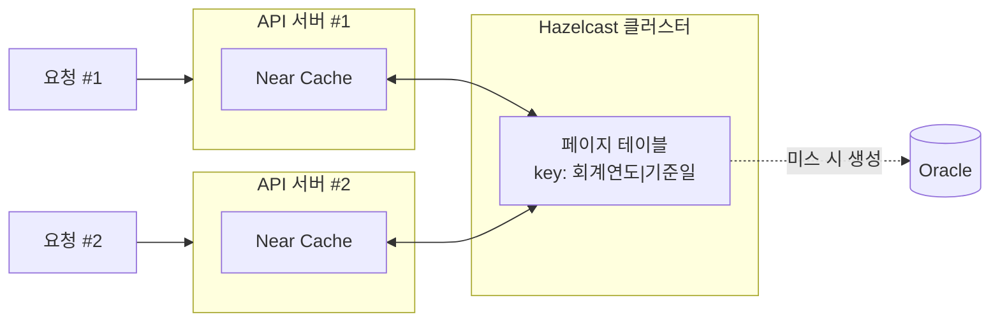
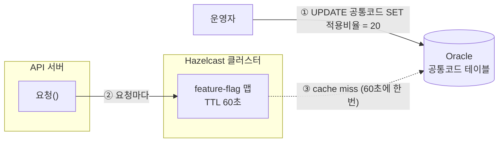

1. [DB로 해결 안 돼요?](#1-db로-해결-안-돼요)
2. [핵심 아이디어](#2-핵심-아이디어)
3. [심혈을 기울인 테스트](#3-심혈을-기울인-테스트)
4. [겁이 나서 달아둔 스위치](#4-겁이-나서-달아둔-스위치)
5. [예측과 실측](#5-예측과-실측)
6. [한계](#6-한계)

---

<script src="https://cdn.jsdelivr.net/npm/chart.js"></script>
<script src="https://cdn.jsdelivr.net/npm/chartjs-plugin-datalabels"></script>
<script src="/assets/attachments/2026-08-27/charts.js" type="module"></script>


# 요약

이 글은 지방자치단체 세출 자료를 제공하는 공개 API의 개선을 다룹니다. API는 선분이력으로 제공됩니다. 조회일자를 넣으면, 당시 시점의 세출 정보(사업)를 보여줍니다. 응답은 자치단체 순으로 정렬되고, 페이지는 offset 방식으로 넘어갑니다.

문제는 응답의 정렬 순서가 원장 테이블이 아닌, 행정구역 코드를 담은 외부 테이블에 있다는 점입니다. 그래서 원장 테이블의 어떠한 인덱스도 이 정렬을 대신할 수 없고, 최악의 경우 파티션 풀 스캔이 강제됩니다.

이 문제는 API를 일자별로 훑는 대량 조회에서 두드러집니다. 대량 조회는 요청 파라미터에 따라 세 갈래로 나뉩니다: (a) 지역 조건 없이 요청하는 경우, (b) 광역 단위로 요청하는 경우, (c) 자치단체 단위로 요청하는 경우입니다. (c)는 인덱스가 적용되지만, 나머지는 조인을 거쳐야 나오는 값이라 인덱스의 도움을 받지 못합니다.

이 글에서 택한 방법은, 정렬 순서를 DB가 아니라 캐시가 대신 보장하게 하는 것입니다. `(회계연도, 기준일)`마다 자치단체별로 몇 건씩 있는지 정렬해 미리 표로 만들어 둡니다. 그러면 몇 번째 행부터 몇 번째 행까지 달라는 요청을, 어떤 자치단체의 몇 번째 행에서 몇 번째 행이라는 좁은 조회로 바꿀 수 있습니다.

배포 전후 응답이 완전히 같은지 2개년치 날짜별 경계 페이지를 전수 대조해 검증했고, 점진적 적용과 롤백이 가능하도록 비율 기반 Feature Flag를 뒀습니다. 9월 1일 배포 후 하루 동안 27,212건을 관측한 결과, 8월 한 달과 비교해 응답시간 중앙값은 1,450ms에서 142ms로 90.2%, P90은 2,467ms에서 179ms로 92.7% 줄었습니다.

<span style="opacity:0.45;">※ 2026.09.02 하루의 초기 관측입니다. 배포 후 1주·2주·1개월 결과를 같은 기준으로 순차 갱신합니다.</span>


---

# 1. DB로 해결 안 돼요?

가령 선분이력[^lineage]으로 쌓인 하루치 자료 46만 건을 1,000개씩 fetch한다고 가정하면, 5페이지는 이렇게 불러옵니다.
```
┌─────┬─────────────────┬───────────────────────────────────────┐
│ ... |      1,000      |                  ...                  │
│     |                 |                                       │
└─────┴─────────────────┴───────────────────────────────────────┘
0     └─ 4,001 ~ 5,000 ─┘                                 463,770
```
{: .ascii-diagram}

고작 1,000건이 필요하더라도 46만 건을 전체 스캔해야만 했죠. 여기에 정렬 문제까지 겹쳤습니다. 때문에 앞쪽 페이지는 1,000ms 안팎으로 불러올 수 있지만, 마지막 페이지에 이르면 3,000 ~ 8,000ms까지 지연되곤 했습니다.

이 [API](https://www.lofin365.go.kr/portal/LF5120000.do?pdtaId=0GAR4HBB8LWEBSL4NIHZ817053)는 대개 하루가 아니라 여러 날짜를 순회하는 대량조회로 쓰입니다. 문제는 이 대량조회 중 상당수가 인덱스의 도움을 받지 못한다는 데 있습니다. 왜 그런지 살펴보겠습니다.

### 이미 파티션도 인덱스도 있습니다

각 사업은 자치단체별로 나뉘어져 정렬돼 있습니다. 그렇다면 이런 의문이 드실 수 있습니다.

> 파티션이랑 인덱스를 쓰면 되는 거 아냐?

사실 이미 연도별로 파티션이 적용돼 있고, 인덱스도 PK 포함 세 개나 존재합니다.

문제는 요청을 찰떡같이 넘겨 줘야 인덱스 덕을 본다는 겁니다. 요약의 (a)전국, (b)광역, (c)자치단체 세 유형을 각각 실측해 보면 이렇습니다:

- 유저 A: ❌ 20260826, 1,000개 사이즈로 5페이지 주세요.
    <br>→ 1,500ms ~ 3,000ms
- 유저 B: ❌ 20260826, 서울특별시 자료만, 1,000개 사이즈로 5페이지 주세요.
    <br>→ 1,500ms~
- 유저 C: ✅ 20260826, 서울특별시 본청 자료만, 1,000개 사이즈로 5페이지 주세요.
    <br>→ 200ms~

유형 C만 인덱스 컬럼(서울 본청)을 요청에 포함시켰기 때문에, ACCESS의 빠른 응답속도를 누릴 수 있는 겁니다.

### 인덱스를 추가하면?

그럼 이런 생각이 드실 수 있습니다.

> 유저 B는 아무튼 조회조건을 주네. 이 조회조건을 인덱스에 추가시키면 되지 않나?

저도 같은 생각으로 인덱스를 신청해 봤지만 반려됐습니다. 다른 요청의 실행계획이 바뀔 수 있다는 합당한 이유였습니다.

조인에 쓰이는 코드성 테이블도 문제였습니다. 행정구역은 바뀔 수 있습니다. 경북 군위군이 대구 군위군이 된 것처럼 말이죠. 또 행정구역의 변화에 따라 정렬 순서도 바뀔 수 있습니다. 이 모든 정보가 코드 테이블에 있습니다. 즉 정렬, 필터의 기준이 인덱스를 활용할 수 없는 원장 테이블 바깥에 있는 셈입니다.


### 결국 모두를 만족시킬 수는 없다

여차저차 B의 문제를 해결했다고 해도, 유저 A의 문제는 DB로 해결할 수 없습니다. 좁힐 조건 자체가 없어서입니다.

<br><br>

결국 DB에서는 도저히 풀 수가 없었습니다. 그래서 애플리케이션에서 풀어보기로 했습니다.

---

# 2. 핵심 아이디어

이게 핵심입니다.

> 일자별로 자치단체마다 몇 건씩 가지고 있는지만 미리 알 수 있다면, 요청을 각 구간으로 번역할 수 있다.

사실은 모든 행에 구간이 있고, 정렬되어 있다는 점에 착안했습니다.

```
┌────────────┬────────────┬─────┬────────────┬─────┬────────────┐
│  서울본청  │ 서울종로구 │ ... │  부산본청  │ ... │  제주본청  │
│    4,399   │   1,130    │     │   3,840    │     │   5,706    │
└────────────┴────────────┴─────┴────────────┴─────┴────────────┘
0     └─ 4,001 ~ 5,000 ─┘                                 463,770
```
{: .ascii-diagram}

이제 동일한 5페이지를 요청하면:
- 서울 본청의 4,001번부터 4,399번까지의 자료 (399개)
- 서울 종로구의 1번부터 601번까지의 자료 (601개)

를 합쳐 제공합니다. **(연도, 자치단체) 인덱스가 존재하기 때문에** 응답시간이 크게 줄어들고, 페이지 위치와 무관하게 평탄화됩니다. 애초에 조회비용이 작으니 정렬 비용도 사라지는 건 덤입니다.

### 모든 요청이 유저 C가 된다

각 자치단체 구간으로 번역된다는 말은, 페이지 테이블이 **자치단체 코드를 직접 지정해 준다**는 말이 됩니다.

```
유저 A (전국)     → 페이지 테이블 → [자치단체1, 자치단체2, ...] 로 쪼개줌
유저 B (광역)     → 페이지 테이블 → [자치단체1, 자치단체2]      로 쪼개줌
유저 C (자치단체) → 페이지 테이블 → [자치단체1]                 (원래와 같음)
```
{: .ascii-diagram}

사용자가 뭘 요청하든, 마법같이 자치단체 코드를 넣어 인덱스를 태워줍니다.


### 어떻게 동작하나

cache miss가 일어나면 해당 일자의 캐시를 생성합니다. 실제 DB를 조회해서 얻은, 동일한 값과 정렬순서입니다.

```
key    "2026|20260826"
value  [
         { lafCd: "1100000", rowCount: 4399 },  // 서울 본청 Block
         { lafCd: "1111000", rowCount: 1130 },  // 서울 종로구 Block
         ...
         { lafCd: "4900000", rowCount: 5706 },  // 제주 본청 Block
       ]
```

이제 Block, 자치단체의 행수를 담은 작은 구조체 리스트를 순회합니다. 이번에는 가장 마지막 464 페이지를 호출해 보겠습니다.

```
   [1,4399]    [4400,5529]        [458065,463770]
┌────────────┬────────────┬───────┬────────────┐
│  서울본청  │ 서울종로구 │  ...  │  제주본청  │
│    4,399   │   1,130    │       │   5,706    │
└────────────┴────────────┴───────┴────────────┘   마지막 770건만 필요
                                           └───┘ ← [463001, 463770]

page = [463001, 464000]     # 요청 페이지
for (서울본청, 서울종로구, ... 제주본청):

    ① 서울본청
    span = [1, 4399]
    if span ∩ page = ∅: ❌continue

    ② 서울종로구
    span = [4400, 5529]
    if span ∩ page = ∅: ❌continue

    ...

    ⓝ 제주본청
    span = [458065, 463770]
    if span ∩ page = ∅: ✅false
    
    hit    = span.intersect(page) = [463001, 463770]  ✅ 교집합 계산
    offset = hit.from - span.from = 463001 - 458065 = 4936
    fetch  = hit.length           = 463770 - 463001 + 1 = 770
    BlockSlice("4900000", offset=4936, fetch=770)     ✅ 해당 조건으로 DB 조회
```
{: .ascii-diagram}
- 요청 구간(`[p_from,p_to]`)과 순회 구간(`[b_from,b_to]`)이 겹칠 때 반환합니다.
- 여러 번 겹친다면 계속 순회하여 합칩니다. 요청 페이지 사이즈(pSize)에 도달할 때까지입니다.
- pSize 상한이 1,000이고 제일 작은 자치단체가 867행이라, 페이지가 최대로 걸칠 수 있는 구간은 3개입니다(2026년 기준).
- 유저가 요청하지 않았는데도 마지막에 자치단체 코드("4900000", 제주본청)가 생긴 것을 알 수 있습니다.


### 페이지 테이블은 어디에 있나

Hazelcast는 JVM 안에 IMDG 사본을 보유할 수 있는 Near Cache를 제공합니다. 일종의 L1, L2 캐시 관계 같은 거죠.

클러스터에 (key, value)를 저장하면, Hazelcast가 알아서 사본을 옮겨줍니다.




덕분에 hit시 IMDG 서버로의 왕복조차 생략됩니다. 표를 처음 만드는 비용은 COUNT(*) 쿼리 한 번뿐입니다. 요청마다 나가던 총 건수 조회 비용을 사본(캐시)으로 절감하는 셈이죠.

### 얼마나 오래 들고 있나

그렇다고 무한정 쌓아둘 순 없어서, LRU 정책과 maxSize(20)를 걸어뒀습니다. 20은 호출 분포로부터 얻은 휴리스틱입니다.

```
Near Cache (최근 사용 순)
┌────────────────┬────────────────┬─────┐
│ 2026|20260803  │ 2026|20260802  │ ... │
└────────────────┴────────────────┴─────┘
                                      └─ 최대 크기 넘으면
                                         가장 오래 안 쓰인 키부터 축출
```
{: .ascii-diagram}

대부분의 요청은 지난달 정도까지에 머무니 이 정도면 충분할 것으로 보입니다.

---

# 3. 심혈을 기울인 테스트

인기 많은 API입니다. 배포 전 응답과 배포 후 응답이 달라서는 안 됩니다.

통합 테스트 13개, 그리고 597일(20250101~)을 하루씩 훑는 대규모 테스트 1개로 2주에 걸쳐 검증했습니다. 검증은 크게 4갈래로 나뉩니다.

### 캐시가 생기고 재사용되는가

- 첫 호출에 페이지 테이블이 실제로 생기는지
- 캐시가 있을 때와 없을 때 응답이 같은지

확인했습니다. 캐시를 타든 안 타든 사용자에게 보이는 결과는 같아야 하니까요.

### 새 응답이 예전 응답과 완벽히 동일한가

- 전국·광역·자치단체 유형별 요청 (유저 A, B, C)
- 첫 페이지·중간 페이지·마지막 페이지·범위 밖 페이지

두 조합을 전수조사합니다. 새 응답과 예전 응답이 같아야 통과합니다.

가장 까다로운 건 한 페이지가 자치단체 경계를 걸치는 경우입니다. 그래서 무작위로 찔러보는 대신, 경계값을 분석해 **경계 페이지들을 전수조사하는 방식**으로 검증했습니다.

예를 들면 이렇습니다.

```
   [1,4399]   [4400,5529]
┌────────────┬────────────┬───
│  서울본청  │ 서울종로구 │ ...
│    4,399   │   1,130    │
└────────────┴────────────┴───
             ↑
 4,399가 1,000의 배수가 아니니, 이 경계는 어느 페이지 안에서 걸친다는 뜻

누적 = 0
pSize = 1000

① 서울본청
   구간 = [1, 4399]
   누적 = 4399
   4399 % 1000 = 399   ← 0이 아니므로 걸침
   return 5            ← 이 페이지만 별도로 검증
...
```
{: .ascii-diagram}

### fallback이 실제로 동작하는가

구현한 코드는 페이지 테이블의 정합성 검증이 실패하면 fallback합니다. 이걸 확인하려면 자료를 의도적으로 망가뜨릴 수밖에 없습니다. 그래서

- Stub으로 정합성을 일부러 어긋나게 만들어 fallback이 실제로 작동하는지

확인했습니다.

### 최근 자료를 모두 새로운 방식으로 제공해도 문제가 없는가

특정 기간이 주어지면, 그 기간에 속한 집행일자마다의 블록 경계를 전체 검증하고 싶었습니다.

그래서 `@TestFactory`로 날짜를 받아 동적 테스트를 생성하도록 구성했습니다. 날짜마다 다음을 검증합니다:

- 블록들이 정렬 순서대로 빠짐없이, 겹치지 않게 이어지는가
- 광역별·자치단체별로 나눠 합해도 기존 총건수와 맞는가
- 페이지 몇 개를 골라 실제로 조회해도 이전 응답과 같은가

### 테스트 하네스 다듬기

여러 번 검증하다 보니, 날짜별로 700초씩 걸려서 너무 느렸습니다. 그래서

- `@Execution(CONCURRENT)`와 parallel=4로 병렬 테스트가 가능하도록

수정했습니다.

그런데 때로는 빠르게 총건수 정도만 검증하고 싶을 때도 있습니다. 그래서

- `boolean QUICK` 상수를 만들고, QUICK일 때에는 최소 페이지만 검증하도록

수정했습니다.

테스트가 너무 느리다 보니, 기간을 나눠 동료들과 각자의 컴퓨터에서 병렬로 돌렸습니다. 그런데 heap 메모리, DB 보안 프로그램 종료 등으로 IDE가 예기치 못하게 종료되는 경우도 많았습니다. 그래서

- 별도 Logger Appender를 두고, 통합 테스트에서 필요한 log들만 쌓도록

수정했습니다. 그러면 실패 지점부터 이어갈 수도 있고, 파일로 서로의 진척도를 공유할 수도 있으니까요.

---

# 4. 겁이 나서 달아둔 스위치

수년째 돌던 개방 API를 한 번에 갈아끼우기는 무서웠습니다. 그래서 언제든 옛날로 되돌릴 수 있는 스위치를 하나 달았습니다. Feature Flag입니다.

### 정수 스위치

on/off가 아니라 **0~100 사이의 숫자**입니다. "전체 요청 중 몇 %를 새 경로로 보낼까"를 뜻합니다.

```
0    →  100% old, 0% new (꺼짐)
20   →  80% old, 20% new (부분 켜짐💡)
100  →  0% old, 100% new (완전히 켜짐💡)
```

기존 공통 테이블에 행을 추가하도록 설계했습니다. UPDATE 한 번이면 재배포도, 재기동도 필요 없습니다.

### 스위치는 어디에 있나



여기서 페이지 테이블과 정반대의 선택을 했습니다. 페이지 테이블에는 Near Cache를 붙여 왕복을 아꼈지만, 이 스위치 맵에는 **60초 TTL**만을 걸었습니다.

이러한 설계는 다음과 같은 장점이 있습니다:

1. 반영이 빠릅니다. 로컬에 사본이 있으면 무효화 비용이 발생합니다.
2. 구현이 간단합니다. 로컬 캐시와 서버 캐시의 상태나 생명주기를 고려할 필요가 없습니다.

하지만 다음과 같은 단점이 있습니다:

1. 요청마다 최소 한 번은 Hazelcast로 원격 왕복이 발생합니다.
2. 60초마다 DB를 다시 조회해야 합니다.

그래도 이 정도는 감수 가능하다고 생각했습니다:

- 단점이 전부 행 하나짜리 조회입니다. 최악의 경우 하루 1,440번 DB를 다시 읽는 건데, "요청마다 46만 행 스캔"에 비할 바는 아닙니다.

### 주사위를 굴리자

요청마다 주사위를 굴리는 방법을 택했습니다.

```java
int roll = ThreadLocalRandom.current().nextInt(100);
boolean isOn = roll < rate;     // rate=20이면 20% 확률로 true
```

이때 핵심은 주사위를 요청당 딱 한 번만 굴리는 겁니다. 그렇지 않으면 건수 조회와 목록 조회가 서로 다른 flag를 탈 수 있습니다.


### 스위치 로그는 별도로

주사위의 결과는 별도의 로그로 남습니다. 다음은 예시입니다:
```
[14:32:07.128] QWGJK path=block  reason=ok   rate=20 fyr=2026 exeYmd=20260826 pIndex=5  pSize=1000 rows=1000 ms=132
[14:32:07.311] QWGJK path=legacy reason=flag rate=20 fyr=2026 exeYmd=20260826 pIndex=5  pSize=1000 rows=1000 ms=1874
[14:32:09.455] QWGJK path=block  reason=ok   rate=20 fyr=2026 exeYmd=20260826 pIndex=12 pSize=1000 rows=1000 ms=145
[14:32:09.812] QWGJK path=legacy reason=flag rate=20 fyr=2026 exeYmd=20260826 pIndex=12 pSize=1000 rows=1000 ms=2015
```

로그를 따로 남긴 이유는, 카나리 배포를 흉내낼 경우 A/B 표본을 쉽게 구하고 싶어서였습니다. 예컨대 같은 time window 안에서 (new: rate=20)과 (old: rate=20)을 나란히 놓으면 공정한 비교가 가능하니까요.

### 스위치가 고장 나면 무조건 off

캐시든 DB든 무엇이든 고장나면 비율은 0이 됩니다(off).

```
try:
    비율 = Hazelcast에서 조회
    if 비율이 없으면:
        비율 = DB에서 조회 후 60초짜리로 캐시에 채움
catch (Hazelcast장애, DB장애 ...):
    비율 = 0
```

---

# 5. 예측과 실측

이번 개선이 얼마나 영향을 미칠지 예측한 뒤, 실측과 비교해보고 싶었습니다.

### 예측의 산출

배포 이후 백분위수가 어떻게 변할지 궁금했습니다. 하지만 배포되지도 않았는데 어떻게 추측할 수 있을까요?

저는 **실제 트랜잭션에 개선비를 곱하는 방식**을 택했습니다. 다음은 2026.07.01 ~ 2026.07.31 트랜잭션 약 52만 건을 유형화한 것입니다.

| 분류 | 건수 비중 | 처리 |
|:---:|:---:|:---|
| 유형 A (전국) | 13.3% | 실측 개선율을 곱함 |
| 유형 B (광역) | 36.5% | 실측 개선율을 곱함 |
| 유형 C (자치단체) | 42.0% | 그대로 둠(개선율 0) |
| 유형 미상 | 6.4% | 제외 |
| 소량 요청 | 1.8% | 제외 |

- stage 서버에서 JMeter로 유형별 대표 조회를 반복 실행해, 개선 전후 응답시간을 쟀습니다. 여기서 나온 유형별 개선비를 실제 트랜잭션에 곱했습니다.
- **유형 C**는 이미 인덱스로 접근하고 있어 이번 개선과 무관합니다. 그래도 더 악화되는지는 확인이 필요해 모수에 포함시켰습니다.
- **유형 미상**은 A, B, C 유형으로 볼 수 없는 요청 양태의 모음으로 제외했습니다.
- **소량 요청**은 호출량이 500건 미만인 유저들의 모음으로 양태를 알 수 없어 제외했습니다.

다음은 A, B, C 유형별 **7월 실제 트랜잭션 기반 예측 차트**입니다.

<div style="background:#fff; padding:1rem; border-radius:8px;">
<canvas id="chart-pct-lofin-prediction-combo"></canvas>
</div>

| 지표 | 대조군 | 실험군 |
|:---:|:---:|:---:|
| 평균 | 928ms | 132ms (▼85.8%) |
| 중앙값 | 956ms | 143ms (▼85.0%) |
| P95 | 2,301ms | 195ms (▼91.5%) |
| P99 | 2,577ms | 237ms (▼90.8%) |

제외한 8.2%가 결과를 왜곡한 건 아닌지도 확인했습니다[^allpop]. 상세한 내용은 [한계](#6-한계)에 후술합니다.

### 실측

9월 1일 배포 다음 날의 성공 요청 27,212건을 먼저 확인했습니다. 배포 전 8월 한 달과 기간은 다르므로 최종 결론이 아닌 초기 관측으로 두고, 1주·2주·1개월 결과를 이어서 비교합니다.

<div style="background:#fff; padding:1rem; border-radius:8px;">
<canvas id="chart-pct-lofin-combo"></canvas>
</div>

| 지표 | 배포 전 1달 | 배포 후 1일 | 1주 | 2주 | 1달 |
|:---:|---:|---:|---:|---:|---:|
| 성공 요청 | 789,260건 | 27,212건 | - | - | - |
| 중앙값 | 1,450ms | 142ms (▼90.2%) | - | - | - |
| P90 | 2,467ms | 179ms (▼92.7%) | - | - | - |
| P95 | 4,826ms | 515ms (▼89.3%) | - | - | - |
| P99 | 7,637ms | 1,418ms (▼81.4%) | - | - | - |

8월에는 P29 220ms에서 P30 823ms로 응답시간이 급격히 증가했습니다. 배포 후에는 P93 209ms까지 평탄한 구간이 이어지고, P94부터 308ms로 증가합니다. 느린 요청군의 시작점이 P30에서 P94로 이동한 셈입니다.

배포 후 1초를 넘긴 트랜잭션을 모두 확인한 결과, 전부 사업명 조건(`dbizNm`)을 포함하고 있었습니다. 이 조건은 페이지 테이블 적용 대상이 아니어서 의도적으로 기존 쿼리를 유지한 경로입니다. 따라서 상위 꼬리는 새 조회 경로의 성능 저하나 fallback이 아니라 적용 범위를 반영합니다.

- 배포 전 1달: 2026.08.01 ~ 2026.08.31, 789,260건
- 배포 후 1일: 2026.09.02, 27,212건
- 배포 후 1주: 2026.09.02 ~ 2026.09.08
- 배포 후 2주: 2026.09.02 ~ 2026.09.15
- 배포 후 1달: 2026.09.02 ~ 2026.09.30

---

# 6. 한계

### 예측치는 추정된 유형 분류에 기반한다

개선치를 예측하려면, 운영 환경과 동일한 환경에서 A, B, C 유형의 각 개선비를 알아야 합니다. 그런데 제니퍼5는 트랜잭션을 한 건씩 열어야만 요청 파라미터를 볼 수 있습니다. 52만 건을 전수조사해서 유형을 매길 방법이 없다는 뜻입니다.

그래서 유저는 항상 같은 유형으로 호출한다는 가정을 세워, IP 단위로 트랜잭션을 조회해 A, B 유형을 매겼습니다[^iptype]. 따라서 유저가 서로 다른 유형을 섞어 호출할 경우, 그만큼 통계가 왜곡됩니다.

- 52만 건 중 6.4%는 유형 확인이 어려워 제외했습니다. 중앙값 2,119ms로 A 유형일 가능성이 큽니다만, 확실치 않으니까요. 이들을 A로 간주했을 때 결과가 어떻게 바뀌는지는 5장에 적었습니다.
- 52만 건 중 1.8%는 7월 호출량이 500건 미만이라 유형을 매기지 않고 제외했습니다.
- 개선 대상은 유저 A, B입니다. 유저 C는 이미 인덱스로 접근하고 있어 이 구조가 보탤 것이 없지만, 느려지지 않았는지를 확인해야 하므로 개선도 0을 고정해 통계에 남겼습니다.

### 사업명 조건은 의도적으로 기존 경로를 유지한다

API는 사실 사업명(dbizNm)으로도 조회할 수 있습니다. 이 경우 페이지 테이블이 무색해집니다. 어떤 단어가 검색될지 모르니까요. 그래서 사업명으로 검색하는 경우 이전 쿼리를 그대로 사용합니다.

배포 전에는 사업명으로 몇 건만 조회할 가능성이 높아 영향이 미미할 것으로 예상했습니다. 그러나 배포 후 트랜잭션을 확인해 보니, 특정 사업명으로 기간을 전수 조회하는 실제 수요가 있었습니다. 이는 이번 페이지 테이블의 실패가 아니라 서로 다른 조회 문제이며, 별도의 후속 개선 대상으로 남깁니다.

### 조용한 실패에 대한 경보가 부재한다

캐시 응답의 총 건수가 다르거나, 연속성이 깨진 경우 fallback 처리됩니다. 그런데 정작 언제, 얼마나 자주 그렇게 됐는지는 로그를 직접 뒤져보지 않는 이상 아무도 모릅니다. 빠르게 만든 요청이 예전 요청과 온전히 같은지 손쉽게 알아차릴 방법이 필요합니다.

<br><br><br><br><br>

긴 글 읽어주셔서 감사합니다.

---

# References

[^lineage]: **선분이력 예시**

    전국에 세 개의 사업만 존재한다고 가정하고, 3/1과 8/26 두 일자를 조회하면 다음과 같습니다.

    <div style="background:#fff; padding:1rem; border-radius:8px; height:232px;">
    <canvas id="chart-lineage-lofin"></canvas>
    </div>

    - 3/1 사업은 세 개고, 사업의 이름이나 지출액은 연초와 동일합니다.
    - 8/26 사업은 두 개로 줄었고, 사업의 이름이나 지출액도 각각 변했죠.

[^allpop]: **제외된 8.2%는 어떤 요청들이었나**

    유형 미상과 소량 요청을 합쳐 8.2%를 뺐습니다. 이 요청들이 유독 느린 부류였다면, 최악의 사례를 슬쩍 빼고 결과를 좋게 만든 셈이 됩니다.

    - **유형 미상**은 중앙값 2,119ms, 쿼리 실행시간 비중 93.7%로, 유형 A(중앙값 2,111ms, 쿼리 실행시간 비중 94.2%)와 거의 같습니다. 그래서 유형 미상을 A로 간주하고 유형 A의 개선비를 그대로 적용해 다시 계산해 봤습니다. 개선율이 소폭 상승합니다(평균 기준 85.8% → 86.4%). 따라서 본문의 예측치는 better case를 제외한 값이니, 보수적이라고 볼 수 있습니다.

    - **소량 요청**은 중앙값 61ms, P95 2,085ms로 편차가 너무 커서, 어느 유형으로도 간주할 근거가 없어 그대로 뒀습니다.

    **그건 유형 미상이 개선된다는 가정이잖아요?**

    물론 이건 유형 미상이 A와 비슷하다는 가정 위에 서 있습니다. 그 가정을 걷어내고 8.2% 전체가 하나도 빨라지지 않는다고 가정하면, 52만 건 전체의 평균 개선율은 ▼75.7%까지 내려갑니다.

    제외분이 몰려 있는 상위 백분위에서 개선폭이 급격히 줄어드는 것도 보입니다.

    <div style="background:#fff; padding:1rem; border-radius:8px;">
    <canvas id="chart-pct-lofin-prediction-all-combo"></canvas>
    </div>

    **하지만 실험 통제를 위해서라면**

    가장 보수적인 개선치 75.7%를 본문에 내세웠어야 하는 건 아닐까요? 그렇게 생각하지는 않았습니다.

    8.2%를 개선시켰을 때는 best case, 개선시키지 못했을 때에는 worst case가 되는 것을 보셨습니다. 하지만 예측의 목표는 개선 대상이 얼마나 효과적인지를 보는 것입니다. 8.2%를 포함시킬 이유가 없는 것입니다. 예측치가 얼마나 신뢰할만한지 상한과 하한을 보는 용도일 뿐인 겁니다.
    
    따라서 8.2%의 요청이 예측 대상에서 제외되어야 한다는 결론에 변함은 없습니다.

[^iptype]: **IP로 트랜잭션의 호출 유형을 나눈 방법**

    다시 설명하자면, 이 API의 호출 유형은 크게 셋입니다:
    - 유형 A: (fyr, exe_ymd)
    - 유형 B: (fyr, exe_ymd, wa_laf_cd) ← 광역 코드(서울특별시 등)
    - 유형 C: (fyr, exe_ymd, laf_cd)    ← 자치단체 코드(서울 본청 등)
    
    개선 폭이 유형마다 달라 개선비도 따로 내야 하는데, APM(제니퍼5)에서 요청 파라미터를 알아내려면 트랜잭션을 일일이 클릭하는 방법밖에 없습니다. 52만 건을 하나씩 열어볼 수는 없으니 이렇게 했습니다.

    1. 클라이언트 IP별로 호출량과 활동 시간대를 뽑는다
    2. 상위 IP만 APM 상세 화면에서 몇 건씩 열어 파라미터를 보고 유형을 매긴다
    3. 각 트랜잭션에 사전 실험으로 얻은 유형별 개선비를 곱한다
