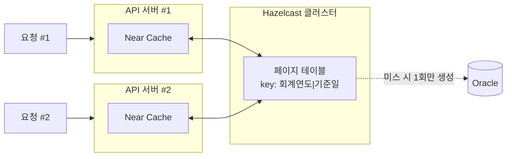
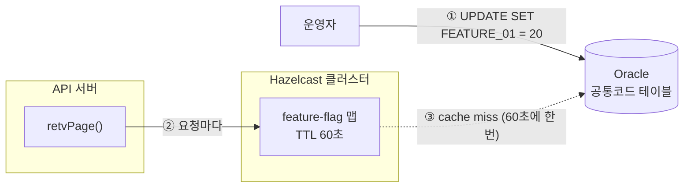

1. [무엇을 고쳤나](#1-무엇을-고쳤나)
2. [무슨 API에요?](#2-무슨-api에요)
3. [DB로 해결 안 돼요?](#3-db로-해결-안-돼요)
4. [핵심 아이디어](#4-핵심-아이디어)
5. [심혈을 기울인 테스트](#5-심혈을-기울인-테스트)
6. [겁이 나서 달아둔 스위치](#6-겁이-나서-달아둔-스위치)
7. [한계](#7-한계)

---

<script src="https://cdn.jsdelivr.net/npm/chart.js"></script>
<script src="https://cdn.jsdelivr.net/npm/chartjs-plugin-datalabels"></script>
<script src="/assets/attachments/2026-08-27/charts.js" type="module"></script>


# 요약

### 캐시로 페이지 테이블을 구축해, 특정 API의 응답속도를 개선했습니다(예측).

<div style="background:#fff; padding:1rem; border-radius:8px;">
<canvas id="chart-pct-lofin-prediction-combo"></canvas>
</div>

<div style="background:#fff; padding:1rem; border-radius:8px;">
<canvas id="chart-pct-lofin-prediction-all-combo"></canvas>
</div>

<div style="overflow-x:auto;">
<table>
<colgroup>
<col style="width:18%;">
<col style="width:41%;">
<col style="width:41%;">
</colgroup>
<thead>
<tr><th>지표</th><th>대조군</th><th>실험군</th></tr>
</thead>
<tbody>
<tr><td align="center">평균</td><td align="center">928ms</td><td align="center">132ms (▼85.8%)</td></tr>
<tr><td align="center">중앙값</td><td align="center">956ms</td><td align="center">143ms (▼85.0%)</td></tr>
<tr><td align="center">P95</td><td align="center">2,301ms</td><td align="center">195ms (▼91.5%)</td></tr>
<tr><td align="center">P99</td><td align="center">2,577ms</td><td align="center">237ms (▼90.8%)</td></tr>
</tbody>
</table>
</div>

*※ 2026.07.01 ~ 2026.07.31 운영 트랜잭션 약 52만 건을 호출 유형에 따라 분류하고, 호출 유형별 보정계수를 적용하여 추산함. 분류할 수 없는 요청 8.2%는 제외함.*

<h3 style="opacity:0.45;">실제로는 -배 개선되었습니다. (2026.09.08 업데이트 예정)</h3>

<div style="background:#fff; padding:1rem; border-radius:8px; opacity:0.45;">
<canvas id="chart-pct-lofin-combo"></canvas>
</div>

<div style="overflow-x:auto; opacity:0.45;">
<table>
<colgroup>
<col style="width:18%;">
<col style="width:20.5%;">
<col style="width:20.5%;">
<col style="width:20.5%;">
<col style="width:20.5%;">
</colgroup>
<thead>
<tr><th>지표</th><th>배포 전</th><th>1주</th><th>2주</th><th>1달</th></tr>
</thead>
<tbody>
<tr><td align="center">평균</td><td align="center"></td><td align="center"></td><td align="center"></td><td align="center"></td></tr>
<tr><td align="center">중앙값</td><td align="center"></td><td align="center"></td><td align="center"></td><td align="center"></td></tr>
<tr><td align="center">P95</td><td align="center"></td><td align="center"></td><td align="center"></td><td align="center"></td></tr>
<tr><td align="center">P99</td><td align="center"></td><td align="center"></td><td align="center"></td><td align="center"></td></tr>
</tbody>
</table>
</div>

<p style="opacity:0.45;"><em>※ 배포 전 2026.08.01 ~ 2026.08.31 운영 트랜잭션 약 -건, 배포 후 1주 2026.09.02 ~ 2026.09.08 약 -건, 배포 후 2주 2026.09.02 ~ 2026.09.15 약 -건, 배포 후 1달 2026.09.02 ~ 2026.09.30 약 -건을 각각 비교함.</em></p>


---

# 1. 무엇을 고쳤나

운영 중인 [API](https://www.lofin365.go.kr/portal/LF5120000.do?pdtaId=0GAR4HBB8LWEBSL4NIHZ817053)에 페이지 테이블을 도입했습니다.

### 개선 전

가령 463,770건의 자료를 1,000개씩 fetch한다고 가정한다면, 5페이지는 이렇게 불러옵니다.
```
┌─────┬─────────────────┬───────────────────────────────────────┐
│ ... |      1,000      |                  ...                  │
│     |                 |                                       │
└─────┴─────────────────┴───────────────────────────────────────┘
0     └─ 4,001 ~ 5,000 ─┘                                 463,770
```
{: .ascii-diagram}

고작 1,000건이 필요하더라도 46만건을 전체 스캔해야만 했죠. 여기에 정렬 문제까지 겹쳤습니다. 때문에 앞쪽 페이지는 1,000ms 안팎으로 불러올 수 있지만, 마지막 페이지에 이르면 3,000 ~ 8,000ms까지 지연되곤 했습니다.

### 개선 후

사실은 모든 행에 구간이 있고, 정렬되어 있다는 점에 착안했습니다.

```
┌────────────┬────────────┬─────┬────────────┬─────┬────────────┐
│  서울본청  │ 서울종로구 │ ... │  부산본청  │ ... │  제주본청  │
│    4,399   │   1,130    │     │   3,840    │     │   5,706    │
└────────────┴────────────┴─────┴────────────┴─────┴────────────┘
0     └─ 4,001 ~ 5,000 ─┘                                 463,770
```
{: .ascii-diagram}

이제 위와 동일한, 5페이지를 요청하면:
- 서울 본청의 4,001번부터 4,399번까지의 자료 (399개)
- 서울 종로구의 1번부터 601번까지의 자료 (601개)

를 합쳐 제공합니다. **`(연도, 자치단체)` 인덱스가 존재하기 때문에** 응답시간이 132ms 안팎으로 줄어듭니다.

---

# 2. 무슨 API에요?

이 API는 **조회일자**를 넣으면 **당일 자치단체의 사업 내역**을 보여주는 API입니다. 데이터는 선분이력으로 관리되고 있지요.

이해를 돕기 위해 전국에 세 개의 사업만 존재한다고 가정하겠습니다. 3/1, 8/26 두 일자를 조회합니다. 빨간 선에 주목해 주세요.

<div style="background:#fff; padding:1rem; border-radius:8px; height:232px;">
<canvas id="chart-lineage-lofin"></canvas>
</div>

- 3/1 사업은 세 개고, 사업의 이름이나 지출액은 연초와 동일합니다.
- 8/26 사업은 두 개로 줄었고, 사업의 이름이나 지출액도 각각 변했죠.

전국의 모든 지방 사업을 합치면 1년에 45~48만개 정도가 나옵니다. 즉, 앞서 보신 예시의 46만건은 "특정 일자의 전국 사업 상태"입니다. 더 나아가, 1년에 45~48만개의 사업이 어떻게 변화했는지 알고 싶으면, 빨간 선을 365개 그어야 한다는 이야기가 됩니다.

하루만 찾아보는 사람은 드뭅니다. 대부분 연구나 사업 목적으로 전체 일자를 조회하고 싶어하죠. API는 페이지네이션으로 제공되기에, 매 요청마다 45~48만개 행을 조회하고 정렬하고 버리는 참담한 모습을 눈물을 머금고 지켜봐야 했습니다.

이 API는 늘 우리 팀의 아픈 손가락이었습니다. 다른 API는 200ms ~ 300ms 선인데, 이 API만 ~8,000ms에 이르니까요.


---

# 3. DB로 해결 안 돼요?

각 사업은 자치단체별로 나뉘어져 정렬돼 있습니다. 그렇다면 이런 의문이 드실 수 있습니다.

> 파티션이랑 인덱스를 쓰면 되는 거 아냐?

사실 이미 연도별로 파티션이 적용돼 있고, 인덱스도 PK 포함 세 개나 존재합니다.

문제는 요청을 찰떡같이 넘겨 줘야 인덱스 덕을 본다는 겁니다. 예를 들어:

- 유저 A: ❌ 20260826, 1_000개 사이즈로 5페이지 주세요.
    <br>→ 1,500ms ~ 3,000ms
- 유저 B: ❌ 20260826, 서울특별시 자료만, 1_000개 사이즈로 5페이지 주세요.
    <br>→ 1,500ms~
- 유저 C: ✅ 20260826, 서울특별시 본청 자료만, 1_000개 사이즈로 5페이지 주세요.
    <br>→ 200ms~

유저 C만 인덱스 컬럼(서울 본청)을 요청에 포함시켰기 때문에, ACCESS의 빠른 응답속도를 누릴 수 있는 겁니다.

### 인덱스를 추가하면?

그럼 이런 생각이 드실 수 있습니다.

> 유저 B는 아무튼 조회조건을 주네. 이 조회조건을 인덱스에 추가시키면 되지 않나?

저도 같은 생각으로 인덱스를 신청해 봤지만 반려됐습니다. 다른 요청의 실행계획이 바뀔 수 있다는 합당한 이유였습니다.

조인에 쓰이는 코드성 테이블도 문제였습니다. 행정구역은 바뀔 수 있습니다. 경북 군위군이 대구 군위군이 된 것처럼 말이죠. 때문에 광역 자치단체 코드 WA_LAF_CD는 외부에서 쓰이는 코드성 테이블과 조인이 필수였습니다. 이것도 인덱스 활용을 어렵게 했습니다.


### 결국 모두를 만족시킬 수는 없다

여차저차 B의 문제를 해결했다고 해도, 유저 A의 문제는 DB로 해결할 수 없습니다. 좁힐 조건 자체가 없어서입니다.

<br><br>

결국 DB에서는 도저히 풀 수가 없었습니다. 그래서 애플리케이션에서 풀어보기로 했습니다.

---

# 4. 핵심 아이디어

이게 핵심입니다.

> 일자별로 자치단체마다 몇 건씩 가지고 있는지만 미리 알 수 있다면, 요청을 각 구간으로 번역할 수 있다.

### 모든 요청이 유저 C가 된다

각 자치단체 구간으로 번역된다는 말은, 페이지 테이블이 **자치단체 코드를 직접 지정해 준다**는 말이 됩니다. 모두가 200ms의 초고속 인터넷 스피드를 누리는 겁니다.

```
유저 A (전국)     → 페이지 테이블 → [자치단체1, 자치단체2, ...] 로 쪼개줌
유저 B (광역)     → 페이지 테이블 → [자치단체1, 자치단체2]      로 쪼개줌
유저 C (자치단체)  → 페이지 테이블 → [자치단체1]               (원래도 이거였음)
```
{: .ascii-diagram}

사용자가 뭘 요청하든, 마법같이 자치단체 코드를 넣어 인덱스를 태워줍니다.


### 어떻게 동작하나

cache miss가 일어나면 해당 일자의 캐시를 생성합니다. 실제 DB를 조회해서 얻은, 동일한 값과 정렬순서입니다.

```
key    "2026|20260826"
value  [
         { lafCd: "1100000", rowCount: 4399 },  // 서울 본청 Block
         { lafCd: "1111000", rowCount: 1130 },  // 서울 종로구 Block
         ...
         { lafCd: "4900000", rowCount: 5706 },  // 제주 본청 Block
       ]
```

이제 Block, 자치단체의 행수를 담은 작은 구조체 리스트를 순회합니다. 이번에는 가장 마지막 464 페이지를 호출해 보겠습니다.

```
   [1,4399]    [4400,5529]        [458065,463770]
┌────────────┬────────────┬───────┬────────────┐
│  서울본청  │ 서울종로구 │  ...  │  제주본청  │
│    4,399   │   1,130    │       │   5,706    │
└────────────┴────────────┴───────┴────────────┘   마지막 770건만 필요
                                           └───┘ ← [463001, 463770]

page = [463001, 464000]     # 요청 페이지
passed = 0                  # 지나온 수(커서)
for (서울본청, 서울종로구, ... 제주본청):

    ① 서울본청
    span = [1, 4399]
    passed = 4399
    if span ∩ page = ∅: ❌continue

    ② 서울종로구
    span = [4400, 5529]
    passed = 5529
    if span ∩ page = ∅: ❌continue

    ...

    ⓝ 제주본청
    span = [458065, 463770]
    passed = 463770
    if span ∩ page = ∅: ✅false
    
    hit    = span.intersect(page) = [463001, 463770]  ✅ 교집합 계산
    offset = hit.from - span.from = 463001 - 458065 = 4936
    fetch  = hit.length           = 463770 - 463001 + 1 = 770
    BlockSlice("4900000", offset=4936, fetch=770)     ✅ 해당 조건으로 DB 조회
```
{: .ascii-diagram}
- 요청 페이지 구간(`[p_from,p_to]`)을 주소 번역된 구간(`[b_from,b_to]`)과 겹쳐 반환하는 겁니다.
- 유저가 요청하지 않았는데도 마지막에 자치단체 코드("4900000", 제주본청)가 생긴 것을 알 수 있습니다.
- pSize에 관계없이 무한정 찾을 수 있도록 구현했지만, 실제로는 3개 구간까지만 겹칠 수 있습니다. 제일 작은 자치단체가 867행이기 때문입니다.


### 페이지 테이블은 어디에 있나

Hazelcast는 JVM 안에 IMDG 사본을 보유할 수 있는 Near Cache를 제공합니다. 일종의 L1, L2 캐시 관계 같은 거죠.

클러스터에 (key, value)를 저장하면, Hazelcast가 알아서 사본을 옮겨줍니다.




덕분에 hit시 IMDG 서버로의 왕복조차 생략됩니다. 표를 처음 만드는 비용은 COUNT(*) 쿼리 한 번뿐입니다. 즉 **요청마다 나가던 COUNT(*)가 통째로 사라진 셈입니다.**

그렇다고 무한정 쌓아둘 순 없어서, LRU 정책과 maxSize(20)를 걸어뒀습니다. 20은 호출 분포로부터 얻은 휴리스틱입니다.

```
Near Cache (최근 사용 순)
┌────────────────┬────────────────┬─────┐
│ 2026|20260803  │ 2026|20260802  │ ... │
└────────────────┴────────────────┴─────┘
                                      └─ 최대 크기 넘으면
                                         가장 오래 안 쓰인 키부터 축출
```
{: .ascii-diagram}

대부분의 요청은 어제 또는 지난주, 지난달 정도에 머무니 이 정도면 충분할 것으로 보입니다.

---

# 5. 심혈을 기울인 테스트

인기 많은 API입니다. 배포 전 응답과 배포 후 응답이 달라서는 절대 안 됩니다.

통합 테스트 13개, 그리고 597일(20250101~)을 하루씩 훑는 대규모 테스트 1개로 2주에 걸쳐 검증했습니다. 검증은 크게 4갈래로 나뉩니다.

### 매핑표 캐시가 생기고 재사용되는가

- 첫 호출에 매핑표가 실제로 생기는지
- 캐시가 비어 있을 때와 이미 있을 때 응답이 같은지

확인했습니다. 캐시를 타든 안 타든 사용자에게 보이는 결과는 같아야 하니까요.

### 새 응답이 예전 응답과 완벽히 동일한가

- 전국·광역·자치단체 유형별 요청 (유저 A, B, C)
- 첫 페이지·중간 페이지·마지막 페이지·범위 밖 페이지

두 조합을 전수조사합니다. 새 응답과 예전 응답이 행 단위로 완전히 같아야 통과합니다.

가장 까다로운 건 한 페이지가 자치단체 경계를 걸치는 경우입니다. 그래서 무작위로 찔러보는 대신, 경계값을 분석해 **경계 페이지들을 전수조사하는 방식**으로 검증했습니다.

예를 들면 이렇습니다.

```
   [1,4399]   [4400,5529]
┌────────────┬────────────┬───
│  서울본청  │ 서울종로구 │ ...
│    4,399   │   1,130    │
└────────────┴────────────┴───
             ↑
 4,399가 1,000의 배수가 아니니, 이 경계는 어느 페이지 안에서 걸친다는 뜻

누적 = 0
pSize = 1000

① 서울본청
   구간 = [1, 4399]
   누적 = 4399
   4399 % 1000 = 399   ← 0이 아니므로 걸침
   return 5            ← 이 페이지만 별도로 검증
...
```
{: .ascii-diagram}

### 방어 로직과 Near Cache가 실제로 작동하는가

페이지 테이블이 예전 응답과 다르면 fallback하는 방어 로직이 있습니다. 자료를 망가뜨리지 않는 이상 확인할 길이 없습니다. 그래서

- Stub으로 정합성을 일부러 어긋나게 만들어 방어 로직이 실제로 작동하는지

확인했습니다.

### 최근 자료를 모두 새로운 방식으로 제공해도 문제가 없는가

특정 기간이 주어지면, 그 기간별 집행일자(빨간 선)의 블록 경계를 싹 전수조사하고 싶었습니다.

그래서 `@TestFactory`로 날짜를 받아 동적 테스트를 생성하도록 구성했습니다. 날짜마다 다음을 검증합니다:

- 블록들이 정렬 순서대로 빠짐없이, 겹치지 않게 이어지는가
- 광역별·자치단체별로 나눠 합해도 기존 총건수와 맞는가
- 페이지 몇 개를 골라 실제로 조회해도 이전 응답과 같은가

그런데 여러 번 검증하다 보니, 날짜별로 700초씩 걸려서 너무 느렸습니다. 그래서

- `@Execution(CONCURRENT)`와 parallel=4로 병렬 테스트가 가능하도록

수정했습니다.

그런데 때로는 빠르게 총건수 정도만 검증하고 싶을 때도 있습니다. 그래서

- `boolean QUICK` 상수를 만들고, QUICK일 때에는 최소 페이지만 검증하도록

수정했습니다.

테스트가 너무 느리다 보니, 기간을 나눠 동료들과 각자의 컴퓨터에서 병렬로 돌렸습니다. 그런데 heap 메모리, DB 보안 프로그램 종료 등으로 IDE가 예기치 못하게 종료되는 경우도 많았습니다. 그래서

- 별도 Logger Appender를 두고, 통합 테스트에서 필요한 log들만 쌓도록

수정하기도 했습니다. 그러면 실패 지점부터 이어갈 수도 있고, 파일로 서로의 진척도를 공유할 수도 있으니까요.

---

# 6. 겁이 나서 달아둔 스위치

수년째 돌던 개방 API를 한 번에 갈아끼우기는 무서웠습니다. 그래서 언제든 옛날로 되돌릴 수 있는 스위치를 하나 달았습니다. Feature Flag입니다.

### 정수 스위치

on/off가 아니라 **0~100 사이의 숫자**입니다. "전체 요청 중 몇 %를 새 경로로 보낼까"를 뜻합니다.

```
0    →  100% old (꺼짐)
20   →  20% new, 80% old
100  →  100% new (켜짐)
```

기존 공통코드 테이블에 행을 추가하도록 설계했습니다. UPDATE 한 번이면 재배포도, 재기동도 필요 없습니다.

### 스위치는 어디에 있나



여기서 페이지 테이블과 정반대의 선택을 했습니다. 페이지 테이블에는 Near Cache를 붙여 왕복을 아꼈지만, 이 스위치 맵에는 **60초 TTL**만을 걸었습니다.

이러한 설계는 다음과 같은 장점이 있습니다:

1. 반영이 빠릅니다. 로컬에 사본이 있으면 무효화가 필요합니다.
2. 구현이 간단합니다. 로컬 캐시와 서버 캐시의 상태나 생명주기를 고려할 필요가 없습니다.

하지만 다음과 같은 단점이 있습니다:

1. 요청마다 최소 한 번은 Hazelcast로 원격 왕복이 발생합니다.
2. 60초마다 DB를 다시 조회해야 합니다.

그래도 이 정도는 감수 가능하다고 생각했습니다:

- 단점이 전부 행 하나짜리 조회입니다. 최악의 경우 하루 1,440번 DB를 다시 읽는 건데, "요청마다 46만 행 스캔"에 비할 바가 아닙니다.

### 주사위를 굴리자

pod가 수십 수백개든, Spring을 쓰는 이상 요청은 스레드 단위로 할당됩니다. 저는 그래서 요청마다 주사위를 굴리는 방법을 택했습니다.

```java
int roll = ThreadLocalRandom.current().nextInt(100);
boolean isOn = roll < rate;     // rate=20이면 20% 확률로 true
```

이때 핵심은 주사위를 요청당 딱 한 번만 굴리는 겁니다. 그렇지 않으면 페이지네이션용 총 건수 조회와 자료 조회가 서로 다른 feature를 탈 수 있습니다.


### 스위치 로그는 별도로

주사위의 결과는 별도의 로그로 남습니다. 다음은 예시입니다:
```
[14:32:07.128] QWGJK path=block  reason=ok   rate=20 fyr=2026 exeYmd=20260826 pIndex=5  pSize=1000 rows=1000 ms=132
[14:32:07.311] QWGJK path=legacy reason=flag rate=20 fyr=2026 exeYmd=20260826 pIndex=5  pSize=1000 rows=1000 ms=1874
[14:32:09.455] QWGJK path=block  reason=ok   rate=20 fyr=2026 exeYmd=20260826 pIndex=12 pSize=1000 rows=1000 ms=145
[14:32:09.812] QWGJK path=legacy reason=flag rate=20 fyr=2026 exeYmd=20260826 pIndex=12 pSize=1000 rows=1000 ms=2015
```

로그를 따로 남긴 이유는, 카나리 배포를 흉내낼 경우 A/B 표본을 쉽게 구하고 싶어서였습니다. 예컨대 같은 time window 안에서 (new: rate=20)과 (old: rate=20)을 나란히 놓으면 공정한 비교가 가능하니까요.

### 스위치가 고장 나면 무조건 old

Hazelcast가 맛이 가든 DB가 맛이 가든, 예외가 나면 무조건 비율을 0으로 떨어뜨렸습니다.

```
try:
    비율 = Hazelcast에서 조회
    if 비율이 없으면:
        비율 = DB에서 조회 후 60초짜리로 캐시에 채움
catch (Hazelcast 장애든 DB 장애든 뭐든):
    비율 = 0     ← 무조건 현행
```

새 기능이 흔들리는 것과, 그 새 기능을 지켜보는 스위치까지 같이 흔들려서 현행마저 죽는 건 완전히 다른 사고입니다. 판정 로직이 뭘 확신하지 못하면, 확신하지 못한다는 사실 자체를 안전한 쪽(현행)으로 해석하게 만들었습니다.

---

# 7. 한계

### 예측치는 추정된 유형 분류에 기반한다

개선치를 예측하려면, 운영 환경과 동일한 환경에서 A, B, C 유형의 각 개선비를 알아야 합니다. 그런데 제니퍼5는 트랜잭션을 한 건씩 열어야만 요청 파라미터를 볼 수 있습니다. 52만 건을 전수조사해서 유형을 매길 방법이 없다는 뜻입니다.

그래서 호출자는 항상 같은 유형으로 호출한다는 가정을 세워, IP 단위로 트랜잭션을 조회해 A, B 유형을 매겼습니다[^iptype]. 따라서 호출자가 서로 다른 유형을 섞어 호출할 경우, 그만큼 통계가 왜곡됩니다.

- 52만 건 중 10.9%는 유형 확인이 어려워 통계에서 제외했습니다. 중앙값 2,119ms로 A 유형일 가능성이 큽니다만, 확실치 않으니까요.
- 52만 건 중 5.2%는 C 유형으로 통계에서 제외했습니다. 사실상 이번 개선 대상은 A, B 유형이기 때문입니다.

### 사업명 조건은 이번 개선 대상이 아니다

API는 사실 사업명(dbizNm)으로도 조회할 수 있습니다. 이 경우 페이지 테이블이 무색해집니다. 어떤 단어가 검색될지 모르니까요. 그래서 사업명으로 검색하는 경우 이전 쿼리를 그대로 사용합니다.

다만 사업명으로 조회하는 사용자는 단건을 조회하려는 가능성이 높습니다. 따라서 이전 쿼리를 그대로 사용해도 영향이 미미할 것이라고 생각했습니다.

### 조용한 실패는 검증하지 못했다

캐시 응답의 총 건수가 다르거나, 연속성이 깨진 경우 fallback 처리됩니다. 그런데 정작 언제, 얼마나 자주 그렇게 됐는지는 로그를 직접 뒤져보지 않는 이상 아무도 모릅니다. 빠르게 만든 요청이 예전 요청과 온전히 같은지 손쉽게 알아차릴 방법이 필요합니다.

<br><br><br><br><br>

긴 글 읽어주셔서 감사합니다.

---

# References

[^iptype]: **IP로 운영 트랜잭션의 호출 유형을 나눈 방법**

    다시 설명하자면, 이 API의 호출 유형은 크게 셋입니다:
    - 유형 A: (fyr, exe_ymd)
    - 유형 B: (fyr, exe_ymd, wa_laf_cd) ← 광역 코드(서울특별시 등)
    - 유형 C: (fyr, exe_ymd, laf_cd)    ← 자치단체 코드(서울 본청 등)
    
    개선 폭이 유형마다 달라 개선비도 따로 내야 하는데, APM(제니퍼5)에서 요청 파라미터를 알아내려면 트랜잭션을 일일이 클릭하는 방법밖에 없습니다. 52만 건을 하나씩 열어볼 수는 없으니 이렇게 했습니다.

    1. 클라이언트 IP별로 호출량과 활동 시간대를 뽑는다
    2. 상위 IP만 APM 상세 화면에서 몇 건씩 열어 파라미터를 보고 유형을 매긴다
    3. 각 트랜잭션에 사전 실험으로 얻은 유형별 개선비를 곱한다
