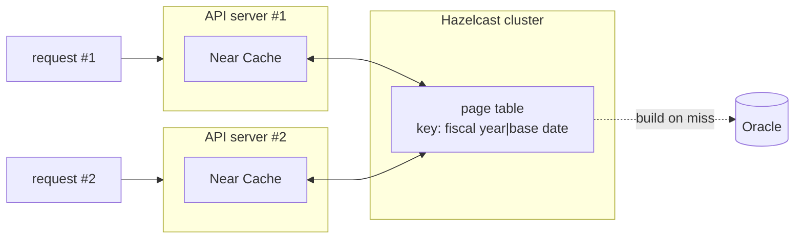
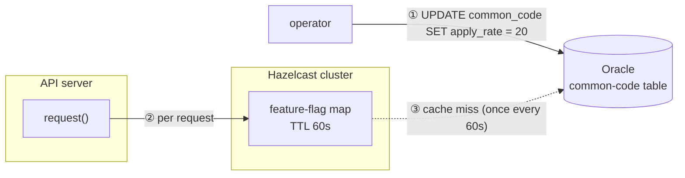

1. [Can't the database handle this?](#1-cant-the-database-handle-this)
2. [The core idea](#2-the-core-idea)
3. [Testing, obsessively](#3-testing-obsessively)
4. [The switch I added out of fear](#4-the-switch-i-added-out-of-fear)
5. [Prediction and measurement](#5-prediction-and-measurement)
6. [Limitations](#6-limitations)

---

<script src="https://cdn.jsdelivr.net/npm/chart.js"></script>
<script src="https://cdn.jsdelivr.net/npm/chartjs-plugin-datalabels"></script>
<script src="/assets/attachments/2026-08-27/charts.js" type="module"></script>


# Summary

This post is about improving a public API that serves local-government expenditure data. The API is served as valid-time history: give it a query date and it shows the expenditure records (programs) as of that moment. Responses are sorted by local government, and pages advance by offset.

The problem is that the sort order lives not in the ledger table but in an external table holding the administrative region codes. So no index on the ledger can stand in for that sort, and in the worst case a full partition scan is forced.

This problem stands out in bulk queries that sweep the API date by date. Bulk queries split three ways by request parameter: (a) requesting with no region filter, (b) requesting at the regional level, (c) requesting at the local-government level. (c) hits an index; the rest need a join to produce the value and get no help from an index.

The approach this post takes is to have the cache, not the database, guarantee the sort order. For each `(fiscal year, base date)`, precompute a table of how many rows each local government has, in sorted order. Then a request for "rows N through M" can be rewritten into the narrow query "rows N through M within such-and-such local government."

I ran a full date-by-date boundary test across two years of data to confirm the response was identical before and after, and put in a ratio-based feature flag for gradual rollout and rollback.

- mean 88.7% (1,458ms → 164.5ms)
- median 90.3% (1,450ms → 141ms)
- P95 96.2% (4,826ms → 183ms)
- P99 82.6% (7,637ms → 1,330ms)

It improved.


---

# 1. Can't the database handle this?

Suppose a day's worth of data, 460,000 rows accumulated as valid-time history[^lineage], is fetched 1,000 at a time. Page 5 comes back like this:

```
┌─────┬─────────────────┬───────────────────────────────────────┐
│ ... |      1,000      |                  ...                  │
│     |                 |                                       │
└─────┴─────────────────┴───────────────────────────────────────┘
0     └─ 4,001 ~ 5,000 ─┘                                 463,770
```
{: .ascii-diagram}

Even if you only need 1,000 rows, you have to scan all 460,000. Then the sort problem piled on top. So the front pages come back in around 1,000ms, but by the last page it drags out to 3,000 ~ 8,000ms.

This [API](https://www.lofin365.go.kr/portal/LF5120000.do?pdtaId=0GAR4HBB8LWEBSL4NIHZ817053) is mostly used for bulk queries that walk through many dates rather than one. The problem is that a good share of those bulk queries get no help from an index. Let me look at why.

### There is already a partition, and there are indexes

Each program is split and sorted by local government. So you might wonder:

> Can't you just use the partition and the indexes?

There is in fact a per-year partition, and there are three indexes, PK included.

The problem is that you only benefit from an index if you hand the request over just right. Measure the summary's three types, (a) nationwide, (b) regional, (c) local government, one by one, and it looks like this:

- User A: ❌ Give me 20260826, page 5 at size 1,000.
    <br>→ 1,500ms ~ 3,000ms
- User B: ❌ Give me 20260826, Seoul data only, page 5 at size 1,000.
    <br>→ 1,500ms~
- User C: ✅ Give me 20260826, Seoul HQ data only, page 5 at size 1,000.
    <br>→ 200ms~

Only type C put an index column (Seoul HQ) in the request, so it gets to enjoy the fast response time of ACCESS.

### What if you add an index?

Then you might think:

> User B does give a filter, at least. Can't you add that filter to an index?

I thought the same and filed for an index, but it was rejected. The reason was sound: it could change the execution plan of other requests.

The code table used in the join was a problem too. Administrative regions can change, the way Gunwi County went from North Gyeongsang to Daegu. And the sort order can change along with the region change. All of that information is in the code table. In other words, the basis for the sort and the filter is outside the ledger table, where an index cannot reach it.

### In the end you can't satisfy everyone

Even if you somehow solved B's problem, you cannot solve User A's problem in the database. There is no filter to narrow it with in the first place.

<br><br>

In the end the database simply could not solve it. So I decided to try solving it in the application.

---

# 2. The core idea

This is the crux.

> If you could know in advance how many rows each local government holds on each date, you could translate a request into the corresponding spans.

The insight is that every row actually has a span, and it is sorted.

```
┌────────────┬────────────┬─────┬────────────┬─────┬────────────┐
│  Seoul HQ  │   Jongno   │ ... │  Busan HQ  │ ... │  Jeju HQ   │
│    4,399   │   1,130    │     │   3,840    │     │   5,706    │
└────────────┴────────────┴─────┴────────────┴─────┴────────────┘
0     └─ 4,001 ~ 5,000 ─┘                                 463,770
```
{: .ascii-diagram}

Now, request that same page 5 and it serves:
- Seoul HQ's rows 4,001 through 4,399 (399 rows)
- Seoul Jongno's rows 1 through 601 (601 rows)

combined. **Because a (year, local government) index exists**, the response time drops sharply and flattens out regardless of page position. Since the query cost is small to begin with, the sort cost disappears too, as a bonus.

### Every request becomes User C

Translating into per-local-government spans means the page table **hands you the local-government code directly**.

```
User A (nationwide) → page table → splits into [local govt 1, local govt 2, ...]
User B (regional)   → page table → splits into [local govt 1, local govt 2]
User C (local govt) → page table → [local govt 1]              (same as before)
```
{: .ascii-diagram}

Whatever the user requests, it magically inserts a local-government code and rides the index.

### How it works

On a cache miss, it builds the cache for that date. It is the same values and sort order obtained by actually querying the DB.

```
key    "2026|20260826"
value  [
         { lafCd: "1100000", rowCount: 4399 },  // Seoul HQ block
         { lafCd: "1111000", rowCount: 1130 },  // Seoul Jongno block
         ...
         { lafCd: "4900000", rowCount: 5706 },  // Jeju HQ block
       ]
```

Now it walks the list of Blocks, small structs holding each local government's row count. This time let me call the very last page, page 464.

```
   [1,4399]    [4400,5529]        [458065,463770]
┌────────────┬────────────┬───────┬────────────┐
│  Seoul HQ  │   Jongno   │  ...  │  Jeju HQ   │
│    4,399   │   1,130    │       │   5,706    │
└────────────┴────────────┴───────┴────────────┘   only the last 770 rows needed
                                           └───┘ ← [463001, 463770]

page = [463001, 464000]     # requested page
for (Seoul HQ, Seoul Jongno, ... Jeju HQ):

    ① Seoul HQ
    span = [1, 4399]
    if span ∩ page = ∅: ❌continue

    ② Seoul Jongno
    span = [4400, 5529]
    if span ∩ page = ∅: ❌continue

    ...

    ⓝ Jeju HQ
    span = [458065, 463770]
    if span ∩ page = ∅: ✅false

    hit    = span.intersect(page) = [463001, 463770]  ✅ compute the intersection
    offset = hit.from - span.from = 463001 - 458065 = 4936
    fetch  = hit.length           = 463770 - 463001 + 1 = 770
    BlockSlice("4900000", offset=4936, fetch=770)     ✅ query the DB with that condition
```
{: .ascii-diagram}
- It returns when the requested span (`[p_from,p_to]`) and the walked span (`[b_from,b_to]`) overlap.
- If they overlap several times, it keeps walking and accumulating, until it reaches the requested page size (pSize).
- The pSize cap is 1,000 and the smallest local government has 867 rows, so a page can straddle at most 3 spans (as of 2026).
- Notice that a local-government code ("4900000", Jeju HQ) has appeared at the end even though the user did not request it.

### Where the page table lives

Hazelcast provides a Near Cache that can hold an IMDG replica inside the JVM. It is like an L1/L2 cache relationship.

Store a (key, value) in the cluster and Hazelcast moves the replicas around for you.




So on a hit, even the round trip to the IMDG server is skipped. The cost of building the table the first time is a single `COUNT(*)` query. In effect, the per-request total-count query cost is saved by the replica (the cache).

### How long it holds

You cannot pile it up forever, so I put an LRU policy and `maxSize(20)` on it. 20 is a heuristic from the call distribution.

```
Near Cache (most recently used first)
┌────────────────┬────────────────┬─────┐
│ 2026|20260803  │ 2026|20260802  │ ... │
└────────────────┴────────────────┴─────┘
                                      └─ once it exceeds the max size,
                                         evict from the least recently used key
```
{: .ascii-diagram}

Most requests stay within roughly the last month, so this should be enough.

---

# 3. Testing, obsessively

It is a popular API. The response before deployment and the response after must not differ.

I verified over two weeks with 13 integration tests plus one large test that sweeps 597 days (from 20250101) one day at a time. The verification splits broadly into four strands.

### Does the cache get built and reused

- Whether the page table actually gets built on the first call
- Whether the response is the same with and without the cache

I checked. The result the user sees has to be the same whether or not it goes through the cache.

### Is the new response perfectly identical to the old one

- Requests by type: nationwide, regional, local government (Users A, B, C)
- First page, middle page, last page, out-of-range page

I do a full sweep of the two combinations. The new response has to equal the old response to pass.

The trickiest case is a page that straddles a local-government boundary. So instead of poking at random, I analyzed the boundary values and verified by **fully sweeping the boundary pages**.

Here is an example.

```
   [1,4399]   [4400,5529]
┌────────────┬────────────┬───
│  Seoul HQ  │   Jongno   │ ...
│    4,399   │   1,130    │
└────────────┴────────────┴───
             ↑
 4,399 is not a multiple of 1,000, so this boundary falls inside some page

running total = 0
pSize = 1000

① Seoul HQ
   span = [1, 4399]
   running total = 4399
   4399 % 1000 = 399   ← not 0, so it straddles
   return 5            ← verify this page separately
...
```
{: .ascii-diagram}

### Does the fallback actually work

The implemented code falls back if the page table's consistency check fails. To verify that, you have no choice but to break the data on purpose. So I checked

- whether the fallback actually kicks in when a Stub deliberately makes the consistency mismatch.

### Is it fine to serve all recent data the new way

Given a certain period, I wanted to fully verify the block boundaries for every disbursement date in that period.

So I used `@TestFactory` to take a date and generate a dynamic test. For each date it verifies:

- whether the blocks connect in sort order, with none missing and none overlapping
- whether splitting and summing by region and by local government still matches the old total count
- whether picking a few pages and actually querying gives the same response as before

### Polishing the test harness

Running the verification many times, it was too slow at 700 seconds per date. So I changed it

- so that parallel testing was possible with `@Execution(CONCURRENT)` and parallel=4.

But sometimes you just want to quickly verify the total count. So I changed it

- to add a `boolean QUICK` constant, verifying only the minimum pages when QUICK is set.

Because the test was so slow, we split the period and ran it in parallel on our own machines, colleagues and I. But the IDE would shut down unexpectedly a lot, from heap memory, from a DB security program terminating, and so on. So I changed it

- to add a separate Logger Appender that accumulates only the logs the integration test needs.

That way you can pick up from where it failed, and share progress with each other as a file.

---

# 4. The switch I added out of fear

Swapping out an open API that had run for years, all at once, was scary. So I added a switch that could roll it back at any time. A feature flag.

### An integer switch

Not on/off but **a number between 0 and 100**. It means "what percentage of all requests should go to the new path."

```
0    →  100% old, 0% new (off)
20   →  80% old, 20% new (partially on💡)
100  →  0% old, 100% new (fully on💡💡)
```

I designed it to add a row to the existing common table. One UPDATE, no redeploy, no restart.

### Where the switch lives



Here I made the opposite choice from the page table. The page table got a Near Cache to save the round trip, but this switch map got **only a 60-second TTL**.

This design has these advantages:

1. It reflects fast. A local replica incurs an invalidation cost.
2. It is simple to implement. You do not have to reason about the state or lifecycle of a local cache versus a server cache.

But it has these disadvantages:

1. Every request makes at least one remote round trip to Hazelcast.
2. It re-queries the DB every 60 seconds.

Still, I thought this much was acceptable:

- The disadvantages are all a single-row query. Worst case, that is re-reading the DB 1,440 times a day, which is nothing next to "scan 460,000 rows per request."

### Roll the dice

I chose to roll a die per request.

```java
int roll = ThreadLocalRandom.current().nextInt(100);
boolean isOn = roll < rate;     // rate=20 → true with 20% probability
```

The key here is to roll the die exactly once per request. Otherwise the count query and the list query could ride different flags.

### The switch log goes separately

The dice results go into a separate log. Here is an example:

```
[14:32:07.128] QWGJK path=block  reason=ok   rate=20 fyr=2026 exeYmd=20260826 pIndex=5  pSize=1000 rows=1000 ms=132
[14:32:07.311] QWGJK path=legacy reason=flag rate=20 fyr=2026 exeYmd=20260826 pIndex=5  pSize=1000 rows=1000 ms=1874
[14:32:09.455] QWGJK path=block  reason=ok   rate=20 fyr=2026 exeYmd=20260826 pIndex=12 pSize=1000 rows=1000 ms=145
[14:32:09.812] QWGJK path=legacy reason=flag rate=20 fyr=2026 exeYmd=20260826 pIndex=12 pSize=1000 rows=1000 ms=2015
```

The reason I kept the log separate is that if I mimic a canary deployment, I want easy A/B samples. Line up (new: rate=20) and (old: rate=20) within the same time window, say, and you can compare fairly.

### If the switch breaks, off no matter what

If anything breaks, cache or DB, the rate becomes 0 (off).

```
try:
    rate = read from Hazelcast
    if rate is missing:
        rate = read from DB, then fill the cache with a 60-second entry
catch (Hazelcast failure, DB failure ...):
    rate = 0
```

---

# 5. Prediction and measurement

I wanted to predict how much this change would matter, then compare against the measurement.

### Calculating the prediction

I was curious how the percentiles would shift after deployment. That calls for a predicted value. But how, when it is not even deployed?

I chose to **multiply the pre-deployment transactions by an improvement factor**. The following types about 520,000 transactions from 2026.07.01 to 2026.07.31.

| Type | Share by count | Handling |
|:---:|:---:|:---|
| Type A (nationwide) | 13.3% | multiply by the measured improvement rate |
| Type B (regional) | 36.5% | multiply by the measured improvement rate |
| Type C (local govt) | 42.0% | leave as-is (improvement rate 0) |
| Type unknown | 6.4% | exclude |
| low-volume requests | 1.8% | exclude |

- On the stage server, I repeatedly ran representative queries per type with JMeter and measured the response time before and after the change. I multiplied the actual transactions by the per-type improvement factor that came out of this.
- **Type C** already accesses via an index, so it is unrelated to this change. Still, I kept it in the denominator because I needed to confirm it did not get worse.
- **Type unknown** is a collection of request shapes that cannot be seen as type A, B, or C, so I excluded it.
- **Low-volume requests** is a collection of users with fewer than 500 calls, whose shape cannot be known, so I excluded it.

The following is the prediction chart, **based on the pre-deployment (July) transactions**, by type.

<div style="background:#fff; padding:1rem; border-radius:8px;">
<canvas id="chart-pct-lofin-prediction-combo"></canvas>
</div>

| Metric | Control | Experiment |
|:---:|:---:|:---:|
| mean | 928ms | 132ms (▼85.8%) |
| median | 956ms | 143ms (▼85.0%) |
| P95 | 2,301ms | 195ms (▼91.5%) |
| P99 | 2,577ms | 237ms (▼90.8%) |

I also checked whether the excluded 8.2% skewed the result[^allpop]. Details follow in [Limitations](#6-limitations).


### Measurement

- August, the comparison period, saw heavier load than other months. That should be kept in mind when reading the results.
- P23 through P97 were generally in line with the prediction, within ±6%.
- The tail latency around P98 came from cache misses and searches using the dbizNm (program name) parameter. The latter is outside the scope of this change.

<canvas id="chart-pct-lofin-combo"></canvas>

| Metric | Before | After, 1 day | After, 1 week | <span style="opacity:0.45;">2 weeks</span> | <span style="opacity:0.45;">1 month</span> |
|:---:|:---:|:---:|:---:|:---:|:---:|
| mean | 1,458ms | 184ms (▼87.4%) | 164.5ms (▼88.7%) | | |
| median | 1,450ms | 142ms (▼90.2%) | 141ms (▼90.3%) | | |
| P95 | 4,826ms | 515ms (▼89.3%) | 183ms (▼96.2%) | | |
| P99 | 7,637ms | 1,418ms (▼81.4%) | 1,330ms (▼82.6%) | | |

- before, 1 month, 2026.08.01 to 2026.08.31, about 790,000 transactions
- after, 1 day, 2026.09.02, about 30,000 transactions
- after, 1 week, 2026.09.02 to 2026.09.08, about 360,000 transactions
<div style="opacity:0.45;" markdown="1">
- after, 2 weeks, 2026.09.02 to 2026.09.15, about - (pending)
- after, 1 month, 2026.09.02 to 2026.09.30, about - (pending)
</div>


---

# 6. Limitations

### The prediction rests on an estimated type classification

To predict the improvement, you need the per-type improvement factor for A, B, and C in an environment identical to production. But Jennifer5 only lets you see the request parameters by opening transactions one at a time. Which means there is no way to do a full sweep of 520,000 transactions and label the types.

So I assumed a user always calls with the same type, queried transactions by IP, and labeled types A and B[^iptype]. If a user mixes different types of calls, the statistics are skewed by that much.

- Of the 520,000, 6.4% were hard to classify and excluded. At a median of 2,119ms they are likely type A, but not certainly.
- Of the 520,000, 1.8% had fewer than 500 calls, so I did not label a type and excluded them.
- The targets of the change are Users A and B. User C already accesses via an index, so this structure adds nothing, but I fixed its improvement at 0 and kept it in the statistics because I had to confirm it did not slow down.

### The program-name condition deliberately keeps the old path

The API can in fact be queried by program name (dbizNm). In that case the page table is moot, since you cannot know which word will be searched. So for a program-name search it uses the old query as-is.

Before deployment I expected the impact to be negligible, since a program-name search likely returns only a handful of rows. But checking the post-deployment transactions, there was real demand for full-period queries by a specific program name. It is not a target of this page-table change, and it remains as a separate follow-up.

### There is no alarm for silent failure

If the cache response has a different total count, or the continuity breaks, it falls back. But nobody actually knows when, or how often, that happens, short of digging through the logs by hand. I need an easy way to notice whether a request served fast is wholly identical to the old request.

<br><br><br><br><br>

Thanks for reading this long one.

---

# References

[^lineage]: **A valid-time history example**

    Assume only three programs exist nationwide, and query two dates, 3/1 and 8/26:

    <div style="background:#fff; padding:1rem; border-radius:8px; height:232px;">
    <canvas id="chart-lineage-lofin"></canvas>
    </div>

    - On 3/1 there are three programs, and the program names and disbursement amounts are the same as the start of the year.
    - On 8/26 they have dropped to two, and each program's name and disbursement amount has changed.

[^allpop]: **What requests were in the excluded 8.2%**

    I removed 8.2% by combining type-unknown and low-volume requests. If those requests were a particularly slow group, that amounts to quietly dropping the worst cases and making the result look good.

    - **Type unknown** has a median of 2,119ms and a query-execution-time share of 93.7%, nearly the same as type A (median 2,111ms, query-execution-time share 94.2%). So I treated type unknown as A, applied type A's improvement factor as-is, and recomputed. The improvement rate rises slightly (85.8% → 86.4% on the mean). So the prediction in the body excludes the better case and can be seen as conservative.

    - **Low-volume requests** have a median of 61ms and P95 of 2,085ms, too much variance to treat as any type on any grounds, so I left them out.

    **Isn't that assuming type-unknown improves?**

    Of course this stands on the assumption that type unknown resembles A. Strip that assumption and assume the whole 8.2% gets no faster at all, and the mean improvement rate across all 520,000 drops to ▼75.7%.

    You can also see the improvement shrink sharply at the upper percentiles where the excluded requests are concentrated.

    <div style="background:#fff; padding:1rem; border-radius:8px;">
    <canvas id="chart-pct-lofin-prediction-all-combo"></canvas>
    </div>

    **But for experimental control**

    Shouldn't I have put the most conservative figure, 75.7%, in the body? I did not think so.

    You saw that when the 8.2% improves it is the best case, and when it does not improve it is the worst case. But the goal of the prediction is to see how effective the target of the change is. There is no reason to include the 8.2%. It only serves to show the upper and lower bounds of how trustworthy the prediction is.

    So the conclusion that the 8.2% of requests should be excluded from the prediction target does not change.

[^iptype]: **How I split transactions into call types by IP**

    To restate, this API has three broad call types:
    - Type A: (fyr, exe_ymd)
    - Type B: (fyr, exe_ymd, wa_laf_cd) ← regional code (Seoul, etc.)
    - Type C: (fyr, exe_ymd, laf_cd)    ← local-government code (Seoul HQ, etc.)

    The improvement differs per type, so the improvement factor has to be computed per type, but the only way to get the request parameters out of the APM (Jennifer5) is to click transactions one by one. Since I could not open 520,000 of them, I did this:

    1. Pull call volume and active hours per client IP.
    2. Open a few transactions for the top IPs only, on the APM detail screen, read the parameters, and label the type.
    3. Multiply each transaction by the per-type improvement factor obtained from the prior experiment.
